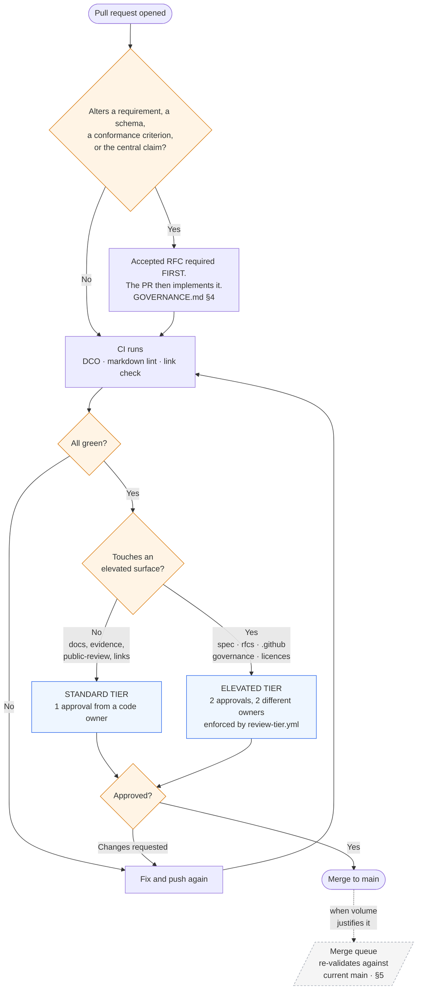

# Review and Merge Workflow

**Status: adopted by the maintainers, 2026-08-30.** This document describes practice; it does not amend [`GOVERNANCE.md`](../GOVERNANCE.md), which is amendable only by RFC. Two things must be true for it to be more than an intention: the repository settings must enforce it (§8), and the [open questions](#open-questions) must be closed.

**Objective:** keep `main` protected without making every change wait on two senior people. Automate the mechanical checks; spend human review where judgment is actually needed.

**Audience:** maintainers, reviewers, and any contributor who wants to know what happens to a pull request after they open it.

This document describes **mechanics**. Authority — who decides what, and by what process — lives in [`GOVERNANCE.md`](../GOVERNANCE.md), which is itself amendable only by RFC. **Where the two disagree, `GOVERNANCE.md` governs and this document is the one that gets fixed.**

---

## 0. The shape of it

Three things the diagram is meant to make obvious. **The RFC gate comes first** and no number of approvals substitutes for it. **The tier is decided by the paths touched**, never by who wrote the change. And **the merge queue is not in the flow yet** — it is drawn dashed because it is deliberately off (§5).

## 1. The baseline

- `main` is **protected**. No direct pushes, by anyone, including maintainers.
- Every change reaches `main` through a **pull request**.
- **Automated checks must pass** before merge (§3).
- **At least one human approval** is required. Higher-risk surfaces require two (§2).
- **No self-merge of one's own substantive change.** Approving your own work defeats the point; a maintainer may merge their own typo fix once someone else has approved it.

Turning branch protection on, and configuring required checks, is a repository-settings action performed by a maintainer on GitHub. This document says what the settings should express, not how to click them.

## 2. Two review tiers

The tier depends on **what the change touches**, not on who wrote it.

### Standard — one approval

Everything not listed as elevated. In practice: documentation, `public-review/`, `evidence/`, links, formatting, harness tooling, and clarifications that change no requirement.

One approval from a code owner, plus green CI, is enough to merge.

### Elevated — two approvals

Owners are set in [`CODEOWNERS`](CODEOWNERS): the core team owns what the project *specifies*, the maintainers own what it *promises* and the guardrails themselves. Two approvals, from **two different owners of the touched surface**, are required when a pull request touches any of:

| Surface | Why |
|---|---|
| `spec/` | Normative text. The framework's actual substance. |
| `rfcs/` (the process itself, not an individual RFC's discussion) | Changing how change happens. |
| Conformance criteria, the conformance model, the threat model | These are what an adopter relies on when claiming conformance. |
| Machine-readable schemas | An implementation may depend on them; a silent break is expensive downstream. |
| `GOVERNANCE.md`, `CODE_OF_CONDUCT.md`, licensing files, `CITATION.cff` | Project-level commitments. |
| `.github/` — workflows, `CODEOWNERS`, branch-protection-adjacent config | Whoever changes the guardrails can remove them. |
| Anything security-relevant in the harness | Ordinary software-supply-chain hygiene. |

**Approvals do not substitute for the RFC process.** Per [`GOVERNANCE.md` §4](../GOVERNANCE.md), a change that alters a requirement, a conformance criterion, a schema, or the central claim requires an **accepted RFC first**; the pull request then implements it. Two approvals on a normative pull request with no accepted RFC behind it is a process error, not a shortcut.

### When the tier is unclear

Treat it as elevated and say so in the pull request. Guessing low is the expensive mistake; guessing high costs one extra review.

## 3. What CI checks, and what it does not

CI exists to make human review about **judgment**, not about spotting a broken link.

Currently enforced on every pull request (see [`workflows/`](workflows/)):

| Check | What it catches |
|---|---|
| **DCO** | Missing `Signed-off-by:` (see [CONTRIBUTING](../CONTRIBUTING.md#developer-certificate-of-origin-dco)) |
| **Markdown lint** | Structural and formatting defects across all documentation |
| **Link check** | Dead internal and external links |

Proposed additions, in rough order of value:

1. **Schema validation** — validate the repository's machine-readable artifacts against their own schemas, so a malformed example cannot merge.
2. **Dependency and vulnerability scanning** — meaningful mainly for the reference harness, which is a separate repository ([`croa-reference-harness`](https://github.com/croa-project/croa-reference-harness)). Build and unit tests belong there too; this repository is specification and documentation, and has little to build.
3. **Spell/terminology check** on normative text, to catch RFC 2119 keywords used casually.

**What CI cannot tell you.** A clean run means the text is well-formed, not that it is correct, and certainly not that a deployment is conformant. [`CONTRIBUTING.md`](../CONTRIBUTING.md) already states this and it bears repeating here: a green pipeline is neither necessary nor sufficient for conformance.

## 4. Getting the right reviewer automatically

[`CODEOWNERS`](CODEOWNERS) requests reviews automatically based on the paths a pull request touches. The intent is that a change to the threat model reaches whoever owns the threat model, without anyone having to route it by hand.

It routes to **two teams**, mirroring the roles in [`GOVERNANCE.md` §3](../GOVERNANCE.md) and [`CORE-TEAM.md`](../CORE-TEAM.md):

- **`core-team`** owns what the project specifies: `spec/`, `rfcs/`, `public-review/`, `evidence/`, and everything not claimed by a more specific rule. These are the people with write authority over the specification.
- **`maintainers`** owns what the project commits to (`GOVERNANCE.md`, the licences, `SECURITY.md`, `CITATION.cff`, the role files) and the guardrails themselves (`.github/`). Whoever can change the guardrails can remove them.

**Ownership and tier are different questions.** The core team owns `evidence/` and `public-review/` because it acts on what lands there, but changes to them are standard tier: they record what implementers found, they do not alter what the framework requires. Being owned means *someone specific is asked to look*; being elevated means *two people must approve*.

⚠️ **Both teams must exist** in the `croa-project` organization for any of this to fire. GitHub requests nobody, silently, for a team that does not exist — so an unfixed placeholder is worse than no rule at all. Until the teams are created, replace the handles with individuals; the file says which.

## 5. Merge queue

Not enabled today, and it should not be until it earns its place.

A merge queue re-validates each approved pull request against the current `main` before merging, so that two changes which each pass on their own but conflict in combination are caught by CI rather than by whoever notices later. It is the standard answer to merge coordination becoming a manual chore.

**Turn it on when** several pull requests are routinely open at once and someone finds themselves sequencing merges by hand. Below that volume it adds latency and machinery for no benefit.

## 6. Keeping pull requests small

One concern per pull request, as [`CONTRIBUTING.md`](../CONTRIBUTING.md) already asks. This is not tidiness for its own sake: it is what makes one-approval review defensible. A reviewer can genuinely assess a focused change in minutes. A reviewer facing four unrelated changes approves the whole thing on the strength of the one part they understood, and everyone pretends otherwise.

If a pull request needs a paragraph to explain what it does, it is probably two pull requests.

## 7. What this does not change

- **Discuss first** for anything non-trivial. Review mechanics do not replace the discussion step.
- **Normative change still requires an RFC**, with a Final Comment Period of no less than 14 days, per governance.
- **Governance amendments require an RFC** with a Final Comment Period of no less than 21 days, and this document cannot shorten that.
- **Dissent is recorded, not erased.** An approval count is not a way to outvote a documented objection.

## 8. What must be configured for this to hold

Nothing in this document enforces itself. The following are repository settings a maintainer sets on GitHub, and until each is on, the corresponding section is an intention rather than a rule.

The `Protect-Main` ruleset targets `main` and is Active. State as of 2026-08-30:

| Setting | Enforces | State |
|---|---|---|
| Require a pull request before merging | §1 | ✅ on |
| Block force pushes | §1 | ✅ on |
| Restrict deletions | §1 | ✅ on |
| **Require status checks to pass** | §3, §2 | ❌ **off** — CI runs but does not block, and the review-tier check is useless until this is on |
| Required approvals | §2 | to confirm (collapsed under *Show additional settings*) |
| Require review from Code Owners | §2, §4 | to confirm |
| Dismiss stale approvals on new commits | open question 3 | to confirm |
| Merge queue | §5 | ❌ off — deliberately, for now |
| Require signed commits | — | ❌ off — correct: the project uses DCO sign-off, not commit signatures |
| Require linear history | open question 1 | ❌ off |

Two gaps to close:

**The status checks do not block.** DCO, markdown lint and link-check run on every pull request and report their result, but nothing stops a merge when they fail. §3 is currently an intention. Enabling *Require status checks to pass* and selecting the three workflows closes it.

**Repository admins bypass the ruleset.** The bypass list grants `Repository admin — Always allow`, which means an admin can push straight to `main`, force-push aside, and merge without review. §1 says *no direct pushes, by anyone, including maintainers*, and today that sentence is false for the two people most likely to be tempted by it at 2 a.m. A project whose thesis is that a rule must not depend on the good behaviour of the actor should be the last to leave itself an always-allow. Either empty the bypass list, or narrow it to a documented emergency path (open question 4) that leaves a trace.

### How the elevated tier is enforced

GitHub has **one** required-approvals count per ruleset, applied to every file in the branch. There is no per-path approval count, so "one approval normally, two on the specification" cannot be expressed by that setting alone.

It is enforced instead by [`workflows/review-tier.yml`](workflows/review-tier.yml), which reads the paths a pull request touches and the approvals it carries, and fails when an elevated surface has fewer than two. It counts the **latest** review state per person, so a later *changes requested* overrides an earlier approval, and it ignores the pull request author's own reviews.

Two conditions for it to mean anything:

- it must be registered as a **required status check**, otherwise it reports a red icon that nobody is obliged to look at;
- the **admin bypass** must not leave a route around it.

The list of elevated paths lives at the top of that workflow and must be kept in step with §2 and with [`CODEOWNERS`](CODEOWNERS). Three places, one rule: that is a maintenance cost, and it is the price of GitHub not offering per-path approval counts.

## Open questions

Raised by this draft and not settled:

1. **Merge method.** Squash, merge commit, or rebase? Squash keeps `main` readable; merge commits preserve DCO sign-offs on every individual commit, which matters given the project uses DCO rather than a CLA. This needs a deliberate answer, not a default.
2. **Reviewer approvals.** During Public Review, reviewer votes are advisory ([`GOVERNANCE.md` §3](../GOVERNANCE.md)). May a reviewer's approval satisfy the standard tier's single approval, or must it come from a maintainer?
3. **Stale approvals.** Should an approval be dismissed when new commits are pushed? Safer, and slower.
4. **Emergency path.** If CI itself is broken and blocking a needed fix, who may bypass, and how is the bypass recorded?
5. **How the elevated tier is enforced.** GitHub cannot vary the approval count by path (§8). Three ways to get "one normally, two on the sensitive surfaces", in increasing order of rigour:

   - **Discipline.** Required approvals stays at 1; the PR template asks the author to declare the tier; maintainers do not merge an elevated pull request with one approval. Costs nothing, enforces nothing, and is exactly the *consultative enforcement* this framework was written against.
   - **Two everywhere.** Required approvals set to 2. Genuinely enforced, and with two maintainers it means both of them on every typo. This is the bottleneck the workflow was meant to remove.
   - **A required check that counts.** A workflow reads the pull request's changed paths and its approvals, and fails when an elevated surface has fewer than two. Registered as a required status check, it cannot be talked around: the merge button stays grey. It is also the only option consistent with what CROA asks of everyone else — govern the transition, do not merely recommend it.

   Note that the third option depends on the previous gap being closed: a required check that does not block is a suggestion with a red icon. And that whichever is chosen, an admin bypass reopens the door.

6. **Feasibility at three.** The core team is three people, the maintainers two. Two approvals on `spec/` works; two approvals on `.github/`, owned by the maintainers, means both of them, every time. Should the maintainer-owned surfaces stay at one approval until there is a third maintainer?

---

*Adopted by the maintainers following their discussion of 30 August 2026. Amendments to this document are ordinary pull requests under the elevated tier (§2). Any change that would alter authority rather than mechanics belongs in [`GOVERNANCE.md`](../GOVERNANCE.md) and goes through the [RFC process](../rfcs/README.md) instead.*
