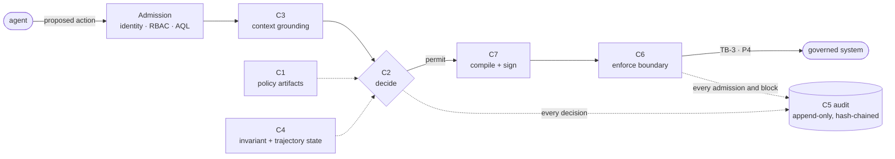

# CROA Architecture Overview (one page)

The whole architecture on one page, for a reader who wants the shape before the specification.

**Authoritative source:** Part II of the specification. Where this page and the spec differ, the spec governs.

---

## The idea in one line

An agent never acts on a governed system directly. It proposes an action; a **deterministic control plane** decides; only an authorized, signed commitment can cross the boundary into the system; every decision is recorded.

## The request gauntlet

Every proposed action runs the same fixed path. No step is an AI model.

If any step withholds authorization, there is **no path** for the action to reach the system — it is not "refused," it is unreachable.

## The seven components (C1–C7)

| | Component | Function |
|---|---|---|
| **C1** | Policy Authority | Issues, maintains, and revokes the signed policy and authorization artifacts. The single source of policy. |
| **C2** | Execution Governor | The deterministic decision point. Evaluates a grounded action against registered invariants → permit / deny. |
| **C3** | Path Resolver | Grounds the request against the **Technical Golden Record** (are the targets real and registered?). Runs before C2. |
| **C4** | Invariant Monitor | Maintains invariant and **trajectory** state — the cumulative view that catches slow, multi-step patterns C2's per-action check would miss. |
| **C5** | Audit & Provenance Store | Append-only, hash-chained log of every governance event. The evidence base; lets any decision be reconstructed afterward. |
| **C6** | Execution Firewall | The execution boundary. Admits **only** operations derived from a valid Compiled Commitment; everything else is blocked. Hosts the Refusal Gateway. |
| **C7** | Contract Compiler | Compiles a permitted action into an immutable, content-addressed, **signed Compiled Commitment (CC)** — the only artifact allowed across the boundary. |

> Component numbers denote **identity, not pipeline order** — at execution time C7 (compile) runs before C6 (enforce).

## Trust boundaries

- **TB-1 Agent boundary** — the agent is an untrusted principal; the Agent Surface is its only interface.
- **TB-2 Policy boundary** — policy is authored only by C1.
- **TB-3 Execution boundary** — governed systems accept only CC-derived operations (network-enforced; property P4).
- **TB-4 Audit boundary** — C5 is append-only; auditors have read-only access.

## The conformance ladder (L0–L5)

A property of a *deployed system within a defined governance boundary*, not of the framework or a vendor.

- **L0–L3** — increasing partial enforcement and evidence.
- **L4 Constructive Enforcement** — the conformance **threshold**: within the modeled action space, under the registered invariants, with network-enforced containment, an agent cannot, by its own choice, reach an invariant-violating state — the sole exception being a governed, signed authorization — demonstrable against evidence. L4 bounds the *action* space, not the *effect* space. *Only L4+ may be called "CROA-conformant."*
- **L5** — L4 plus continuous self-verification (evidence criteria not fully specified in v1.0).

## Key terms (see the [glossary](glossary.md))

**Compiled Commitment (CC)**, **invariant**, **evaluability classes (E1/E2/E3)**, **Technical Golden Record**, **Technical Sycophancy**, **structural reachability**, **effective authority**.

## The properties, stated so they can be attacked

The architecture above is a means; the claim-bearing properties are what a reviewer should argue with. Each is written as claim → preconditions → invariant → enforcement → falsifying test → evidence → what it does *not* establish, in [`spec/properties.md`](../spec/properties.md):

| | Property | One line |
|---|---|---|
| **P-A** | Complete Execution Mediation | Nothing reaches a governed system except as a redeemed Compiled Commitment. |
| **P-B** | Authority Non-Expansion | Delegation cannot grant beyond its delegator, and no composition launders one subject's authority into another. |
| **P-C** | Trajectory Constraint Preservation | A violation assembled from individually permitted actions is denied before the action that completes it. |
| **P-D** | Single-Use Authorization Consistency | At most one execution per commitment, under concurrency, across every enforcement instance. |
| **P-E** | Decision Reconstructability | Any decision can be reconstructed from the audit record alone. |
| **P-F** | Evaluation Determinism | Same inputs, same verdict. |

The same page lists what CROA does **not** establish — cumulative state under concurrency,
commit-time freshness, trap states, resource budgets, irreversibility accumulation, and cross-agent
trajectory detection. Read that list before deciding CROA covers your case.

→ Next: [Quick Start](quick-start.md) · [Why CROA](why-croa.md) · [Deployment topologies](deployment-topologies.md) · [On your existing stack](mapping-to-your-stack.md) · [Research Questions](../public-review/research-questions.md) · full spec via [`spec/README.md`](../spec/README.md).
