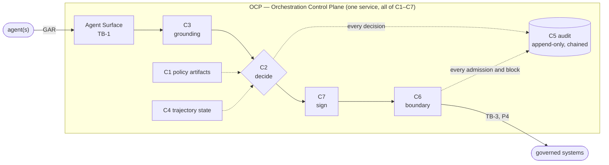
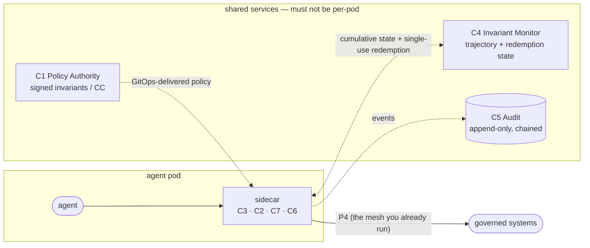
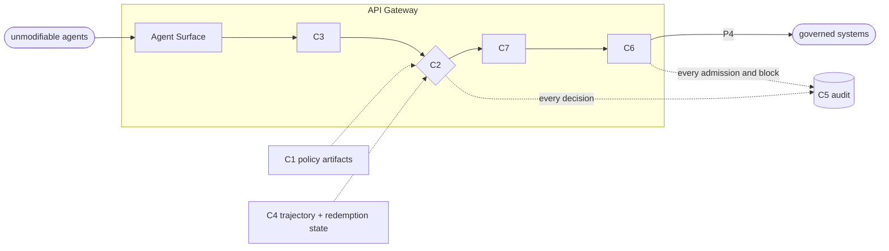

# Deployment topologies

C1–C7 are *logical* components. The overview says what each one does; it does not say where any of
them runs. This page does — five reference topologies, so you can place CROA on a mesh, behind a
gateway, or inside a platform you already operate.

**Authoritative source:** Part IV (Deployment Models) of the specification. This is a summary; the spec governs.

---

## The rule that holds in every topology

The five deployment models are **not** alternative architectures — they are alternative *physical
realizations* of the same logical reference architecture (C1–C7). Whatever the topology, three
properties MUST hold:

1. **No governed agent has a direct channel to a governed system.** Every action crosses the boundary (C6/TB-3).
2. **Only Compiled-Commitment-derived operations cross that boundary** — ideally network-enforced (property **P4**).
3. **Every decision is recorded** in an append-only, hash-chained C5.

If a topology can't preserve those, it isn't a CROA deployment — it's advice.

## The five reference models

| Model | Pick it when… | Where C1–C7 run |
|---|---|---|
| **DM-1 Centralized** | Single governance domain; first deployment | All of C1–C7 in one governance service that every agent calls |
| **DM-2 Federated** | Multiple independent domains / legal entities | One OCP per domain + a higher-order policy authority (`C1-HO`) for cross-domain meta-policy; federated audit (`C5-FED`) |
| **DM-3 Sidecar** | Cloud-native, service mesh, latency-sensitive, scale with agent count | C2/C3/C7/C6 as a per-agent sidecar; C1 and C5 shared |
| **DM-4 Gateway-Mediated** | Brownfield, existing API gateway, agents you can't modify | The gateway hosts the Agent Surface + the C2 pipeline + C6 |
| **DM-5 Embedded Policy Surface** | Platform-level governance, tool-API enforcement (e.g., MCP) | The agent platform hosts the Agent Surface/RBAC; CROA supplies the governance pipeline behind it |

> **Start at DM-1.** It is the RECOMMENDED first deployment: simplest to reason about, operate, and
> audit. Migrate to DM-3 when agent count exceeds the centralized C2 throughput budget, or to DM-2 when
> the org grows independent governance domains. (Part IV §18.5 specifies safe migration ordering.)

## DM-1 — Centralized Orchestration Governor (the baseline)

All seven components live in one governance service — the **OCP (Orchestration Control Plane)**, the
name Part IV gives to the deployed bundle of C1–C7. ("Orchestration Governor" is DM-1's model name; the
component named *Governor* is C2, which sits inside it.) Every governed action request passes through the
OCP before any execution touches any governed system.

**Trade-off:** the centralized C2 is a shared evaluation point — size it for peak load and configure HA.
The same fail-closed availability logic that makes C5 tier-0 (see [`operating-c5.md`](operating-c5.md))
applies to a centralized C2: under overload it produces **fail-deny** (i.e., fail-closed under load) — a
governance success, but a service disruption you must plan for.

## DM-3 — Sidecar (service mesh)

C2/C3/C7/C6 run as a sidecar next to each governed agent; C1 (policy) and C5 (audit) are shared
services. Governance capacity scales linearly with agent count — the mesh you already run *is* the P4
enforcement layer.

**Fit:** cloud-native, latency-sensitive, high agent count. **Cost:** sidecar lifecycle management and
consistent policy distribution.

## DM-4 — Gateway-Mediated (brownfield)

The existing API gateway hosts the Agent Surface and runs the full C2 pipeline + C6. Best when agents
can't be modified to call a new endpoint (legacy, third-party). The gateway must implement the *whole*
`C2.eval` pipeline — not just its native ACLs/rate-limits — and admit only commitment-derived operations.

## DM-2 (federated) and DM-5 (embedded)

- **DM-2 Federated** — each domain runs its own OCP; a higher-order policy authority (`C1-HO`) issues
  meta-policy the domains can't override, and a federated audit store (`C5-FED`) aggregates domain chains.
  (`C1-HO` and `C5-FED` are the federation identifiers defined in **Part IV §20**.) Use it for
  multi-entity / multi-jurisdiction enterprises.

- **DM-5 Embedded Policy Surface** — the agent platform (e.g., an MCP host or an internal agent
  framework) provides the Agent Surface and tool-scope admission; CROA supplies the governance pipeline
  behind it. Use it for platform-level governance where you own the agent runtime.

## Where C1 belongs: your GitOps pipeline

In every model, **C1 (Policy Authority) is a natural fit for your existing GitOps flow.** Invariants and
authorization artifacts are signed policy: author them as code, review them by pull request, sign and
distribute them the way you already ship policy — with the separation-of-duties rule that whoever
authors an invariant is not whoever operates the agent (Part VII). This keeps policy change auditable
and out of the runtime path.

## Hybrid is allowed

You may combine models — a DM-1 core with DM-3 sidecars for a few high-frequency agents, or a DM-2
federation whose domains each run DM-4 internally. What may **not** vary is the three invariant
properties at the top of this page.

→ Next: [map the components onto your existing tools](mapping-to-your-stack.md), read the
[operational requirements of C5](operating-c5.md), and check the [external prerequisites](prerequisites.md).
For normative detail (component placement, trust-boundary realization, migration ordering), see **Part IV**.
