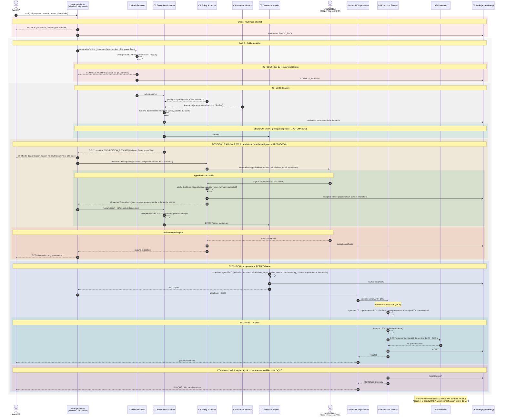

# Exemple d'implémentation — Paiement via MCP (brouillon)

Hypothèses de seuils (à confirmer) : ≤ 1 000 € automatique · ≤ 5 000 € Responsable Finance · > 5 000 € CFO.

```mermaid
sequenceDiagram
    autonumber
    actor AG as Agent IA
    participant HK as Hook préalable<br/>(allowlist · fail-closed)
    participant C3 as C3 Path Resolver
    participant C2 as C2 Execution Governor
    participant C1 as C1 Policy Authority
    participant C4 as C4 Invariant Monitor
    participant C7 as C7 Contract Compiler
    actor APP as Approbateur<br/>(Resp. Finance / CFO)
    participant SRV as Serveur MCP paiement
    participant C6 as C6 Execution Firewall
    participant API as API Paiement
    participant C5 as C5 Audit (append-only)

    AG->>HK: tool_call payment.create(montant, bénéficiaire)

    rect rgba(220, 60, 60, 0.10)
        Note over AG,C5: CAS 1 · Outil hors allowlist
        HK--xAG: BLOQUÉ (fail-closed, aucun appel transmis)
        HK-)C5: événement BLOCK_TOOL
    end

    rect rgba(120, 120, 120, 0.06)
        Note over AG,C5: CAS 2 · Outil enregistré
        HK->>C3: demande d'action gouvernée (sujet, action, cible, paramètres)
        C3->>C3: ancrage dans le Federated Context Registry

        rect rgba(220, 60, 60, 0.10)
            Note over HK,C5: 2a · Bénéficiaire ou ressource inconnus
            C3--xHK: CONTEXT_FAILURE (succès de gouvernance)
            C3-)C5: CONTEXT_FAILURE
        end

        rect rgba(120, 120, 120, 0.06)
            Note over HK,C5: 2b · Contexte ancré
            C3->>C2: action ancrée
            C1-->>C2: politique signée (seuils, rôles, invariants)
            C4-->>C2: état de trajectoire (cumul session / fenêtre)
            C2->>C2: C2.eval déterministe (montant, cumul, autorité du sujet)
            C2-)C5: décision + empreinte de la demande

            rect rgba(40, 170, 120, 0.12)
                Note over HK,C5: DÉCISION · 350 € · politique respectée → AUTOMATIQUE
                C2->>C7: PERMIT
            end

            rect rgba(230, 160, 40, 0.12)
                Note over AG,C5: DÉCISION · 3 500 € ou 7 500 € · au-delà de l'autorité déléguée → APPROBATION
                C2--xHK: DENY · motif AUTHORIZATION_REQUIRED (niveau Finance ou CFO)
                HK-->>AG: en attente d'approbation (l'agent ne peut rien affirmer à la place)
                HK->>C1: demande d'exception gouvernée (empreinte exacte de la demande)
                C1->>APP: demande d'approbation (montant, bénéficiaire, motif, empreinte)

                rect rgba(40, 170, 120, 0.12)
                    Note over HK,APP: Approbation accordée
                    APP->>C1: signature personnelle (clé + MFA)
                    C1->>C1: vérifie le rôle de l'approbateur ≥ niveau requis (annuaire autoritatif)
                    C1-)C5: exception émise (approbateur, portée, expiration)
                    C1-->>HK: Governed Exception signée · usage unique · portée = demande exacte
                    HK->>C2: resoumission + référence de l'exception
                    C2->>C2: exception valide, non consommée, portée identique
                    C2->>C7: PERMIT (sous exception)
                end

                rect rgba(220, 60, 60, 0.10)
                    Note over AG,APP: Refus ou délai expiré
                    APP--xC1: refus / expiration
                    C1-)C5: exception refusée
                    C1--xHK: aucune exception
                    HK--xAG: REFUS (succès de gouvernance)
                end
            end

            rect rgba(60, 120, 220, 0.10)
                Note over AG,C5: EXÉCUTION · uniquement si PERMIT obtenu
                C7->>C7: compile et signe l'ECC (opération, montant, bénéficiaire, sujet, fenêtre, nonce, compensating_controls = approbation éventuelle)
                C7-)C5: ECC émis (hash)
                C7-->>HK: ECC signé
                HK->>SRV: appel outil + ECC
                SRV->>C6: requête vers l'API + ECC

                Note over C6: Frontière d'exécution (TB-3)
                C6->>C6: signature C7 · opération == ECC · fenêtre · sujet présentateur == sujet ECC · non rédimé

                rect rgba(40, 170, 120, 0.12)
                    Note over AG,C5: ECC valide → ADMIS
                    C6->>C6: marque l'ECC rédimé (atomique)
                    C6->>API: POST /payments · identité de service de C6 · ECC id
                    API-->>C6: 201 paiement créé
                    C6-)C5: ADMIT
                    C6-->>SRV: résultat
                    SRV-->>AG: paiement exécuté
                end

                rect rgba(220, 60, 60, 0.10)
                    Note over AG,C5: ECC absent, altéré, expiré, rejoué ou paramètres modifiés → BLOQUÉ
                    C6-)C5: BLOCK (motif)
                    C6--xSRV: 403 Refusal Gateway
                    SRV--xAG: BLOQUÉ · API jamais atteinte
                end
            end
        end
    end

    Note over API: n'accepte que le trafic issu de C6 (P4, contrôle réseau)<br/>l'agent et le serveur MCP ne détiennent aucun secret de l'API
```
