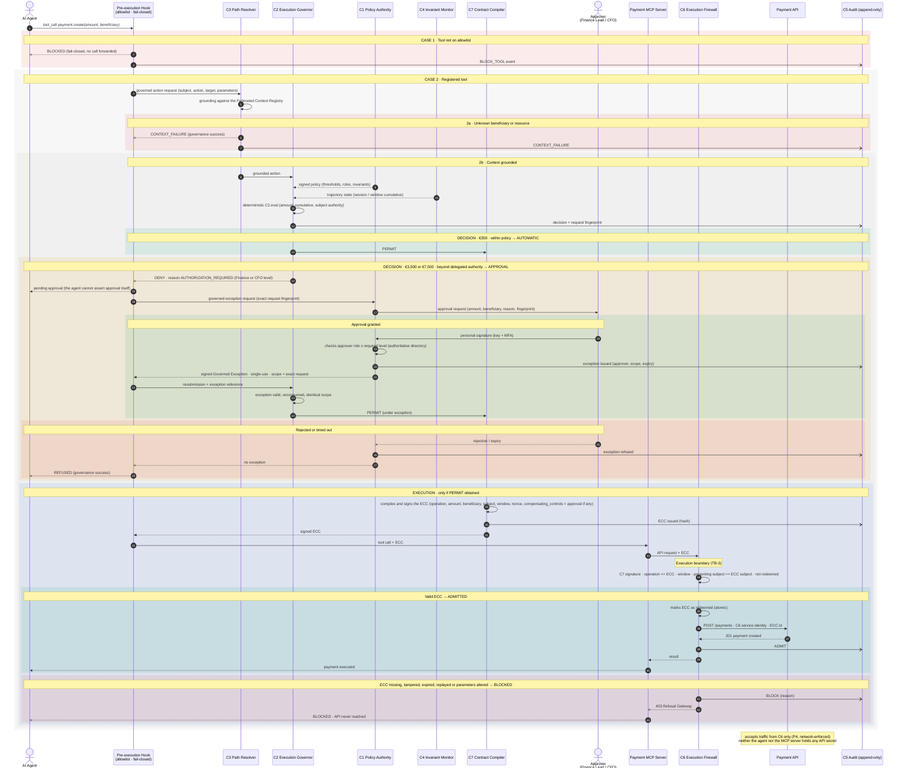

# Implementation example — Payment via MCP (draft)

Assumed thresholds (to be confirmed): ≤ €1,000 automatic · ≤ €5,000 Finance Lead · > €5,000 CFO.

```mermaid
sequenceDiagram
    autonumber
    actor AG as AI Agent
    participant HK as Pre-execution Hook<br/>(allowlist · fail-closed)
    participant C3 as C3 Path Resolver
    participant C2 as C2 Execution Governor
    participant C1 as C1 Policy Authority
    participant C4 as C4 Invariant Monitor
    participant C7 as C7 Contract Compiler
    actor APP as Approver<br/>(Finance Lead / CFO)
    participant SRV as Payment MCP Server
    participant C6 as C6 Execution Firewall
    participant API as Payment API
    participant C5 as C5 Audit (append-only)

    AG->>HK: tool_call payment.create(amount, beneficiary)

    rect rgba(220, 60, 60, 0.10)
        Note over AG,C5: CASE 1 · Tool not on allowlist
        HK--xAG: BLOCKED (fail-closed, no call forwarded)
        HK-)C5: BLOCK_TOOL event
    end

    rect rgba(120, 120, 120, 0.06)
        Note over AG,C5: CASE 2 · Registered tool
        HK->>C3: governed action request (subject, action, target, parameters)
        C3->>C3: grounding against the Federated Context Registry

        rect rgba(220, 60, 60, 0.10)
            Note over HK,C5: 2a · Unknown beneficiary or resource
            C3--xHK: CONTEXT_FAILURE (governance success)
            C3-)C5: CONTEXT_FAILURE
        end

        rect rgba(120, 120, 120, 0.06)
            Note over HK,C5: 2b · Context grounded
            C3->>C2: grounded action
            C1-->>C2: signed policy (thresholds, roles, invariants)
            C4-->>C2: trajectory state (session / window cumulative)
            C2->>C2: deterministic C2.eval (amount, cumulative, subject authority)
            C2-)C5: decision + request fingerprint

            rect rgba(40, 170, 120, 0.12)
                Note over HK,C5: DECISION · €350 · within policy → AUTOMATIC
                C2->>C7: PERMIT
            end

            rect rgba(230, 160, 40, 0.12)
                Note over AG,C5: DECISION · €3,500 or €7,500 · beyond delegated authority → APPROVAL
                C2--xHK: DENY · reason AUTHORIZATION_REQUIRED (Finance or CFO level)
                HK-->>AG: pending approval (the agent cannot assert approval itself)
                HK->>C1: governed exception request (exact request fingerprint)
                C1->>APP: approval request (amount, beneficiary, reason, fingerprint)

                rect rgba(40, 170, 120, 0.12)
                    Note over HK,APP: Approval granted
                    APP->>C1: personal signature (key + MFA)
                    C1->>C1: checks approver role ≥ required level (authoritative directory)
                    C1-)C5: exception issued (approver, scope, expiry)
                    C1-->>HK: signed Governed Exception · single-use · scope = exact request
                    HK->>C2: resubmission + exception reference
                    C2->>C2: exception valid, unconsumed, identical scope
                    C2->>C7: PERMIT (under exception)
                end

                rect rgba(220, 60, 60, 0.10)
                    Note over AG,APP: Rejected or timed out
                    APP--xC1: rejection / expiry
                    C1-)C5: exception refused
                    C1--xHK: no exception
                    HK--xAG: REFUSED (governance success)
                end
            end

            rect rgba(60, 120, 220, 0.10)
                Note over AG,C5: EXECUTION · only if PERMIT obtained
                C7->>C7: compiles and signs the ECC (operation, amount, beneficiary, subject, window, nonce, compensating_controls = approval if any)
                C7-)C5: ECC issued (hash)
                C7-->>HK: signed ECC
                HK->>SRV: tool call + ECC
                SRV->>C6: API request + ECC

                Note over C6: Execution boundary (TB-3)
                C6->>C6: C7 signature · operation == ECC · window · presenting subject == ECC subject · not redeemed

                rect rgba(40, 170, 120, 0.12)
                    Note over AG,C5: Valid ECC → ADMITTED
                    C6->>C6: marks ECC as redeemed (atomic)
                    C6->>API: POST /payments · C6 service identity · ECC id
                    API-->>C6: 201 payment created
                    C6-)C5: ADMIT
                    C6-->>SRV: result
                    SRV-->>AG: payment executed
                end

                rect rgba(220, 60, 60, 0.10)
                    Note over AG,C5: ECC missing, tampered, expired, replayed or parameters altered → BLOCKED
                    C6-)C5: BLOCK (reason)
                    C6--xSRV: 403 Refusal Gateway
                    SRV--xAG: BLOCKED · API never reached
                end
            end
        end
    end

    Note over API: accepts traffic from C6 only (P4, network-enforced)<br/>neither the agent nor the MCP server holds any API secret
```
