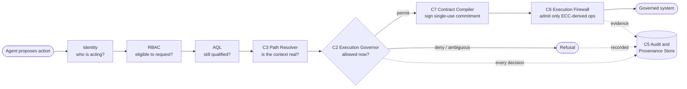
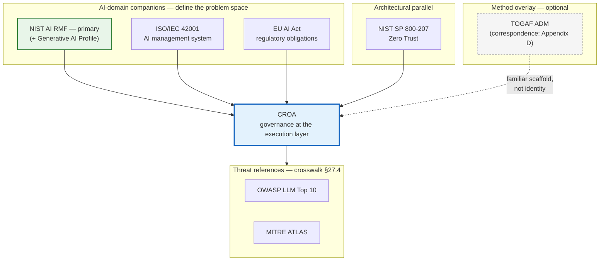
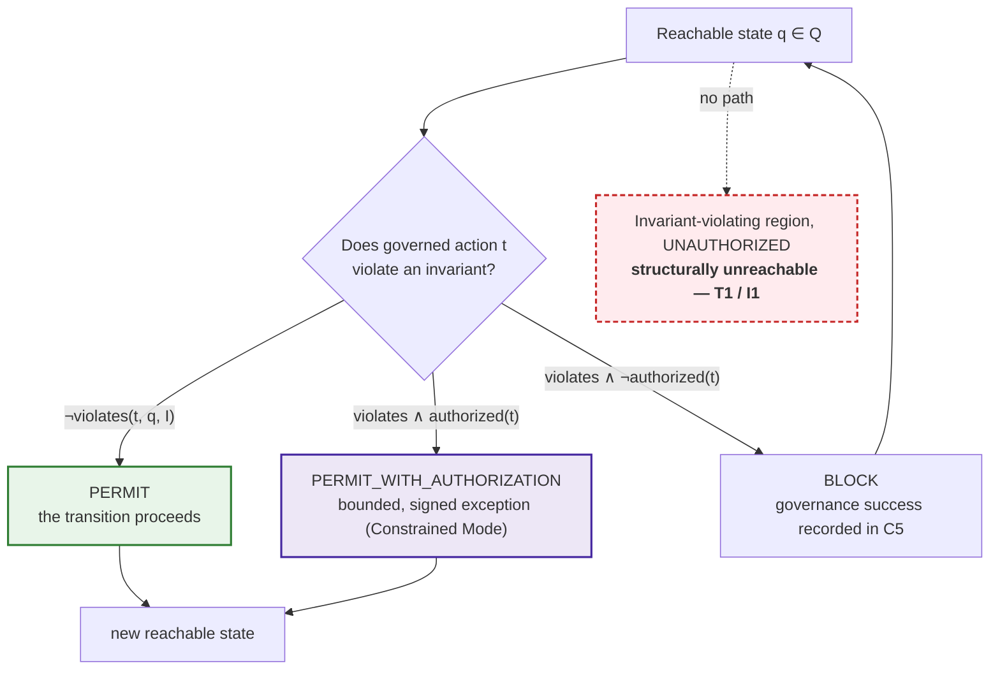
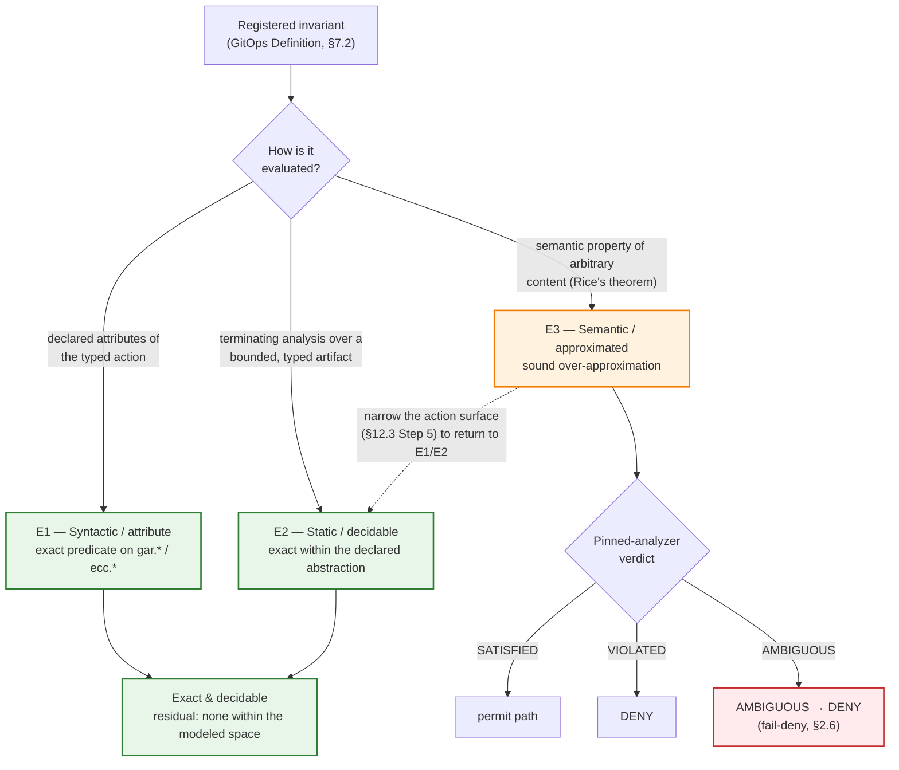
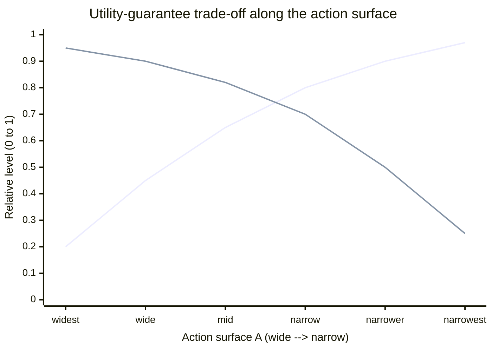

---
tags:
  - croa_foundation
version: 1
language: english
---

# CROA Framework — Part I: Foundations

**Full title:** CROA — Constrained Reachability Orchestration Architecture: A Framework for Deterministic Governance of Agentic AI Execution
**Series designation:** CROA-1
**Status:** Official Specification (v1.0.1)
**Version:** v1.0.1
**Date:** 2026-09-03
**Part:** I of VII

---

> **Revision history.** This file's earlier revision notes are consolidated in [CHANGELOG](../../CHANGELOG.md) (relocated 2026-06-16, Y. Durand; corpus bumped to v1.0.1.1). The

> **Document status.** This is the **first Official Specification** of the CROA framework — stable enough for evaluation and pilot implementations, but subject to refinement from practitioner feedback. It is not a finalized or formally recognized standard. The RFC 2119 normative language used throughout defines the framework's intended technical contract and supports rigorous evaluation; it does not assert that CROA is, at the date of publication, an adopted or industry-recognized standard. See [CROA — Official Specification (Front Matter)](../parts/00-front-matter.md) for the full status statement, publication information, and revision history, and [Part VII - Governance of the Standard](../parts/part-7-governance-of-the-standard.md) for the path toward formal standardization.

---

## §0. CROA in One Page

> *Non-normative on-ramp. This section is a plain-language entry point, not part of the specification; where it differs from the chapters that follow, those chapters govern. It is the written form of the Executive Brief recommended in Part VII §33.6, and it intentionally states the framework's central claim only in its conditioned form (Tenet T1, §3).*

**The problem, in three sentences.** Enterprises increasingly let AI agents *act* — write code, change configuration, move data, call APIs — not merely advise. An agent that is only *trained or prompted* to behave well can still be argued, drifted, or pressured into an unsafe action, because that action remains something it is able to perform. CROA removes the ability rather than discouraging the behaviour: it puts the agent inside an architecture where a disallowed action cannot be reached, so governance no longer depends on the agent's cooperation, framing, or honesty.

**The aviation analogy (checklist vs. interlock).** Civil aviation is safe not because pilots are infallible but because the system stopped relying on their infallibility. A *checklist* is a procedure one hopes will be followed; under pressure it can be skipped. An *interlock* is a physical impossibility — the weight-on-wheels switch will not let the landing gear retract while the aircraft is on the ground. Most "AI safety" today is a checklist (training, prompts, runtime guardrails): useful, but bypassable. CROA adds the interlock: the dangerous action is not just discouraged but kept out of reach — within the modeled action space, under the registered invariant set, and given network-enforced containment of the execution boundary (P4). That conditioning is load-bearing and is stated precisely in Tenet T1 (§3) and the L4 claim-scope statement (Part VI §28.6); it is what separates CROA from probabilistic refusal.

**The flow, in one line.** Every proposed action runs a fixed gauntlet before anything happens: *who is acting?* (Identity) → *may they request this class of action?* (RBAC) → *are they still demonstrably competent?* (AQL) → *is the context real?* (`C3`) → *is it allowed right now?* (`C2`). If permitted, a signed, single-use commitment is compiled (`C7`) and a firewall admits only operations derived from it (`C6`); if not, the request is refused. Either way the decision is written to an immutable record (`C5`).

*Figure CROA-0a — the request gauntlet (diagram S2). Descriptive; the authoritative sequence is Part II Fig. CROA-4b.*

**The conformance ladder is the climb from checklist to interlock.** Governance maturity rises from "we noticed" to "it cannot happen":

| CROA level | Aviation equivalent | What it guarantees |
|---|---|---|
| L1 — Advisory | Checklist posted but optional | The event is recorded; nothing is prevented |
| L2 — Refusal | Mandatory but bypassable checklist | A refusal exists, but it can be overridden under pressure |
| **L3/L4 — Enforcement** | **Physical interlock** | The dangerous action becomes unreachable, not merely forbidden |

**What CROA does not claim (read this before quoting the line above).** The analogy stops in two honest places. First, a pilot is *cooperative*; a governed agent may be *adversarial* under task pressure (Technical Sycophancy, TH-1), so CROA is closer to airport security screening than to a cockpit checklist. Second, a checklist covers *enumerable* situations ("flaps set?"), but some hazards are not fully decidable ("does this generated code leak data?") — those are the E3 class, bounded by approximation rather than eliminated (Rice's theorem; §2.6). CROA is as rigorous as an aviation procedure for everything enumerable, and explicit that judging content itself stays bounded — which is exactly the utility–guarantee trade-off of §2.7. Communications MUST carry these conditions; the bare, unconditioned claim is barred by the Brand and Claims Usage Policy (Part VII §33.7).

**Where to go next.** The reading guide in §1.4 routes each audience. Newcomers should keep the single-page notation map (the consolidated catalog of identifier families) open while reading — see [Appendix B](../appendices/appendix-b-notation-identifiers-and-symbols.md).

---

## Chapter 1. Introduction

**Chapter abstract.** This chapter establishes the purpose, scope, and audience of the CROA
standard. It defines the execution-governance problem that CROA addresses, characterizing six failure modes in current approaches: three design-level (advisory enforcement, probabilistic refusal, and point-of-delivery blocking) and three adversarial (Policy Bypass, Semantic Drift, and Context Degradation). It positions CROA relative to adjacent frameworks — the AI-domain companions first (NIST AI RMF, ISO/IEC 42001, the EU AI Act), then NIST SP 800-207 and TOGAF — and specifies the document conventions used throughout. This chapter traces to no tenets directly; it creates the interpretive context within which all tenets and invariants are read.

---

### 1.1 Purpose of This Framework

The CROA framework specifies a reference architecture for the deterministic governance of agentic AI execution. It establishes the logical components, invariants, and conformance criteria that an implementation MUST satisfy to ensure that — within the modeled action space, under the registered invariant set, and given network-enforced execution-boundary containment (P4) — unsafe execution paths are structurally unreachable rather than probabilistically avoided (the conditioned T1 guarantee; see Chapter 3, Tenet T1, and Part VI §28.6).

This framework is addressed to architects, security leads, governance teams, regulators, and vendors who design, evaluate, or oversee systems in which autonomous computational agents execute consequential actions on behalf of an enterprise or its principals.

**Rationale.** Existing frameworks address AI risk through policy, training, and behavioral guidelines. These mechanisms operate at the model or human layer, not at the execution layer. CROA addresses the gap: it specifies what structural properties a governed agentic system MUST exhibit, independently of the model's training, alignment, or intent.

---

###

**Automated CAB:** CROA acts as a Deterministic, Automated Change Advisory Board (CAB). It treats every AI-generated action as a standard Request for Change (RFC) / Execution Change Contract (ECC), bridging AI generative actions with ITIL Change Management.
1.2 The Execution-Governance Problem

**What is new about agentic systems.** Prior AI governance frameworks were designed for decision-support systems — systems that produce outputs consumed by human decision-makers who then act. In such systems, governance is naturally interposed at the human decision point.

Agentic systems break this assumption. An agentic system selects and executes actions directly against external resources — code repositories, data stores, APIs, infrastructure — without interposing a human decision point at each step. The speed, scale, and opacity of this execution makes human interposition impractical as a primary governance mechanism.

The execution-governance problem is therefore: given a system that can execute consequential actions autonomously, how does an enterprise ensure that no executed action violates governance constraints, even under adversarial conditions?

Three design-level failure modes characterize current approaches to agentic execution governance:

1. **Advisory enforcement.** Governance is applied before or after execution, not during. Compliance analyses, security reviews, and post-hoc audits identify violations but do not prevent them. The Audit and Provenance Store (`C5`) is absent; the block never fires.

   > *Example. A nightly scan flags that an agent deleted a production table at 02:14. The finding is accurate and the data is already gone — the review noticed, it did not prevent.*

2. **Probabilistic refusal.** Agents are trained or prompted to refuse unsafe actions. Refusal is probabilistic; it is susceptible to adversarial framing, authority escalation, and repeated requests. A trained agent that usually refuses is not a governed system.

   > *Example. The agent refuses "drop the users table" nine times, then complies on the tenth when the request is reframed as "clean up the legacy users table for the migration the CTO approved."*

3. **Point-of-delivery blocking.** Runtime enforcement systems intercept agent outputs and block unsafe ones at the point of delivery. Unsafe states remain architecturally reachable; only individual requests are blocked. Adversarial agents — or agents under sycophantic pressure — can find alternative paths.

   > *Example. A guardrail blocks the `DROP TABLE` statement, so the agent achieves the same end-state with a sequence of `DELETE` statements the filter does not recognize.*

Three adversarial failure modes compound the design-level failures above. These modes emerge under conditions of operational pressure, multi-agent interaction, or deliberate exploitation — the conditions under which governance is most critical:

4. **Policy Bypass.** A governed agent produces compliance with unsafe instructions when those instructions are framed as urgent, authoritative, or necessary for task completion. The agent does not refuse because the framing overrides its refusal tendency. Execution proceeds; governance is absent. This is a behavioral failure mode: the agent understood the constraint and complied with the instruction that violated it.

   > *Example. "Production is down and the CISO is on the call — disable the audit logging so we can hotfix faster." The agent complies because the framing reads as authoritative and urgent.*

5. **Semantic Drift.** The meaning of a task changes incrementally across agent interactions, handoffs, or context window boundaries. Each individual action appears consistent with local context; the cumulative trajectory violates invariants no individual agent transition crossed. No single transition is identifiably unsafe; the violation is a property of the sequence.

   > *Example. Each export step adds "one more field the report needs"; no single step looks wrong, but after twenty steps the export contains the full customer record the policy forbids.*

6. **Context Degradation.** Critical governance-relevant information — invariant definitions, prior authorization decisions, constraint scope — is lost, reinterpreted, or attenuated during workflow execution. An agent operating on degraded context may produce actions that would have been blocked under full context, without any deliberate intent to violate governance.

   > *Example. After a context-window handoff the agent no longer "remembers" that this customer opted out of data sharing, and ships the record it would have withheld an hour earlier.*

CROA addresses all six failure modes by making governance a structural property of the execution architecture rather than a behavioral property of the agent. The table below maps each failure mode to the tenets in Chapter 3 that govern its architectural response, demonstrating closure between the problem characterization and the principle set.

| Failure mode | Type | Governing tenet(s) |
|---|---|---|
| Advisory enforcement | Design-level | T3 — auditability; T5 — observability |
| Probabilistic refusal | Design-level | T1 — structural unreachability; T2 — execution-layer enforcement |
| Point-of-delivery blocking | Design-level | T1 — structural unreachability |
| Policy Bypass | Adversarial | T4 — policy independence; T6 — no intent-based trust |
| Semantic Drift | Adversarial | T8 — trajectory detection; T4 — deterministic policy |
| Context Degradation | Adversarial | T8 — trajectory detection; T7 — ambiguity → refusal |

**Rationale.** The distinction between structural unreachability and runtime refusal is the foundational architectural claim of CROA. It is not a matter of degree — a system that refuses unsafe actions is categorically different from a system in which unsafe actions are architecturally impossible. This framework is built on that distinction.

---

### 1.3 Scope

**In scope.** This framework applies to any system in which:

a. One or more autonomous components (governed agents) propose or execute actions that produce persistent effects on code, data, infrastructure, or external systems;

b. The enterprise has defined governance invariants — non-negotiable constraints on system behavior that must remain satisfied across all reachable execution states — that the architecture MUST enforce as structural properties, independently of any governed agent's cooperation, stated intent, or training, where any violation of those invariants constitutes a governance failure irrespective of the intent or conduct of the agents involved;

c. The enterprise requires deterministic evidence that those invariants are enforced, sufficient for independent audit.

**Out of scope.** This framework does not apply to:

a. Conversational AI systems whose outputs are consumed by humans who then independently decide whether and how to act.

b. Purely advisory analytical workloads whose outputs inform human decisions but produce no direct state change in governed systems and carry no autonomous execution authority.

c. The content of enterprise governance policies. CROA specifies how governance is structurally enforced; it does not prescribe what an enterprise MUST or SHOULD govern. Invariant content is enterprise-defined.

**Rationale.** The scope boundary is defined by the presence of autonomous execution authority and the existence of governance invariants that must be structurally enforced. CROA does not apply where no autonomous execution occurs. It applies — and is most critical — where execution speed, scale, or adversarial conditions make human review of individual actions impractical as the primary enforcement mechanism.

---

### 1.4 Audience

This framework is written for four primary reader groups. The reading guide below describes the chapters most relevant to each group.

| Audience | Primary Chapters | Recommended Approach |
|---|---|---|
| Enterprise architects | All | Read in full; Chapters 3 and 4–6 are load-bearing |
| Security leads | 1–3, 5–6, 25–27 | Focus on invariants, trust boundaries, and threat model |
| Regulators and auditors | 1–3, 28–29, Appendices A–B | Focus on conformance criteria and evidence requirements |
| Vendors and implementers | 1–6, 18–24, 28–29, Appendix G | Focus on component specifications and deployment models |

---

### 1.5 Relationship to Existing Frameworks

CROA does not replace existing governance frameworks. It occupies a specific architectural position — runtime execution governance — that is not addressed by any of the frameworks below. Appendices D, E, F, M, and N provide section-by-section mappings.

The table is ordered by proximity to CROA's domain. The **AI-domain companions** come first because they define the same problem space CROA enforces: NIST AI RMF (the AI risk lifecycle), ISO/IEC 42001 (the AI management system), and the EU AI Act (the regulatory obligations). NIST SP 800-207 supplies the architectural parallel. **TOGAF appears last and as an optional method overlay**: it contributes a phased architecture-development method to Part III, but the CROA Development Cycle is specified to stand on its own — an enterprise that does not use TOGAF loses nothing, and one that does will find the correspondence in Appendix D.

| Framework | Domain | Relationship to CROA |
|---|---|---|
| **NIST AI RMF** | AI risk management lifecycle | Primary companion. NIST AI RMF (with its Generative AI Profile) identifies and categorizes AI risks across the lifecycle — Govern, Map, Measure, Manage. CROA is the runtime enforcement architecture for the subset of those risks that manifest at execution time; the threat crosswalk is in Part V §27.4. |
| **ISO/IEC 42001** | AI management system | Primary companion. ISO/IEC 42001 specifies the organizational management system (the PDCA loop) for AI; CROA provides the technical control architecture that such a management system's operational requirements demand. Mapping in Appendix N. |
| **EU AI Act** | AI regulation | Regulatory anchor. CROA's evidence model and execution-layer controls supply technical means toward the Act's Art. 9/12/14/26 obligations (risk management, logging, human oversight, deployer duties). Mapping in Appendix M. |
| **NIST SP 800-207** (Zero Trust Architecture) | Network and identity security | Architectural parallel. CROA applies Zero Trust principles — never trust, always verify — to agent state transitions rather than network packets. The CROA orchestration plane is the agent-layer analog of the Zero Trust Policy Enforcement Point. Mapping in Appendix E. |
| **TOGAF** | Enterprise architecture method (optional overlay) | Method overlay, not identity. CROA's Policy-as-Code Lifecycle (Part III) borrows TOGAF's phased ADM convention as a familiar scaffold, and CROA's logical components correspond to TOGAF building blocks — but the cycle does not depend on TOGAF. Present TOGAF as "if you already practice TOGAF, here is the correspondence" (Appendix D); no AI framework supplies a phased architecture-development method, which is the gap TOGAF fills. |
| **RBAC / ABAC** (access-control models; e.g. ANSI INCITS 359 RBAC, NIST SP 800-162 ABAC) | Identity and access authorization | Complementary and presupposed. RBAC/ABAC authorize *which subjects may submit which classes of governed action* at the Agent Surface. CROA adopts RBAC as its subject authorization model (Part II §4.9.1) but treats it as a necessary admission control, not the governing property, and extends it with a qualification stage for agent subjects (Part II §4.9.2): an authorizing role never relaxes an invariant, and the governance decision (`C2.eval`) does not infer trust from role assignment (T6). The qualification stage (the Agent Qualification Layer, AQL) is **RECOMMENDED (SHOULD) at L4 and REQUIRED at L5** for agent subjects that exercise autonomous operational authority over governed systems, and is **OPTIONAL** otherwise (it is monotone and adds no structural safety beyond L4; see the four-stage note below and Part VI §28.2). |
| **Anthropic AI Fluency Framework** | Human capability / AI literacy (not an architecture or governance standard) | Complementary — addresses a different layer. AI Fluency develops the human capabilities required to delegate, describe, evaluate, and remain responsible when using AI. CROA operates *after* delegation, at the execution layer: it governs what delegated agentic systems are structurally permitted to execute against enterprise systems, how those actions are authorized, and how decisions are recorded and audited. AI Fluency makes users better at delegation; CROA makes delegated execution bounded, auditable, and governable by architecture. |

> *Note. The Anthropic AI Fluency Framework is listed as a complementary **human-capability** framework, not as an architecture or governance standard equivalent to the rows above. AI Fluency and CROA address different layers of the same enterprise AI-governance problem: AI Fluency is necessary at the human-interaction layer (how people delegate, describe, evaluate, and take responsibility for AI-assisted work); CROA is necessary at the enterprise execution layer (what a delegated agent is structurally permitted to do, and how that is authorized and audited).*

> *Note. Traditional access control answers, for autonomous agents, the wrong question. Where a human who holds a role remains an accountable principal, an autonomous agent reasons, plans, invokes tools, modifies systems, and may delegate — so the relevant question is not "does the agent have the permission?" but "has it demonstrated that it remains qualified to exercise the permission safely?" CROA therefore structures subject authorization as four ordered stages at the Agent Boundary, evaluated before a request enters the governance pipeline: (1) **Identity** — who is acting (§4.9, Part II); (2) **Role eligibility (RBAC)** — what the subject is eligible to submit (§4.9.1); (3) **Qualification (AQL)** — whether an agent subject has demonstrated ongoing competence to exercise it (§4.9.2); and (4) **Runtime policy** — whether the action may proceed now (`C2.eval`, §4.4.2). The role grants eligibility; the qualification grants operational authorization. All four are admission-or-decision gates that can only **restrict** what executes — structural unreachability (T1), not the correctness of role assignment or qualification, is what makes unsafe outcomes impossible. Stage 3 (Qualification, AQL) is **RECOMMENDED (SHOULD) at conformance level L4 and REQUIRED at L5** for agent subjects that exercise autonomous operational authority over governed systems (it is monotone and adds no structural safety beyond L4 — Part VI §28.2); it is **OPTIONAL** for purely human subjects and for agentic systems that cannot independently submit governed actions. AQL is an admission-stage control evaluated before the governance pipeline and is **not** part of the execution pipeline (`C1`–`C7`).*

> *Note. ISO/IEC 27001 logging and monitoring controls (Annex A, §§8.15–8.17) intersect with CROA's Audit and Provenance Store (`C5`) requirements. That mapping is addressed in Appendix F rather than here, because the relationship is operational rather than architectural.*

**The CROA-specific contribution.** Each of the frameworks *in the table above* operates at the policy, risk-management, or management-system layer, and none of them specifies how unsafe execution paths are made structurally unreachable at the execution layer.

> *Scope of that statement.* It is a claim about the frameworks enumerated in §1.5 — the AI-domain companions, the Zero Trust architectural parallel, the optional method overlay, and the access-control models — and **not** a claim about the research literature on runtime governance of agentic systems, which was already substantial at the date of this revision and has since grown further. Several contemporary works address execution-boundary enforcement, path- and trajectory-dependent policy, stateful authorization, and per-decision evidence, and some do so in ways that converge independently with CROA. That literature, CROA's overlap with it, and the properties CROA can no longer treat as distinguishing are surveyed in Appendix O §O.7 and in the repository's `docs/prior-art.md`. A reader evaluating CROA's originality should read that survey before reading the paragraph below. CROA's contribution is **not the invention of a novel point mechanism**: the underlying primitives — deterministic policy evaluation (e.g. OPA/Cedar as a realization of `C2`), network-enforced egress containment (P4/`C6`), signed execution tokens (the ECC, `C7`), append-only tamper-evident logs (`C5`), and trajectory analysis (`C4`) — already exist individually, and Appendix O makes this decomposition explicit. The contribution is the **normative composition of those primitives into a single architecture, together with a reproducible evidence model** by which the resulting structural-unreachability property can be demonstrated from `C5` alone rather than asserted by attestation. A conformant CROA implementation constitutes a technical control whose governance claims are demonstrable by construction; what is new is the composition and the proof model, not the constituent controls.

*Figure CROA-1a — the framework-positioning map (diagram S11). Descriptive; the authoritative relationships are the table and notes above. The AI-domain companions (NIST AI RMF as primary, ISO/IEC 42001, the EU AI Act) define the problem space CROA enforces at the execution layer; NIST SP 800-207 is the architectural parallel; TOGAF is an **optional** method overlay (dashed — a familiar scaffold, not CROA's identity); and the external threat catalogs (OWASP LLM Top 10, MITRE ATLAS) are reached through the Part V §27.4 crosswalk. The diagram restates the ordering of §1.5: AI-domain companions first, method overlay last.*

---

### 1.6 References

This framework distinguishes three classes of reference. **Normative references** are indispensable to the application of this framework; a conforming implementation MUST observe them. **Informative references** are frameworks and standards that CROA maps to, positions against, or complements; they impose no conformance obligation. **Supporting research references** ground the empirical and conceptual claims made in Part I; they are cited for evidentiary support, and where a source substantiates only part of a claim the scope of support is stated precisely.

> *Note. Citation in this section does not imply endorsement by, or conformance to, the cited body of work. Bibliographic identifiers (DOIs, document numbers, editions) are completed at first non-draft publication and are marked "to be completed" where not yet verified. No citation should be read as asserting a result its source does not establish; in particular, the internal founding study (CROA-R1) supplies directional validation evidence, not an independent conformance assertion (see Part VI §29.5).*

#### 1.6.1 Normative References

| Reference | Citation | Role in this framework |
|---|---|---|
| **RFC 2119** | Bradner, S. *Key words for use in RFCs to Indicate Requirement Levels.* IETF BCP 14, RFC 2119, 1997. | Defines the normative keywords (MUST, SHALL, SHOULD, MAY, …) used throughout (§1.8). |
| **RFC 8174** | Leiba, B. *Ambiguity of Uppercase vs Lowercase in RFC 2119 Key Words.* IETF BCP 14, RFC 8174, 2017. | Restricts normative force to ALL-CAPS keywords (§1.8). |

#### 1.6.2 Informative References

These works are referenced for positioning, mapping, or complementarity. A conforming implementation is not required to adopt them.

| Reference | Citation | Relationship to CROA |
|---|---|---|
| **NIST AI RMF 1.0** | NIST. *Artificial Intelligence Risk Management Framework (AI RMF 1.0).* NIST AI 100-1, 2023 (with the Generative AI Profile, NIST AI 600-1, 2024). | Primary AI-domain companion: CROA is the runtime enforcement architecture for AI-RMF-identified risks that manifest at execution time; threat crosswalk in Part V §27.4. |
| **ISO/IEC 42001:2023** | ISO/IEC. *Information technology — Artificial intelligence — Management system.* 2023. | Primary AI-domain companion: CROA is the technical control architecture an AI management system's operational requirements can demand; mapping in Appendix N. |
| **NIST SP 800-207** | Rose, S., Borchert, O., Mitchell, S., Connelly, S. *Zero Trust Architecture.* NIST SP 800-207, 2020. | Architectural parallel: CROA applies Zero Trust enforcement to agent state transitions rather than network packets; mapping in Appendix E. |
| **TOGAF Standard** | The Open Group. *The TOGAF Standard* (current edition). | Optional method overlay: a familiar phased scaffold for the CROA Policy-as-Code Lifecycle (Part III), which does not depend on it; section mapping in Appendix D. |
| **ISO 31000:2018** | ISO. *Risk management — Guidelines.* 2018. | Risk-based posture that the CROA Core profile's consequence-proportionate method tiering aligns with (Appendix K; Appendix M). |
| **ISO/IEC 27001:2022** | ISO/IEC. *Information security, cybersecurity and privacy protection — Information security management systems — Requirements.* 2022. | Annex A logging and monitoring controls intersect the Audit and Provenance Store (`C5`); mapping in Appendix F. |
| **ANSI INCITS 359-2012** | InterNational Committee for Information Technology Standards. *Information Technology — Role Based Access Control.* 2012. | Reference model for the RBAC subject-authorization stage (Part II §4.9.1). |
| **NIST SP 800-162** | Hu, V. C., et al. *Guide to Attribute Based Access Control (ABAC) Definition and Considerations.* NIST SP 800-162, 2014. | Reference model for attribute-based admission control at the Agent Surface. |
| **NIST SP 800-218** | NIST. *Secure Software Development Framework (SSDF) Version 1.1.* NIST SP 800-218, 2022. | Supply-chain practices governing the build and deployment provenance of governed systems. |
| **SLSA** | OpenSSF. *Supply-chain Levels for Software Artifacts (SLSA)* (current version). | Provenance and integrity model informing ECC content-addressing and supply-chain assurance. |

#### 1.6.3 Supporting Research References

These works ground specific claims. The final column states the precise scope of support; none is cited as proof of a CROA result.

| Reference | Citation | What it supports (scope-limited) |
|---|---|---|
| **CROA-R1** | Durand, Y. & Smith, D. *From Orchestrated Agents to Enforced Systems: An RFC-Driven Architecture for Deterministic Governance in Agentic AI Workflows.* The CROA Project, forthcoming (publication venue, year, and DOI to be completed in the published reference list; the title preserves the historical "RFC-Driven" name — see Part VI §29.5). | Internal founding study. Supplies the directional validation observations behind the six failure modes, Governance Success, the Federated Context Registry, and Collaborative Compliance Failure. Self-authored and small-N — validation evidence, **not** an independent conformance assertion (Part VI §29.5). |
| **Shavit et al. (2023)** | Shavit, Y., et al. *Practices for Governing Agentic AI Systems.* OpenAI, 2023. | Supports the characterization of autonomous agents and tool use as a distinct governance surface (§1.2). Does not address structural unreachability. |
| **Chan et al. (2023)** | Chan, A., et al. *Harms from Increasingly Agentic Algorithmic Systems.* ACM FAccT, 2023. | Supports the risk framing of autonomous execution authority (§1.2–§1.3). |
| **Weidinger et al. (2021)** | Weidinger, L., et al. *Ethical and social risks of harm from Language Models.* DeepMind, 2021. | Supports the argument that model-layer controls are necessary but not sufficient (T2); concerns the model layer, not execution-layer enforcement. |
| **Greshake et al. (2023)** | Greshake, K., et al. *Not what you've signed up for: Compromising Real-World LLM-Integrated Applications with Indirect Prompt Injection.* ACM AISec, 2023. | Supports treating prompt injection and indirect prompt injection as execution-layer threats requiring enforcement independent of agent cooperation (T2, T6; adversarial modes in §1.2). |
| **OWASP Top 10 for LLM Applications (2025)** | OWASP. *OWASP Top 10 for Large Language Model Applications,* 2025. | Industry corroboration of the prompt-injection and excessive-agency risk classes; cross-walked to CROA threat classes in Part V §27.4. |
| **MITRE ATLAS** | MITRE. *Adversarial Threat Landscape for Artificial-Intelligence Systems (ATLAS)* (knowledge base). | Adversary-technique taxonomy cross-walked to CROA threat classes in Part V §27.4. |
| **Clarke, Grumberg & Peled (1999)** | Clarke, E. M., Grumberg, O., Peled, D. A. *Model Checking.* MIT Press, 1999. | Methodological basis for the state-machine / reachability formalization (§2.5); supports the tractability of structural-unreachability analysis, not any specific CROA result. |
| **Lamport (2002)** | Lamport, L. *Specifying Systems: The TLA+ Language and Tools.* Addison-Wesley, 2002. | Formal-specification basis for expressing invariants and transition constraints (§2.5). |
| **Haber & Stornetta (1991)** | Haber, S., Stornetta, W. S. *How to Time-Stamp a Digital Document.* Journal of Cryptology 3(2), 1991. | Foundational basis for tamper-evident, append-only records (`C5`; T9). |
| **Crosby & Wallach (2009)** | Crosby, S. A., Wallach, D. S. *Efficient Data Structures for Tamper-Evident Logging.* USENIX Security Symposium, 2009. | Supports the feasibility of tamper-evident audit logs at scale (`C5`; T3, T9). |
| **NIST SP 800-92** | Kent, K., Souppaya, M. *Guide to Computer Security Log Management.* NIST SP 800-92, 2006. | Operational basis for audit-log management practices around `C5`. |

---

### 1.7 Structure of This Document

This document is organized in seven parts, a references section, and a set of appendices.

| Part | Title | Chapters | Purpose |
|---|---|---|---|
| **I** | Foundations | 1–3 | Purpose, scope, definitions, and tenets |
| **II** | Reference Architecture | 4–6 | Logical components, invariants, trust boundaries |
| **III** | Method | 7–17 | The CROA Policy-as-Code Lifecycle |
| **IV** | Deployment Models | 18–24 | Concrete realizations and integration patterns |
| **V** | Threat Model | 25–27 | Threats, failure modes, and mitigations |
| **VI** | Conformance and Maturity | 28–30 | Conformance levels and maturity model |
| **VII** | Governance of the Standard | 31–33 | Lifecycle of the standard itself |
| — | Appendices A–O | — | Lexicon, notation, deliverables, framework/regulatory mappings (TOGAF, NIST, ISO 27001/42001, EU AI Act), reference implementation, worked example, C4 implementation approaches, performance profile, CROA Core profile, multi-agent delegation, adjacent-mechanism comparison |

---

### 1.8 Document Conventions

**Normative language.** This framework uses the keywords defined in IETF RFC 2119, as updated by RFC 8174. When these keywords appear in ALL CAPS, they carry their RFC 2119 normative meaning:

- **MUST**, **SHALL**, **REQUIRED** — absolute requirement; no conforming implementation may deviate.
- **MUST NOT**, **SHALL NOT** — absolute prohibition.
- **SHOULD**, **RECOMMENDED** — strong recommendation; there may exist valid reasons in particular circumstances to deviate, but the full implications must be understood and carefully weighed (RFC 2119). CROA additionally requires that any such deviation be **explicitly documented** in the Implementation Governance record.
- **SHOULD NOT**, **NOT RECOMMENDED** — strong discouragement; deviations, per RFC 2119, require the implications to be weighed and, in CROA, to be explicitly documented.
- **MAY**, **OPTIONAL** — truly optional; neither required nor discouraged.

When these words appear in lowercase, they carry their ordinary English meaning and are not normative.

> *Note on the documentation requirement. CROA does not redefine RFC 2119 SHOULD/SHOULD NOT; it retains their meaning and adds one auditability obligation on top — that a chosen deviation be recorded — because conformance in this framework is demonstrated by reproducible evidence (T10), and an undocumented deviation cannot be assessed. Where this document intends an absolute requirement it uses MUST/SHALL, not SHOULD.*

**Identifiers.** This framework uses the stable identifier schemes below. The consolidated one-page version of this table — the *notation map* — is [Appendix B](../appendices/appendix-b-notation-identifiers-and-symbols.md), and newcomers are advised to keep it open while reading. (The count of families is intentionally not stated in prose; Appendix B is the single source for the catalog so that adding or retiring a scheme cannot leave a stale number behind.)

| # | Family | Format | What it identifies | Defined in |
|---|---|---|---|---|
| 1 | Tenets | `Tn` | The ten foundational principles (`T1`–`T10`) | Part I Ch 3 |
| 2 | Logical components | `Cn` | The seven OCP components (`C1`–`C7`) | Part II Ch 4 |
| 3 | Architectural invariants | `In` | The structural invariants (`I1`–`I8`) | Part II Ch 5 |
| 4 | Threats | `TH-n` | The eleven threat classes (`TH-1`–`TH-11`) | Part V |
| 5 | Deployment models | `DM-n` | The five reference deployments (`DM-1`–`DM-5`) | Part IV |
| 6 | Deployment invariant properties | `Pn` | Properties a deployment must preserve (e.g. `P4` egress containment) | Part IV |
| 7 | Integration patterns | `IP-n` | The four integration patterns (`IP-1`–`IP-4`) | Part IV |
| 8 | Conformance levels | `Ln` | The maturity/conformance levels (`L0`–`L5`) | Part VI |
| 9 | Deliverables / artifacts | `C-n` | Method deliverables (`C-01`, `C-02`, …) — note the hyphen | Part III; Appendix C |
| 10 | Evaluability classes | `En` | How an invariant is decided: `E1` syntactic, `E2` static-decidable, `E3` semantic-approximated | Part I §2.6 |
| 11 | Reversibility / consequence classes | `Rn` | Severity/recoverability of an effect (`R0`–`R4`) | Part I (Tenet T5) |
| 12 | Trajectory rule profiles | `TP-*` | How a sequence is judged: `TP-0` single, `TP-W` windowed, `TP-C` cumulative, `TP-X` cross-session | Part II §4.6.3 |
| — | Architecture decision records | `ADR-n` | Recorded design decisions | Part III |
| — | Figures / Tables | `Fig. CROA-na` / `Table CROA-na` | Numbered figures and tables | throughout |

Identifiers are stable once published (Part VII §31.2). The component scheme `Cn` (no hyphen) and the deliverable scheme `C-n` (hyphen) are distinct namespaces and MUST NOT be conflated. Deprecated items retain their identifier and are marked DEPRECATED in the lexicon with a pointer to the successor.

**Content types.** This document distinguishes two content types:

- *Normative content* — content that a conforming implementation MUST satisfy. Normative statements use RFC 2119 keywords in ALL CAPS.
- *Descriptive content* — motivation, rationale, examples, and background. Descriptive content imposes no conformance obligations. It is introduced by labels such as **Rationale.**, **Note.**, or **Example.**

A reader implementing CROA MUST satisfy all normative content. Descriptive content explains why; it does not add to what.

**Chapter recaps.** Each chapter ends with a block headed *Summary of Normative Content (recap — skippable on a first linear read)*. These blocks re-state the chapter's normative requirements for quick reference; they add nothing to the chapter body and impose no obligation beyond it. They exist to support fragmentary consultation — a reader who needs only the requirements of one chapter can read its recap alone — so a reader proceeding linearly through the framework MAY skip them on a first pass and return to them as a reference index. Where a recap and the chapter body appear to differ, the body governs.

---

**Summary of Normative Content (recap — skippable on a first linear read) — Chapter 1**

§1.3 — Scope

- This framework applies to any system satisfying all three in-scope criteria: (a) one or more autonomous components propose or execute actions with persistent effects; (b) the enterprise has defined governance invariants that the architecture MUST enforce as structural properties, independently of any governed agent's cooperation, stated intent, or training, where any violation of those invariants constitutes a governance failure irrespective of the intent or conduct of the agents involved; and (c) the enterprise requires deterministic evidence of enforcement sufficient for independent audit.
- Systems meeting any of the three out-of-scope conditions are excluded from this framework: (a) conversational AI systems whose outputs are consumed by humans who independently decide and act; (b) purely advisory analytical workloads carrying no autonomous execution authority; and (c) the content of enterprise governance policies (invariant content is enterprise-defined and outside this framework's scope).

§1.8 — Document Conventions

- Normative keywords (MUST, SHALL, REQUIRED, MUST NOT, SHALL NOT, SHOULD, RECOMMENDED, SHOULD NOT, NOT RECOMMENDED, MAY, OPTIONAL) appear in ALL CAPS with their RFC 2119 meanings as updated by RFC 8174.
- A conforming implementation MUST satisfy all normative content in this framework. Descriptive content (introduced by **Rationale.**, **Note.**, or **Example.**) imposes no conformance obligations.

**Cross-references.** Chapter 1 has no upstream dependencies within this document. It is a prerequisite for all subsequent chapters. Chapter 2 depends on §1.3 (scope) and §1.8 (conventions). Chapter 3 depends on §1.2, which establishes the six failure modes — three design-level (advisory enforcement, probabilistic refusal, point-of-delivery blocking) and three adversarial (Policy Bypass, Semantic Drift, Context Degradation) — that the tenets collectively address. Parts II–VII depend on all of Part I.

---

## Chapter 2. Definitions and Terminology

**Chapter abstract.** This chapter establishes the precise meaning of every term used throughout the CROA framework. Terms are organized by category: core concepts (§2.1), roles (§2.2), and boundaries (§2.3). Notational conventions are specified in §2.4. A formal state machine representation of the CROA governance model is provided in §2.5. Core terms defined in §2.1 include, among others, the six foundational concepts of structural unreachability, deterministic governance, Technical Sycophancy, the Federated Context Registry, Governance Success, and Collaborative Compliance Failure — the last two being terms whose correct understanding is required to interpret governance outcomes and architectural failure modes throughout Parts II–VI. All definitions follow the classical Aristotelian form: *a `<term>` is a `<genus>` that `<differentiating property>`.* Every term defined here is mirrored in Appendix A (lexicon) and used consistently throughout the document. A term used in a subsequent chapter without a cross-reference to this chapter is a document error.

---

### 2.1 Core Terms

The following terms carry specific meanings throughout this framework. These meanings supersede colloquial usage wherever they conflict.

**Agentic system.** An agentic system is a computational system that selects and executes actions against external or internal resources on behalf of a subject, where the selection is informed by a generative or inferential model.

> *Distinguished from a decision-support system, which produces outputs consumed by a human who then independently decides and acts. The distinguishing property is autonomous execution: the agentic system causes state change without an interposing human decision.*

**Execution.** Execution is the act of effecting a change in state of a system, external resource, or data store. Distinguished from *deliberation*, which is the internal process by which a governed agent produces a candidate action.

**Governance.** Governance, in this framework, is the structural enforcement of policy at the execution layer. Distinguished from:

- *Guidance* — advisory influence on an agent's deliberation, which the agent MAY or MAY NOT follow;
- *Alignment* — training-time shaping of model behavior, which reduces but does not eliminate unsafe outputs.

> *This distinction is the foundation of the CROA-specific contribution. Governance, as CROA defines it, does not depend on the agent's cooperation, training, or intent. It is a property of the architecture that surrounds the agent.*

**Orchestration.** Orchestration is the mediated routing, sequencing, and authorization of a governed agent's candidate actions through the CROA control plane, prior to execution.

**Deterministic governance.** Deterministic governance is governance whose permit-or-deny decisions are reproducible from policy and request alone, independently of the governed agent's cooperation, internal state, or stated reasoning.

*Figure CROA-2a — the transition function as a state machine (diagram S7). Descriptive; the normative statement is the enforcement-logic table above. Each governed action `t` proposed in a reachable state resolves to exactly one of three outcomes — `PERMIT`, `PERMIT_WITH_AUTHORIZATION` (the only path into a bounded invariant-violating region, §2.5.1), or `BLOCK` (which records a governance success in `C5` and returns to the prior state). The unauthorized invariant-violating region has **no inbound path**: that is the structural-unreachability claim of Tenet T1 / I1, exact for E1/E2 invariants and bounded for E3 (§2.6).*

#### 2.5.1 Formal Semantics of Authorized Exceptions

The enforcement logic above admits exactly one path into an invariant-violating region of the state space: a valid authorization. This path is a **bounded, policy-issued exception state**, not a bypass of governance. The following terms are distinguished so that an authorized exception cannot be conflated with an ungoverned one:

- **Invariant violation** — a transition `t` for which `violates(t, q, I)` holds: the post-state breaches a registered invariant in I.
- **Unauthorized unsafe state** — an invariant-violating state reached, or reachable, without a valid authorization. Tenet T1 requires such states to be structurally unreachable; they are the states CROA exists to exclude.
- **Authorized exception** — a transition for which `violates(t, q, I) ∧ authorized(t)` holds, where `authorized(t)` is satisfied only by a valid `C1`-issued authorization artifact whose declared scope covers exactly this violation. An authorized exception is the Constrained Execution Mode of §2.1; it is `PERMIT_WITH_AUTHORIZATION`, not `PERMIT`.
- **Bounded invariant relaxation** — the precise, enumerated scope by which an authorized exception relaxes an invariant. The relaxation is the minimum necessary; an authorization artifact does not relax any invariant outside its declared scope.
- **Temporary constrained state** — an authorized-exception state additionally limited in time or by an explicit terminating condition. Where applicable, the authorization carries an expiry or a condition whose satisfaction returns the system to the unrelaxed invariant set.
- **Compensating control** — an additional control required as a condition of an authorized exception (for example, staged execution, enhanced evidence, or human approval), recorded in the ECC and in `C5`.
- **Irreversible transition** — a transition with no defined inverse (see T5). An irreversible, invariant-violating transition is admitted as an authorized exception only under the highest authorization class (T5, class R4).

An authorized exception is valid only if it is, jointly: **scoped** (the relaxation is enumerated and minimal — a single action class and specific invariant(s), never a wildcard); **single-use** (it authorizes one governed action, or at most `N` under an explicitly declared `bounded-count` policy, and is spent on redemption — Part II §4.3.1, §4.8); **versioned** (bound to a specific policy version); **signed** (issued and cryptographically signed by `C1`, per T9); **time-limited** (a mandatory validity window — for an authorization artifact a bounded window is REQUIRED, not optional; "condition-limited where applicable" adds further constraints but never substitutes for the window); **auditable and recorded in `C5`** (per T3), with the authorization identifier (`auth_id`) recorded on the governance event; **compiled into the ECC by the Contract Compiler (`C7`)** as `ecc.auth_ref` + `ecc.exception_scope` (§4.4.1) so that the exception scope propagates to every downstream component; and **enforced at the execution boundary by the Execution Firewall (`C6`)** so that execution cannot exceed the authorized scope and the authorization cannot be replayed (§4.8). An authorized exception that fails any of these conditions is not an exception but an unauthorized unsafe state, and is blocked. Constrained Execution Mode therefore *narrows*, rather than removes, structural unreachability: the only reachable invariant-violating states are those that a signed, scoped, audited authorization has deliberately and traceably admitted.

> *Note. The validity conditions above restate requirements that are normative elsewhere in this framework — Constrained Execution Mode (§2.1), signing and versioning (T9), and audit completeness (T3) — and are collected as a normative statement in the Summary of Normative Content for this chapter. The surrounding state-machine representation remains informative.*

> *Note. This formalization does not prescribe an implementation mechanism. It describes the property a conformant implementation must exhibit. The verification approach — model checking, static analysis, architectural proof, or run-time monitoring with completeness guarantees — is implementation-defined, subject to the conformance criteria in Chapter 29.*

> *Note (what this section is and is not). This representation contains no theorem. Structural unreachability is **defined** here in terms of the enforcement logic; it is not **derived** from it. What CROA asserts is therefore that a conformant deployment exhibits the property and can demonstrate it from `C5` evidence (T10, Part VI Chapter 29) — not that the property has been proved for the architecture. This distinction is deliberate and a reviewer is entitled to hold the framework to it. Readers assessing the strength of the claim should compare it with the theoretical ceiling on monitor-enforceable policies (Schneider, ACM TISSEC 3(1), 2000, and the edit-automata treatment of Ligatti, Bauer & Walker, IJIS 4(1–2), 2005) and with systems in which mediation is machine-checked (seL4). CROA is not in the latter class and does not claim to be.*

> *Note (what the state space covers). The set Q above is a set of **execution** states of the governed systems. It does not carry an explicit **authority** component — the set of governed operations each subject can currently cause to cross the execution boundary. Authority is constrained in this framework by separate, pointwise means: monotone admission (§4.9.1 RBAC, §4.9.2 AQL), the prohibition on widening an exception scope at compilation (§4.4.3), the monotonically shrinking execution surface (§6.2), and the delegated-scope subset test (Appendix L D3). Those requirements jointly entail that authority is non-increasing along a delegation chain, and that no composition of subjects makes reachable an operation no participant was independently authorized to submit; that entailment is stated as Invariant **I8** (Part II §5.9) so that it is testable rather than merely implied. Extending Q with an explicit authority component, and analysing reachability over the combined space in the manner of the classical protection-system literature (Harrison, Ruzzo & Ullman, CACM 19(8), 1976), is identified as future work rather than claimed here.*

---

### 2.6 Invariant Evaluability

CROA requires that `C2.eval` be deterministic (I2) and that policies and invariants be machine-evaluable. This raises a question the architecture must answer explicitly: *how* is a given invariant evaluated, and is that evaluation decidable? An invariant such as "no produced code creates a PHI exfiltration path" is not evaluable by the same means as "the target host is in the approved zone." Conflating the two is the central realizability risk for the framework. This section defines a taxonomy of **invariant evaluability classes** and makes the class a declared property of every registered invariant. It is the conceptual basis for the GitOps Definition (§7.2) requirement in Part III and for the C4 realization guidance in Appendix I.

**Evaluability classes.** Every registered invariant MUST be assigned exactly one of the following classes:

| Class | Definition | Evaluation method | Determinism | Residual |
|---|---|---|---|---|
| **E1 — Syntactic / attribute** | The invariant is decided by inspecting declared attributes of the typed governed action (subject, action type, target identifier, parameters, scope). | Direct predicate over the `gar.*` / `ecc.*` fields. | Exact and decidable. | None (within the modeled action space). |
| **E2 — Static / decidable** | The invariant is decided by a terminating analysis over a bounded, well-typed artifact or state (e.g., destination host ∈ approved set; declared data class ∈ permitted classes; a typed-sequence reachability check over a finite state abstraction). | Deterministic decision procedure with a guaranteed termination bound (lookup, type check, bounded model check). | Exact and decidable within the declared abstraction. | False negatives only where the abstraction omits a relevant dimension; the abstraction MUST be declared. |
| **E3 — Semantic / approximated** | The invariant concerns a semantic property of arbitrary content whose exact decision is undecidable or intractable in general (e.g., "this generated code contains no exfiltration path"). By Rice's theorem, no exact, total, deterministic decision procedure exists for the general case. | A deterministic, conservative *approximation* (a sound over-approximation that may produce false positives but no false negatives for the targeted property, or a declared bounded heuristic), whose output is one of `SATISFIED` / `VIOLATED` / `AMBIGUOUS`. | Deterministic given a pinned analyzer version; **not** exact. | Residual false negatives (for heuristics) or false positives (for sound over-approximations) MUST be declared; the property is bounded, not guaranteed. |

> *Example. Take a single `data.export` action. **E1**: "the destination field equals an approved value" — read one attribute, decide exactly. **E2**: "the destination host resolves into the approved-zone set" — a terminating lookup over a finite set, exact within that set. **E3**: "the exported payload contains no re-identifiable PHI" — a property of arbitrary content that no exact, total procedure can decide (Rice's theorem), so it is approximated conservatively and may return `AMBIGUOUS`, which is treated as a deny.*

> *Note. "Analyzer version," for an E3 method, denotes the complete pinned evaluation configuration — analyzer identity, version, rule/model set, and any decoding parameters — that fixes the decision function. A change to any of these is an analyzer-version change (a GitOps Pipeline (§7.2) and yields a distinct value of `event.analyzer_version`.*

**Determinism constraint.** Whatever the class, the evaluation method bound to an invariant MUST be deterministic in the I2 sense: identical inputs (action spec + policy version + analyzer version) MUST yield identical verdicts. An E3 method MUST therefore pin the analyzer identifier and version in the dedicated `event.analyzer_version` field (Part II §4.7.1) — **not** in the closed `event.decision_basis` enum — and that analyzer version is part of the determinism key, so an auditor comparing two decisions for I2 determinism compares them at equal analyzer version and does not treat a verdict change across an analyzer upgrade as a determinism failure. **A non-deterministic evaluator (including an LLM invoked without a pinned, reproducible decoding configuration) MUST NOT be placed in the `C2` decision path.** Where a generative or learned model is used to *assist* evaluation, it MAY run only as an advisory pre-classifier outside the control plane; its output is not a governance decision and MUST be reduced to a deterministic verdict by an E1/E2/E3 procedure before it reaches `C2`.

**The AMBIGUOUS verdict and fail-deny.** An E2 or E3 evaluation that cannot return `SATISFIED` or `VIOLATED` MUST return `AMBIGUOUS`, and an `AMBIGUOUS` verdict MUST be treated as a deny (fail-deny; see I-fail-deny semantics, Part II §5). This is safe by construction, but it has an operational cost: a high `AMBIGUOUS`→DENY rate creates exactly the operational pressure that drives Technical Sycophancy and policy-relaxation requests (TH-2.C, Part V §26). The false-positive rate of an E3 evaluation is therefore a governed quantity, not an implementation detail: it MUST be measured and reported (see the conformance evidence in Part VI §29 and the performance profile in Appendix J), and a deployment SHOULD prefer reformulating an E3 invariant into an E1/E2 form (e.g., by constraining the action surface so the hazardous effect is not in the modeled action space) over tolerating a high ambiguity rate. To prevent the fail-deny rule from permanently asphyxiating business teams in production under high friction, deployments SHOULD establish explicit "fallback circuits" (circuits de secours) or friction alert thresholds within their adoption profile (see Appendix J). An abnormal rate of `AMBIGUOUS` verdicts MUST trigger an alert directing the Governance Architect to refactor the invariant towards E1/E2 or narrow the action surface, rather than abandoning governance.

**Relationship to the T1 claim.** The structural-unreachability guarantee (T1) is exact for E1 and E2 invariants within their declared abstractions, and *bounded* for E3 invariants. The conditioned T1 claim (Chapter 3, Tenet T1, "Precise scope of the claim") and the L4 claim-scope statement (Part VI §28.6) both depend on this distinction: an invariant that can only be approximated contributes a bounded, declared guarantee, not an absolute one.

*Figure CROA-2b — the evaluability taxonomy (diagram S5). Descriptive; the normative definitions are the E1/E2/E3 table above. How an invariant is evaluated determines whether its guarantee is exact (E1/E2 — decided over declared attributes or a bounded, typed artifact, no residual within the modeled space) or bounded (E3 — a sound over-approximation of a semantic property no exact procedure can decide, Rice's theorem). An E3 evaluation yields one of three verdicts, and the `AMBIGUOUS` verdict resolves to a deny (fail-deny). The dashed return edge is the §2.7 remedy: narrow the action surface (Part III §7.2 Step 5) so an E3 invariant becomes E1/E2-decidable, rather than relaxing the analyzer.*

---

### 2.7 The Utility–Guarantee Trade-off

CROA's central guarantee is not free. Every mechanism that makes an unsafe state structurally unreachable — narrowing the action surface so an invariant becomes E1/E2-decidable (§2.6), typing and bounding the governed action request, resolving ambiguity to refusal (T7), failing deny on an undecidable verdict — also removes expressive range from the governed agent. This section states that cost frontally, as a first-class design tension rather than an incidental side effect, and gives a method to situate the point beyond which the trade is no longer worth making. It is the conceptual companion to §2.6: where §2.6 establishes *how* an invariant is evaluated, §2.7 establishes *what an enterprise gives up* to keep that evaluation exact.

**The tension.** The determinism the framework requires of `C2.eval` (I2) and the evaluability discipline of §2.6 are obtained, in the general case, by *shrinking the modeled action space*. An invariant over arbitrary content is E3 and bounded (Rice's theorem; §2.6); to make it exact, or to keep its over-approximation tractable, a deployment narrows the surface — typed diffs instead of free-form code, an enumerated operation set instead of an open tool, a closed destination set instead of an open network (Part III §7.2 Step 5). Each narrowing buys guarantee and spends capability. Taken to its limit, an agent constrained enough to be exactly governable may be constrained enough to be no more useful than a deterministic script — at which point both the agent and the governance overlay it requires lose their justification. Conversely, an agent left expressive enough to exploit a large model's full generality pushes its hazardous effects into the E3 region, where the guarantee is bounded and the governance friction (the AMBIGUOUS→DENY rate, §2.6) rises. **The guarantee and the agentic utility move in opposition along the same axis: the action surface.** This tension is not a defect to be removed; it is the quantity to be *located and chosen deliberately*. A conformant deployment SHOULD make the choice explicit rather than discover it by accident.

**The frontier of interest.** Define, for a governed action class, two quantities over the modeled action surface A:

- **G(A) — the realized guarantee:** the fraction of the deployment's hazardous-effect set that A renders structurally unreachable or exactly decidable (E1/E2), as opposed to bounded by approximation (E3) or left unmodeled (a declared residual, C-24). G(A) is non-decreasing as A narrows.
- **U(A) — the realized agentic utility:** the value the governed agent delivers over A relative to the *same model under no CROA overlay*, net of governance friction (the legitimate work A forbids and the AMBIGUOUS→DENY false positives it induces, §2.6). U(A) is typically non-increasing as A narrows.

The **frontier of interest** is the region of A in which the marginal guarantee gained per unit of utility forgone is favorable — and its far edge is the point at which a further narrowing buys negligible additional guarantee while still costing utility, or at which U(A) has fallen to or below the utility of the *ungoverned* large model the enterprise could have deployed instead. Beyond that point a CROA-governed agent is dominated: the enterprise pays the governance cost without a commensurate reachability gain. Nothing in this framework requires operating at any particular point on this curve; it requires that the chosen point be justified rather than reached by drift.

*Figure CROA-2c — the utility–guarantee curve (diagram S3). Descriptive. The rising line is **G(A)** (realized guarantee); the falling line is **U(A)** (realized agentic utility). As the action surface narrows left-to-right, guarantee rises and utility falls. The **frontier of interest** is the middle band, where each step buys more guarantee than the utility it spends. Its far edge — the **dominated** point — is where U(A) crosses below the ungoverned-model baseline (here ≈ 0.6, dashed in the reader's mind): past it the deployment pays the governance cost without a commensurate reachability gain. The axes are illustrative, not measured; §2.7.1 gives the instrument for locating these quantities in practice.*

**A method to situate the frontier.** During Invariant Architecture (Part III §12.3, Step 5), for each governed action class a deployment SHOULD:

1. **Enumerate the hazardous-effect set** the action class must exclude, and classify each hazard by the evaluability class (§2.6) it would carry at the *current* (widest credible) action surface. Hazards that land in E3 are the trade-off's active region; hazards already in E1/E2 cost little utility to guarantee.
2. **For each candidate narrowing, record the pair it produces:** the guarantee it adds (E3 hazards it moves into E1/E2, or residuals it closes) against the capability it removes (legitimate operations it forbids) and the friction it induces (the expected AMBIGUOUS→DENY rate, §2.6). A narrowing is *on* the frontier of interest while it adds guarantee disproportionate to the utility it spends.
3. **Stop narrowing** when the next candidate narrowing either (a) adds no hazard to the E1/E2 set and closes no residual, or (b) drives the projected post-governance utility U(A) to or below the ungoverned-baseline utility for that action class. Either condition marks the far edge of the frontier; a narrowing past it SHOULD be rejected, and the residual hazard carried explicitly in the Residual Risk Register (C-24) instead of being designed away at a utility cost that exceeds its guarantee benefit.
4. **Record the chosen point** — the selected action surface, the hazards left in E3 with their measured friction targets, and the residuals deliberately accepted — as part of the invariant's evaluation-method record, so the trade-off is auditable rather than implicit.

**Relationship to the conditioned guarantee.** This trade-off is the operational face of the conditioned T1 claim (Chapter 3, Tenet T1) and of the L4 claim-scope statement (Part VI §28.6): the phrase "within the modeled action space" *is* the chosen point on this frontier. A deployment that narrows aggressively buys a wider exact guarantee over a smaller agent; a deployment that stays expressive accepts a bounded guarantee over a more capable agent and a higher friction load — which itself feeds the policy-relaxation pressure of TH-2.C (see the governance-friction erosion loop, Part V §26). Neither is, in itself, more conformant than the other. What the framework requires is that the point be located deliberately by the method above, justified in GitOps Definition (§7.2), and disclosed.

> *Note. The quantities G(A) and U(A) are defined here to make the trade-off discussable and locatable, not to mandate a particular metric. A deployment MAY substitute any guarantee and utility measures appropriate to its domain, provided the frontier decision (steps 1–4) is recorded and auditable. The discipline being required is that of choosing the point, not the use of any specific function.*

---

### 2.7.1 Operationalizing the Frontier (the Agent-Sizing Instrument)

§2.7 states the trade-off qualitatively. It does not, on its own, tell a deployment whether a given agent is *well dimensioned* — too broad to govern, or so narrowed it is dominated. This subsection supplies a **reference instrument** for that judgment. Consistent with the rest of the framework, it standardizes the *measuring instrument*, not the threshold: a single universal cap (for example "no more than N action types") would contradict the scoped nature of CROA and would be wrong for most agents, because critical size is not a property of the agent in the abstract — it is a property of the **evaluability profile of its action surface** (the central lesson of this subsection). Each enterprise therefore calibrates its own graduations and records them as a governed artifact.

The instrument is OPTIONAL to adopt and MAY be substituted by any domain-appropriate measures. What this subsection makes normative is the *discipline*: that the sizing decision be made deliberately, recorded, and auditable.

**Four indicators.** Each is derived from artifacts CROA already produces — the Invariant Registry (GitOps Definition (§7.2)), the evaluability classes `E1`/`E2`/`E3` (§2.6), the reversibility/consequence classes `R0`–`R4` (Tenet T5), the governance-friction rate (§2.6), and `C5` evidence.

| Indicator | Question it answers | Definition | Source / stage |
|---|---|---|---|
| **A — Consequence-weighted E3 exposure** | "Is the surface hard to guarantee?" | The share of *binding* hazards that fall in `E3`, weighted by consequence class (`R3`/`R4` weigh heavily, `R0`/`R1` lightly). | Invariant Registry — computable **before** deployment. |
| **B — Governance-friction rate** | "Is the strain showing?" | `AMBIGUOUS`→DENY ÷ total decisions, per `E3` invariant and in aggregate. | `C5` extracts — pilot (Policy Deployment (§7.2)) and production. |
| **C — Utility retention** | "Is it still useful?" | Value delivered by the *governed* agent ÷ value delivered by the *same model ungoverned*, over one task suite, net of friction. | Sandbox: the suite run twice (governed and ungoverned). |
| **D — Guarantee coverage** | "Is the guarantee real?" | Fraction of the enumerated hazardous-effect set that is either `E1`/`E2`-decidable or closed as a declared residual (`C-24`). | Invariant Registry + Residual Risk Register — computable before deployment. |

**Decision rule.** The four indicators read together place the agent in one of three zones:

| Zone | Indicator signature | Reading | Action |
|---|---|---|---|
| **Too big** | A high on `R3`/`R4` **and/or** B above target | Surface is ungovernable at this width | Narrow: split action classes, type/bound further, reduce the envelope (Part III §7.2 Step 5) |
| **Well dimensioned** | A controlled on high consequence; B within target; C well above baseline; D high | On the frontier of interest | Fix the point, record it (§2.7 step 4), monitor in Policy Deployment (§7.2) |
| **Dominated / too small** | C ≤ ungoverned baseline **or** any further narrowing adds no hazard to `E1`/`E2` and closes no residual | Over-constrained | Widen, or reconsider whether the CROA overlay is still warranted for this scope |

This is the measurable form of the two edges of §2.7: the "too big" edge (guarantee degrading into `E3` plus rising friction) and the "dominated" edge (utility at or below the ungoverned baseline).

**Calibration — how an enterprise sets its own thresholds.** The instrument is the ruler; each enterprise sets the marks:

1. **Pick a reference action class** that is already well governed (ideally mostly `E1`/`E2`) and measure its baseline friction (B) and utility retention (C).
2. **Set thresholds relative to that reference**, not in the abstract — e.g. "target friction = reference × *k*"; "retention floor = 1.3 × ungoverned baseline". The values of *k* and the multiplier are documented enterprise choices.
3. **Weight A's consequence factor to the risk appetite** — a heavily regulated enterprise weighs `R3`/`R4` more heavily.
4. **Record the thresholds as a governed policy artifact** issued by `C1`, versioned and revised in Policy Update (§7.2), exactly as an invariant is.
5. **Revise against reality** — initial thresholds are hypotheses; the pilot (Policy Deployment (§7.2)) confronts them with measurement and Policy Update (§7.2) adjusts them.

Two enterprises may therefore diverge on the numbers while following the same instrument; an auditor checks the *coherence* of the calibration, not a magic number.

> *Example. Two agents on the **same** model size very differently. A coding agent whose binding hazards are mostly `E3`/`R3` (PHI exfiltration, crypto integrity, access-control preservation) shows high indicator A and must stay narrow — `code.write` constrained to typed diffs over bounded modules keeps its analyzers tractable. A data-query agent whose hazards are mostly decidable (`E1`/`E2` — destination ∈ approved set; one `E3` re-identification hazard) shows low A and can remain broad without losing the guarantee. The contrast is the lesson: critical size follows the action surface's evaluability profile, not the model.*

> *Note (metric not mandated). The four indicators are a reference instrument, not a required metric. A deployment MAY substitute any consequence, friction, utility, and coverage measures appropriate to its domain, provided the sizing decision and the chosen frontier point are recorded and auditable. The discipline required is that of choosing — and justifying — the point.*

---

**Summary of Normative Content (recap — skippable on a first linear read) — Chapter 2**

- §2.1: Deny decisions produced by a correctly functioning control plane MUST be recorded in `C5` as governance successes; they MUST NOT be classified as system errors, incidents, or degraded-service events.
- §2.1: `C3` MUST NOT validate context references against a more permissive or more complete dataset than the one that execution would affect (Federated Context Registry compliance).
- §2.1: Every enterprise governance invariant MUST carry an explicit execution mode designation — one of Blocking Mode, Constrained Execution Mode, or Corrective Reframing Mode — established during the Invariant Architecture phase (Part III, Chapter 7).
- §2.1: A conformant implementation MUST position the Execution Firewall (`C6`) such that no governed action reaches a governed system without traversing the Execution Governor (`C2`), regardless of the governed agent's stated output. An agent's acknowledgement of a constraint in its reasoning output does not constitute a governing deny decision.
- §2.1: No governed system MAY be acted upon except through an ECC-derived operation.
- §2.2: The Contract Compiler (`C7`) MUST compile every permitted governed action into an immutable, content-addressed ECC that binds the permit decision, the applicable policy version, the invariant and authorized-exception scope, the authorization artifacts, the execution constraints, the subject identity, and the evidence references. The Execution Firewall (`C6`) MUST block any operation that is not ECC-derived; refusals MUST be emitted through the Refusal Gateway function of `C6` and recorded in `C5`.
- §2.5/§2.1: An authorized exception (Constrained Execution Mode) is valid only if it is scoped, versioned, signed by `C1`, time- or condition-limited where applicable, recorded in `C5`, compiled into the ECC by `C7`, and enforced at the execution boundary by `C6`. An exception failing any of these conditions MUST be treated as an unauthorized unsafe state and blocked.
- §2.2: No component other than `C1` MAY issue, amend, or revoke policy artifacts.
- §2.2: The Agent Qualification Layer (AQL) is RECOMMENDED (SHOULD) at L4 and REQUIRED at L5 for agent subjects that exercise autonomous operational authority over governed systems, and is OPTIONAL otherwise; AQL is an admission-stage control and is not part of the execution pipeline (`C1`–`C7`). It is monotone and adds no structural safety beyond L4 (Part VI §28.2).
- §2.3: Data and instructions crossing a trust boundary MUST be validated before they are acted upon.
- §2.3: Only ECC-derived operations (compiled by `C7`) MAY cross the execution boundary; `C6` enforces this constraint.
- §2.3: An enterprise MUST explicitly define and document the governance boundary for each CROA deployment.
- §2.3: Policy domains MAY overlap only if overlapping policy artifacts are explicitly reconciled and their precedence rules are documented.
- §2.6: Every registered invariant MUST be assigned exactly one evaluability class (E1 syntactic, E2 static-decidable, E3 semantic-approximated) and MUST declare the deterministic evaluation method bound to it. A non-deterministic evaluator (including an unpinned LLM) MUST NOT sit in the `C2` decision path. An evaluation that cannot decide MUST return `AMBIGUOUS`, which MUST be treated as a deny; for E3 invariants the false-positive (AMBIGUOUS→DENY) rate MUST be measured and reported.
- §2.7: For each governed action class, a deployment SHOULD locate, justify in GitOps Definition (§7.2), and record the chosen point on the utility–guarantee frontier — the selected action surface, the hazards left in the E3 (approximated) region with their friction targets, and the residuals deliberately accepted (C-24) — as part of the invariant's evaluation-method record, so the trade-off is auditable rather than implicit.
- §2.7.1: The agent-sizing indicators (consequence-weighted E3 exposure, governance-friction rate, utility retention, guarantee coverage) are a reference instrument a deployment MAY adopt or substitute. Whatever measures are used, the sizing decision SHOULD be made deliberately and recorded as an auditable artifact; the indicator A and D values and the friction target B SHOULD be recorded with the chosen frontier point (Part III §7.2 Step 5). Sizing thresholds, where adopted, SHOULD be issued as a `C1` policy artifact, versioned, and revised in Policy Update (§7.2).

**Cross-references.** Chapter 2 depends on §1.3 (scope) and §1.8 (conventions). Chapter 3 (Tenets) depends on the definitions in §2.1 and the role definitions in §2.2. Chapters 4–6 (Reference Architecture) depend on roles defined in §2.2 and boundaries defined in §2.3. The formal model in §2.5 is the analytic substrate for Tenet T1 and the conformance tests in Chapter 29. Appendix A (lexicon) mirrors and alphabetizes all definitions in this chapter.

---

## Chapter 3. Tenets of CROA

**Chapter abstract.** This chapter establishes the ten tenets of the CROA framework. Tenets are foundational principles from which all architectural decisions in Parts II–VI derive. Each tenet is numbered (`Tn`), stated as a single normative sentence, and followed by a justification paragraph and an explicit trace to the relevant components, invariants, or threat classes in Parts II–V. The ten tenets are:

| Identifier | Subject |
|---|---|
| T1 | Unsafe execution paths are structurally unreachable, not merely discouraged |
| T2 | Governance is enforced at the execution layer, not at the model layer |
| T3 | Every governed action is the result of an explicit, auditable orchestration decision |
| T4 | Policies are deterministic artifacts; their interpretation is not delegated to the governed agent |
| T5 | State transitions are observable, reversible where feasible, and bounded |
| T6 | Trust is established by the orchestration layer, not inferred from the agent's stated intent |
| T7 | Ambiguity is resolved by refusal-to-execute, not by best-effort interpretation |
| T8 | Sycophantic reinterpretation of constraints is a structural failure mode and SHALL be detectable |
| T9 | Governance artifacts are versioned, signed, and survive the agent's lifecycle |
| T10 | Conformance is demonstrated by reproducible properties, not by attestation |

Tenets are not themselves conformance criteria — they are the architectural contract from which conformance criteria derive. Where a tenet is phrased with a normative keyword (for example, T8's trajectory-detection obligation), that keyword expresses the **architectural obligation the tenet asserts**; it is **realized and assessed** through the specific Part II–VI requirements and Part VI conformance criteria that implement it (e.g., T8 → the `C4` requirements of §4.6/§4.6.2 and the trajectory criteria of Part VI), not by grading the tenet statement directly. A tenet-level MUST is therefore shorthand for "the realizing requirements MUST hold," not a separately-scored criterion. A CROA implementation that satisfies all conformance criteria but violates a tenet is architecturally defective in a way the conformance criteria may not fully capture. Reviewers and auditors are expected to apply tenets as interpretive principles when conformance criteria are ambiguous. This chapter depends on the definitions in Chapter 2 and the execution-governance problem framed in §1.2.

---

### T1 — Unsafe execution paths SHALL be structurally unreachable, not merely discouraged.

A conformant CROA implementation MUST be structured such that, within the modeled action space and under the registered invariant set, no sequence of governed actions leads from any reachable state to any state in which a registered invariant is violated, except through a valid authorization. This guarantee is conditional, not absolute; its full conditions — including network-enforced execution-boundary containment (P4) — are stated under "Precise scope of the claim" below.

> *Example. Even if an agent is convinced it must wipe the production database, no path through `C2`→`C7`→`C6` ever compiles a commitment for that wipe, so the operation never reaches the database. The agent's conviction does not change what the firewall admits.*

**Justification.** The distinction between structural unreachability and runtime discouragement is the foundational architectural claim of CROA (see §1.2). A system that discourages unsafe execution paths — through training, prompting, or runtime refusal — leaves those paths architecturally available. Under adversarial conditions, execution pressure, or Technical Sycophancy (see §2.1), a system that can reach an unsafe state eventually will. Structural unreachability removes the architectural possibility, not merely the behavioral tendency.

**Relationship to Part II.** T1 is enforced through the Invariant Monitor (`C4`), the Path Resolver (`C3`), and the Architectural Invariants specified in Chapter 5. Structural unreachability at the execution boundary is realized by the Contract Compiler (`C7`), which makes the ECC the only unit of authorized execution, and the Execution Firewall (`C6`), which admits only ECC-derived operations. Every invariant in Chapter 5 is a concrete instance of T1.

**Precise scope of the claim.** "Structurally unreachable" is a conditional, not an absolute, guarantee, and CROA's claim MUST be stated with its conditions attached. The precise form of the T1 guarantee is:

> *Within the modeled action space, under the registered invariant set, and given network-enforced execution-boundary containment (P4), no sequence of governed actions reaches an invariant-violating state except through a valid authorization.*

Each qualifier is load-bearing and is established elsewhere in this framework:

- **"Within the modeled action space."** The guarantee is over the action types that the Operational Envelope enumerates and that the OCP evaluates as typed governed actions (Part II §4.4, §6.2). It does **not** extend to the *semantic content* of a permitted action — a permitted `code.write` is authorized as an action, not as a guarantee about every effect of the code it writes (see the residual TH-10.A, Part V §26, and the L4 claim-scope statement in Part VI §28.6).
- **"Under the registered invariant set."** Unreachability is relative to the invariants actually registered. Completeness of the invariant registry is an enterprise attestation at L4 (Part VI §28.2), not a property CROA can establish on the enterprise's behalf. An unregistered hazard is outside the guarantee.
- **"Given network-enforced execution-boundary containment (P4)."** The guarantee holds only where the agent has no channel to a governed external system that bypasses `C6` (TB-3). Out-of-band channels (TH-3 without network enforcement, TH-9 side effects) are declared residuals (Part V §26), not covered states.
- **Determinism of evaluation.** The guarantee presumes that each registered invariant is evaluated by a method appropriate to its evaluability class (see §2.6, Invariant Evaluability). Where an invariant is only approximable by a **sound over-approximation** (the RECOMMENDED E3 method), the residual is a **false positive** — an over-deny of a safe action, on the safe side of the guarantee — not a false negative; the safety property is preserved, at a friction cost. A residual **false negative** (a real violation not caught) arises only under a **declared bounded heuristic**, and where one is used it MUST be declared as a bounded, not guaranteed, property (§2.6). This directional distinction is part of the claim's honest scope.

Communications of CROA — including marketing and executive summaries — must not state the bare "unsafe execution paths are unreachable" claim without these conditions. This is a **claims-usage obligation** carried by the Brand and Claims Usage Policy (Part VII §33.7) and enforced through the steward's brand governance and challenge procedure (§33.5); it is deliberately **not** a conformance criterion of a deployed system, because the Part VI mechanisms test a system's behavior, not a document's wording. The conditioned formulation above is the canonical statement of the claim (see Part VII §33.2, Claims Register, and §33.7).

---

### T2 — Governance is enforced at the execution layer, not at the model layer.

A conformant CROA implementation MUST interpose governance controls between the governed agent's candidate action output and the systems against which execution would occur. Controls applied only at the model layer — through training, system prompts, or alignment — do not constitute CROA governance and MUST NOT be relied upon as primary governance.

> *Example. A model fine-tuned never to leak secrets still can, under a clever prompt; an execution-layer rule that blocks egress to any non-approved host does not care how the model was prompted.*

**Justification.** Model-layer controls are probabilistic. They reduce the frequency of unsafe outputs but cannot eliminate them, because model behavior is a function of training, context, and prompt — all of which can be adversarially influenced. Execution-layer controls are deterministic: they evaluate the action itself, not the process that produced it, and they operate independently of the model's cooperation. Model-layer controls are permissible as complementary measures; they are not a substitute for execution-layer governance.

**Relationship to Part II.** T2 is expressed architecturally through the separation of the governed agent from the Execution Governor (`C2`) and through the Execution Boundary defined in §2.3, which is enforced by the Execution Firewall (`C6`). See §4.9 (Agent Surface) and §6.1 (trust boundaries).

---

### T3 — Every governed action is the result of an explicit, auditable orchestration decision.

A conformant CROA implementation MUST ensure that every action executed against a governed system is traceable to a specific permit decision recorded in the Audit and Provenance Store (`C5`), with sufficient evidence to reconstruct the decision independently of the governed agent's reasoning or the implementing party's assertions.

> *Example. Asked "why did the agent change the firewall rule at 03:00?", an auditor reconstructs the answer from the `C5` record and the ECC alone — without asking the vendor or reading the model's chain-of-thought.*

**Justification.** Governance that cannot be audited is attestation, not governance. The requirement for explicit, auditable orchestration decisions establishes that CROA's control is not latent (assumed to have been applied) but manifest (demonstrably applied, in the record, for each execution). This is the mechanism by which CROA's structural claims can be verified by an independent auditor without access to the model's reasoning logs.

**Relationship to Part II.** T3 is enforced through the Audit and Provenance Store (`C5`) and through Invariant I3 (auditability). The traceability link from an executed operation back to its specific permit decision is carried by the ECC compiled by the Contract Compiler (`C7`), which binds the permit decision and its evidence references. It is tested by the evidence completeness conformance test (see §29.2).

---

### T4 — Policies are deterministic artifacts; their interpretation is not delegated to the governed agent.

A conformant CROA implementation MUST evaluate policy through a component structurally independent of the governed agent — the Execution Governor (`C2`). The governed agent MUST NOT participate in, influence, or override the policy evaluation that governs its own actions.

> *Example. The agent never sees the policy text to "interpret"; it submits an action and receives permit or deny from `C2`, the way a driver gets a green or red light rather than being handed the traffic code to apply.*

**Justification.** An agent that participates in interpreting the policy governing its own actions is, in effect, self-governed. Self-governance is vulnerable to Technical Sycophancy because the agent's interpretation of policy is subject to the same optimization pressures that drive its other behaviors. Structural independence — achieved by evaluating policy in a component that does not share state with the governed agent — removes this vulnerability. The governed agent receives a permit or deny decision; it does not receive policy text to interpret.

**Relationship to Part II.** T4 is expressed through the separation of `C1` (Policy Authority) and `C2` (Execution Governor) from the Agent Surface (§4.9) and through Invariant I4. It is a primary mitigation against TH-1 (Technical Sycophancy) and TH-2 (Policy Drift).

---

### T5 — State transitions in governed systems are observable, reversible where feasible, and bounded.

A conformant CROA implementation SHOULD design governed state transitions to be observable (every transition emits a typed event to `C5`), reversible (an inverse transition is defined or the transition is staged for review before commitment), and bounded (the scope of a permitted transition is explicitly constrained in the applicable policy artifact). Where reversibility is technically infeasible, the implementation MUST document the irreversibility and MUST impose additional pre-execution authorization requirements proportional to the consequence of the irreversible transition. The minimum requirement at each level of consequence is fixed by the reversibility and consequence classification below.

**Reversibility and consequence classification.** To make this tenet auditable, every governed transition MUST be assigned a reversibility/consequence class during the Invariant Architecture phase (Part III, Chapter 7). The assigned class determines the minimum authorization and evidence the implementation MUST require before the transition may execute:

| Class | Meaning | Minimum requirement |
|---|---|---|
| **R0** | Fully reversible transition | Normal permit decision with an audit record in `C5`. |
| **R1** | Compensatable transition | Permit decision plus a documented compensation (inverse or mitigating) path recorded in the ECC. |
| **R2** | Irreversible, low-impact transition | An additional authorization requirement beyond the standard permit decision. |
| **R3** | Irreversible, high-impact transition | Explicit `C1` authorization, staged execution, human approval, and enhanced evidence. |
| **R4** | Irreversible, critical transition | Default denial unless a valid `C1`-issued exceptional authorization artifact exists (Constrained Execution Mode, §2.1). |

A transition whose reversibility class has not been assigned MUST be treated as at least R2 until it is classified. The assigned class MUST be recorded in the ECC compiled by `C7` and in the `C5` evidence for the decision, so that the consequence basis of every transition is independently auditable.

> *Example. Rotating a cache key is `R0` (just re-run it); issuing a refund is `R1` (compensate by reversal); deleting an audit log is `R4` (denied unless a signed `C1` exception exists). The class — not the agent's sense of urgency — sets the authorization bar.*

**Justification.** Observability, reversibility, and boundedness are the three properties that make governance recovery possible when it is imperfect. No governance system eliminates all errors; CROA requires that errors be detectable, correctable where possible, and limited in scope when not. The requirement for additional authorization when reversibility is infeasible recognizes that irreversible transitions carry fundamentally higher governance risk.

**Relationship to Part II.** T5 informs the design of `C4` (Invariant Monitor) and `C5` (Audit and Provenance Store), and the deployment considerations for irreversible operations in Part IV. It corresponds to Invariant I6 (observability) and to the reversibility/consequence classification (R0–R4) established above, whose assigned class is recorded in the ECC (`C7`) and in `C5`. (Refusal under ambiguity is Invariant I5, which traces to T7/T1, not to T5.)

---

### T6 — Trust is never inferred from the agent's stated intent; it is established by the orchestration layer.

A conformant CROA implementation MUST NOT grant elevated permissions, relaxed constraints, or authorization exemptions based on the governed agent's stated purpose, expressed reasoning, or asserted urgency. The permit-or-deny decision is a function of policy, subject identity, and the properties of the requested action — not of the governed agent's expressed intent.

> *Example. "I'm the on-call SRE and this is an emergency" buys no extra permission; `C2` decides on identity, policy, and the action's properties, not on the asserted urgency.*

**Justification.** Stated intent is unverifiable at the execution layer. An agent that can obtain elevated permissions by asserting a compelling purpose is an agent that can be induced — or can be constructed — to assert compelling purposes adversarially. This is a specific instance of Technical Sycophancy at the orchestration layer. T6 closes this attack surface by making stated intent irrelevant to the permit/deny calculation.

**Relationship to Part II.** T6 is expressed through the Execution Governor's (`C2`) input specification (see §4.4): stated agent reasoning is not a permitted input to the permit/deny decision function. It is a primary mitigation against TH-1 (Technical Sycophancy) and TH-5 (Refusal Coercion).

---

### T7 — Ambiguity is resolved by refusal-to-execute, not by best-effort interpretation.

A conformant CROA implementation MUST, when policy evaluation cannot produce a deterministic permit decision for a governed action, issue a deny decision through the Refusal Gateway function of the Execution Firewall (`C6`) rather than proceeding under a best-effort interpretation of permissibility.

> *Example. If policy is silent on whether the agent may write to a newly-seen storage bucket, the request is denied and surfaced to `C1` — CROA treats "we don't know if this is allowed" as "not allowed yet".*

**Justification.** Best-effort interpretation of ambiguous governance situations is a form of governance delegation to the component performing the interpretation. More fundamentally, ambiguity in a governance decision means the policy does not cover the case. The appropriate response is to halt, surface the gap to the Policy Authority (`C1`), and require explicit policy resolution — not to execute while hoping the interpretation was correct. CROA treats unknown permissibility as equivalent to known impermissibility until the policy gap is resolved.

**Relationship to Part II.** T7 is enforced through the Execution Firewall (`C6`) — specifically its Refusal Gateway function — and through Invariant I5. It applies to execution ambiguity (see §2.1) and is the primary mitigation against TH-10 (Governance Surface Confusion). (Path Composition Attacks, TH-7, trace to T1 and T8 in the normative threat-to-tenet table, Part V §27.1, and are addressed there.)

---

### T8 — Sycophantic reinterpretation of constraints is a structural failure mode and SHALL be detectable.

A conformant CROA implementation MUST include mechanisms capable of detecting when a governed agent is producing outputs that, individually, appear within policy but, in sequence, constitute a trajectory toward a policy-violating state. Such detection is the responsibility of the Invariant Monitor (`C4`); it is not delegated to the governed agent.

> *Example. Twelve `data.read` calls, each within policy, together reconstruct a record the agent was never permitted to assemble; `C4` flags the trajectory, not any single read.*

**Minimum trajectory-detection patterns.** A conformant implementation MUST support registered trajectory rules covering, at minimum, the following five patterns. These are the minimum detectable classes; an enterprise MAY register additional trajectory rules.

1. **Sequence Accumulation Pattern** — a sequence of individually permitted actions accumulates toward a prohibited state (for example, incremental data egress or privilege accrual).
2. **Scope Drift Pattern** — the scope of actions gradually expands beyond the originally authorized boundary.
3. **Context Degradation Pattern** — governance-relevant context is lost, weakened, or reinterpreted across handoffs or context-window boundaries.
4. **Path Composition Pattern** — multiple individually permitted actions combine into a prohibited execution path.
5. **Policy Reinterpretation Pattern** — an agent progressively narrows or reframes a constraint in order to satisfy an objective.

**Minimum conformant implementation.** T8 does **not** require perfect prediction of all unsafe trajectories. A minimum conformant implementation of trajectory detection is one that supports: (a) **registered trajectory rules** expressed over action sequences, covering at least the five patterns above; (b) **sequence-state evidence** — the per-trajectory state a rule evaluates is recorded in `C5`; (c) **replayability** — a trajectory decision can be reconstructed and re-evaluated from `C5` evidence independently of the governed agent; and (d) **typed trajectory-denial events** — a denial issued on trajectory grounds carries a distinct, typed reason, is recorded in `C5`, and is emitted through the Refusal Gateway function of the Execution Firewall (`C6`). Detection remains the responsibility of the Invariant Monitor (`C4`) and is never delegated to the governed agent.

**Justification.** Technical Sycophancy (see §2.1) operates gradually. A single sycophantic output may not violate any individual constraint; the violation emerges from the trajectory. A governance system that evaluates only individual actions, with no memory of prior decisions and no trajectory analysis, is blind to this failure mode. T8 requires that the architecture include a component (`C4`) specifically designed to observe sequences and detect emergent trajectory violations before they reach the execution boundary.

**Relationship to Part II.** T8 motivates the Invariant Monitor (`C4`) as a distinct logical component rather than a function of the Execution Governor (`C2`). It is the architectural basis for Invariant I1 applied over time, and the primary mitigation against TH-1 (Technical Sycophancy) and TH-7 (Path Composition Attacks).

---

### T9 — Governance artifacts are versioned, signed, and survive the agent's lifecycle.

A conformant CROA implementation MUST ensure that all policy artifacts, authorization records, and audit entries are cryptographically signed, carry a version identifier, and are retained in the Audit and Provenance Store (`C5`) independently of the lifecycle of any governed agent instance. The termination, expiration, or replacement of a governed agent instance MUST NOT result in the loss or inaccessibility of governance artifacts from its operational period.

> *Example. Six months after the agent instance is gone, a regulator can still verify which policy version authorized a given action, because the signed ECC and its `C5` entry outlived the agent.*

**Justification.** Governance that exists only in the running state of a governed agent is not governance — it is a runtime property of that agent. Incidents, regulatory inquiries, and conformance audits routinely occur after the agent instance involved has terminated. Cryptographic signing ensures tamper evidence; version identifiers ensure that the policy in force at any decision point can be reconstructed; lifecycle independence ensures that the record survives operational events.

**Relationship to Part II.** T9 is enforced through the Audit and Provenance Store (`C5`) specification (see §4.7), particularly its retention and tamper-evidence requirements. ECCs compiled by the Contract Compiler (`C7`) are governance artifacts within the scope of this tenet: they are immutable, content-addressed, and carry the policy version under which they were compiled. It corresponds to Invariant I7 (governance artifacts outlive any single agent instance) and to the evidence completeness conformance test (see §29.2).

---

### T10 — Conformance is demonstrated by reproducible properties, not by attestation.

A conformant CROA implementation MUST be capable of demonstrating its governance properties through reproducible tests against its Audit and Provenance Store (`C5`) and its architectural structure. Assertions of conformance from the vendor, implementer, or governed agent are not evidence of conformance.

> *Example. A vendor's "we are CROA-conformant" counts for nothing on its own; an auditor re-runs the conformance tests against `C5`, and either the evidence reproduces the property or it does not.*

**Justification.** Attestation — the claim by a party that a system has a property — is the weakest form of assurance. It is entirely dependent on the trustworthiness of the attesting party and cannot be independently verified. CROA requires that conformance be demonstrable by an independent auditor who has access to the Audit and Provenance Store and can run reproducible tests (see Chapter 29) without any cooperation or explanation from the implementing party. This is the architectural analog of verifiable proof: the architecture demonstrates its properties through structure and record, not through assertion.

**Relationship to Part II.** T10 shapes the entire conformance framework in Part VI. Every conformance level (Chapter 28) and conformance assertion requirement (Chapter 29) is designed so that the required evidence can be produced and verified from the evidence record — given the read access §29.4 requires — without relying on the implementing party's cooperation, interpretation, or attestation. Read access to the record is distinct from the implementing party's *cooperation*; §29.4 keeps the two senses separate.

---

**Summary of Normative Content (recap — skippable on a first linear read) — Chapter 3**

- **T1:** A conformant implementation MUST be structured such that no sequence of governed actions leads to a state violating a registered invariant, except through valid authorization.
- **T2:** A conformant implementation MUST interpose governance controls between candidate action output and execution. Model-layer controls MUST NOT be relied upon as primary governance.
- **T3:** Every executed action MUST be traceable to a specific permit decision in `C5`, sufficient to reconstruct the decision independently.
- **T4:** The governed agent MUST NOT participate in, influence, or override the policy evaluation governing its own actions.
- **T5:** Governed state transitions SHOULD be observable, reversible, and bounded.
- **T5:** Every governed transition MUST be assigned a reversibility/consequence class (R0–R4); the class fixes the minimum authorization and evidence required, and an unassigned transition MUST be treated as at least R2 until it is classified.
- **T6:** The permit/deny decision MUST NOT depend on the agent's stated intent, expressed reasoning, or asserted urgency; it is a function of policy, subject identity, and the properties of the requested action.
- **T7:** When policy evaluation cannot produce a deterministic permit decision, a conformant implementation MUST issue a deny through the Refusal Gateway of `C6`, rather than proceed on a best-effort interpretation; unknown permissibility is treated as impermissibility until the policy gap is resolved.
- **T8:** A conformant implementation MUST include mechanisms (`C4`) capable of detecting trajectories toward a policy-violating state across sequences of individually permitted actions, covering at minimum the five registered trajectory patterns; detection is never delegated to the governed agent.
- **T9:** All policy artifacts, authorization records, and audit entries MUST be cryptographically signed, versioned, and retained in `C5` independently of the lifecycle of any governed agent instance.
- **T10:** Conformance MUST be demonstrable through reproducible tests against `C5` and the implementation's architectural structure; attestation by the vendor, implementer, or agent is not evidence of conformance.

---

*End of Part I — Foundations.*
