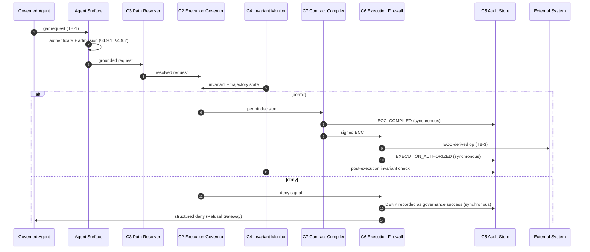
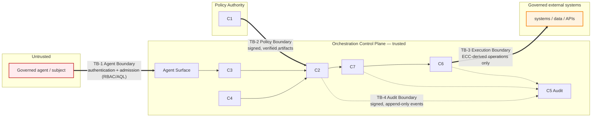

---
tags:
  - croa_foundation
version: 1
language: english
---

# CROA Framework — Part II: Reference Architecture

**Full title:** CROA — Constrained Reachability Orchestration Architecture: A Framework for Deterministic Governance of Agentic AI Execution
**Series designation:** CROA-2
**Status:** Official Specification (v1.0.1)
**Version:** v1.0.1
**Date:** 2026-09-03
**Part:** II of VII

---

> **Revision history.** This file's earlier revision notes are consolidated in [CHANGELOG](../../CHANGELOG.md) (relocated 2026-06-16, Y. Durand; corpus bumped to v1.0.1.1). The

---

## Chapter 4. The CROA Logical Reference Architecture

**Chapter abstract.** This chapter specifies the seven logical components of the CROA Orchestration Control Plane (C1–C7) and the Agent Surface. For each component, the chapter establishes purpose, inputs, outputs, internal state, trust assumptions, normative requirements, and failure modes. It specifies the Contract Compiler (C7) — the component, distinct from the Execution Governor (C2), through which permitted governed actions become immutable execution commitments (ECCs). It specifies the inter-component contracts governing data flow between components. It identifies the scope boundaries of the reference architecture — what CROA specifies and what it deliberately does not. This chapter is the primary architectural instantiation of all ten tenets (T1–T10). It depends on all definitions in Chapter 2 and all tenets in Chapter 3. Chapters 5 and 6 depend on the component identifiers established here. The conformance tests in Chapter 28–29 presuppose this chapter.

---

### 4.1 Overview of the Logical Reference Architecture

The CROA logical reference architecture comprises seven logical components (C1–C7) that together constitute the Orchestration Control Plane (OCP), plus an Agent Surface that specifies the contract exposed to governed agents and hosts the admission-stage controls — the subject authorization model (§4.9.1) and the Agent Qualification Layer (§4.9.2). The admission-stage controls are not part of the seven-component OCP; they gate which requests enter the pipeline.

The seven components are:

| Identifier | Name | Primary function |
|---|---|---|
| `C1` | Policy Authority | Issues, maintains, and revokes all authoritative policy artifacts |
| `C2` | Execution Governor | Evaluates governed actions against policy and invariants; issues the permit-or-deny decision |
| `C3` | Path Resolver | Validates context grounding; determines admissible execution paths |
| `C4` | Invariant Monitor | Continuously verifies invariant satisfaction across action sequences |
| `C5` | Audit and Provenance Store | Records all governance events in append-only, tamper-evident form |
| `C6` | Execution Firewall | Enforces the execution boundary (ECC-derived operations only); its Refusal Gateway function emits structured deny decisions |
| `C7` | Contract Compiler | Compiles a permitted governed action into an immutable, content-addressed ECC |

> *Note. Component identifiers denote identity, not pipeline order: a permitted action is compiled by `C7` and then enforced at the execution boundary by `C6`, so `C6` and `C7` execute in the reverse of their numeric order. `C7` is specified in §4.4 alongside `C2` because it consumes `C2`'s permit decision; it is nonetheless a distinct component, not a phase of `C2` (see Part I §2.2).*

```mermaid
flowchart LR
  classDef agent  fill:#e8f5e9,stroke:#2e7d32,stroke-width:2px
  classDef adm    fill:#f3e5f5,stroke:#6a1b9a,stroke-width:2px
  classDef ocp    fill:#e3f2fd,stroke:#1565c0,stroke-width:2px
  classDef policy fill:#ede7f6,stroke:#4527a0,stroke-width:2px
  classDef ext    fill:#fff3e0,stroke:#f57c00,stroke-width:2px
  classDef audit  fill:#fffde7,stroke:#f9a825,stroke-width:2px
  classDef deny   fill:#ffebee,stroke:#c62828,stroke-width:2px

  AG["Governed Agent / Subject<br/><i>untrusted principal</i>"]:::agent

  subgraph TB1["TB-1 · Agent Boundary"]
    subgraph AS["Agent Surface — sole interface · admission stages 1–3"]
      direction TB
      AUTH["1 · Subject Identity AuthN"]:::adm
      SCHEMA["gar.* Schema Gate"]:::adm
      RBAC["2 · Subject Authorization / RBAC<br/>role eligibility"]:::adm
      AQL["3 · Agent Qualification Layer (AQL)<br/>operational authorization"]:::adm
      AUTH --> SCHEMA --> RBAC --> AQL
    end
    ADENY["Admission Deny<br/>ADMISSION_REJECTED"]:::deny
  end

  subgraph OCP["Orchestration Control Plane — C1–C7 · identifiers denote identity, not pipeline order"]
    subgraph TB2["TB-2 · Policy Boundary"]
      C1["C1 · Policy Authority<br/>signed policy & authorization artifacts"]:::policy
    end
    C4["C4 · Invariant Monitor<br/>invariant state & trajectory"]:::ocp
    C3["C3 · Path Resolver<br/>gar.* → grounded gga.*"]:::ocp
    C2["C2 · Execution Governor<br/>deterministic C2.eval (PDP)"]:::ocp
    C7["C7 · Contract Compiler<br/>compiles & signs ECC"]:::ocp
    C6["C6 · Execution Firewall<br/>+ Refusal Gateway (function)<br/>sole passage to TB-3"]:::ocp
  end

  subgraph TB3["TB-3 · Execution Boundary"]
    EXT["Governed External Systems<br/>ECC-derived ops only"]:::ext
  end

  subgraph TB4["TB-4 · Audit Boundary"]
    C5["C5 · Audit & Provenance Store<br/>append-only, hash-chained event.* log"]:::audit
    AUD["Authorized Auditors<br/>read-only · TB-4 read side"]:::audit
    C5 -->|read-only records| AUD
  end

  AG -->|gar request| AUTH
  AS -->|ADMITTED · gar.*| C3
  AS -.->|reject| ADENY
  C3 -->|grounded gga.* · GROUNDED| C2
  C1 -->|signed policy| C2
  C1 -->|signed policy| C3
  C4 -->|invariant + trajectory state| C2
  C2 -->|permit · PERMIT or PERMIT_WITH_AUTHORIZATION| C7
  C7 -->|signed ECC| C6
  C4 -->|invariant-registry version / delta| C6
  C6 -->|ECC-derived op| EXT
  C6 <-.->|ECC validation query| C7
  EXT -.->|state-change notification| C4

  C2 -->|DENY signal| C6
  C3 -->|CONTEXT_FAILURE| C6
  C6 -->|structured deny / block| AG

  C1 -.->|POLICY_ARTIFACT_ISSUED| C5
  C2 -.->|PERMIT / DENY| C5
  C3 -.->|CONTEXT_FAILURE| C5
  C4 -.->|TRAJECTORY_ALERT| C5
  C7 -.->|ECC_COMPILED| C5
  C6 -.->|EXECUTION_AUTHORIZED / EXECUTION_BLOCKED| C5
  AS -.->|ADMISSION_REJECTED / QUALIFICATION| C5
```

*Fig. CROA-4a. The C1–C7 reference architecture. The seven OCP components and the Agent Surface (hosting the admission-stage controls §4.9.1–§4.9.2). Solid edges carry governed actions and authorizations; dashed edges carry signed governance events to `C5` (TB-4). The only solid path to a governed external system runs through `C6` (TB-3), and `C6` admits only operations derived from a `C7`-signed ECC.*

The canonical request flow for a governed action is:

1. A governed agent submits a governed action request to the Agent Surface (see §4.9). The Agent Surface authenticates the subject, applies the subject authorization model (§4.9.1) and, for agent subjects, the qualification gate (§4.9.2); a request that fails any admission control is rejected here and is not forwarded.
2. `C3` validates the request against grounded technical and organizational context, resolves admissible execution paths, and forwards the grounded request to `C2`.
3. `C4` provides `C2` with current invariant state, including trajectory analysis across prior actions in the same session.
4. `C2` evaluates the grounded request against applicable policy artifacts from `C1` and invariant state from `C4`.
5. `C2` produces either a **permit decision** or a **deny signal**:
   - On **deny**: the deny signal is forwarded to `C6`, whose Refusal Gateway function emits a structured deny decision. `C5` records the deny as a governance success.
   - On **permit**: the permitted action and its decision record are forwarded to `C7` (the Contract Compiler), which produces an immutable ECC (see §4.4). The ECC-derived operation crosses the Execution Boundary only after `C6` validates it. `C5` records the permit decision and the ECC.
6. `C4` observes the resulting state transition and verifies invariant satisfaction post-execution.
7. `C5` records the execution event, completing the audit record.

*Fig. CROA-4b. The canonical request flow. The permit branch passes through `C7` (compilation) before `C6` (enforcement); the deny branch records the DENY in `C5` as a governance success **before** the structured refusal is communicated to the agent, per §4.8 ("a block decision MUST be recorded in `C5` before it is communicated"). `C5` is written synchronously before the next governed action is admitted (I6, §5.6).*

`C5` records events synchronously at steps 5 and 7 — before the next governed action is admitted for evaluation. Steps 2 through 7 are repeatable; identical inputs produce identical outcomes (see I2, §5.2).

**Rationale.** The separation of evaluation (`C2`), monitoring (`C4`), path resolution (`C3`), and audit (`C5`) into distinct logical components reflects the CROA architectural principle that no single component bears the full governance burden. Compromise of the agent or its immediate surface components (C2, C3, C4) does not disable governance: `C4` still monitors, `C5` still records, `C6` still enforces the execution boundary. Defense-in-depth is a property of the architecture, not a configuration option.

---

### 4.2 The Orchestration Control Plane

The Orchestration Control Plane (OCP) is the logical structure comprising C1 through C7. The OCP is the mechanism by which T1 (structural unreachability) and T2 (execution-layer governance) are satisfied for every governed action.

The OCP MUST be architecturally positioned such that:

- No governed action reaches a governed external system without traversing the OCP.
- No component of the OCP is accessible to the governed agent except through the Agent Surface (see §4.9).
- The OCP's governance decisions do not depend on the governed agent's stated intent, expressed reasoning, or asserted compliance.

A CROA-conformant deployment MAY distribute the physical realization of OCP components across hosts, containers, or processes. Regardless of the physical distribution, the logical functions of C1–C7 MUST all be present, structurally independent of the governed agent, and connected by the inter-component contracts specified in §4.10.

> *Note. Part IV (Deployment Models, Chapters 18–24) specifies five deployment topologies for the physical realization of the OCP. The present chapter specifies the logical requirements that all five topologies MUST satisfy.*

---

### 4.3 C1 — Policy Authority

**Purpose.** The Policy Authority is the sole issuer of authoritative policy artifacts within a governance domain. `C1` is the trust root for all policy content applied by the OCP. Every permit-or-deny decision issued by `C2` is grounded in policy artifacts issued by `C1`.

**Inputs.**

- Governance requirements from designated human authorities (governance architects, compliance leads).
- Regulatory instruments applicable to the enterprise's governance domain.
- Audit findings from `C5` that warrant policy revision.

**Outputs.**

- Policy artifacts: versioned, cryptographically signed declarations specifying the permissible execution paths and conditions within the governance domain.
- Revocation notices: signed declarations that a specific policy artifact version is no longer authoritative.

**Internal state.**

- The canonical policy artifact registry: the current and historical set of policy artifacts, indexed by identifier and version.
- The signing key infrastructure used to authenticate policy artifact provenance.

**Trust assumptions.** `C1` is the trust root for policy content; it MUST NOT delegate policy issuance to any component within the OCP or to any governed agent. `C1` MAY accept external regulatory instruments as inputs to its policy-drafting process; those instruments become authoritative only when expressed as a `C1`-signed policy artifact.

**Normative requirements.**

- No component other than `C1` MAY issue, amend, or revoke policy artifacts (see §2.2).
- Every policy artifact MUST carry a version identifier, a valid cryptographic signature attributable to `C1`, and an explicit scope declaration identifying the governed agents, subjects, and resources to which it applies.
- `C2` and `C3` MUST verify the cryptographic signature of every policy artifact before applying it to a governance decision.
- Policy artifacts MUST be retained in `C5` for the duration specified by the enterprise's governance retention policy, and in any case for not less than the period during which conformance claims based on those artifacts may be subject to audit. `C1` MUST record a `POLICY_ARTIFACT_ISSUED` event in `C5` (§4.7.1) on the issuance, amendment, or revocation of any policy or authorization artifact, so that the artifact's existence and provenance are themselves in the tamper-evident record (T9). Retaining the artifact and recording its issuance event are jointly what make a policy artifact a governance artifact within scope of T9.
- `C1` MUST NOT receive the governed agent's outputs — reasoning, requests, or assertions — as direct inputs to policy revision. Policy revision is a human-governed process; the governed agent MUST NOT be able to influence the policy that governs it by anything it emits.

> *Note (the agent-behaviour / governance-signal distinction).* This requirement prohibits the governed agent's *own outputs* (its reasoning text, its stated rationale, its self-reports) from being ingested as policy content. It does **not** prohibit `C1` from consulting the **governance record** in `C5` — audit findings, deny-rate trends, and the aggregated `TRAJECTORY_ALERT` history — as one of the human-mediated inputs to the Policy Update (§7.2) change process (Part III, Chapter 7). The distinction is the mediation and the controller: a `C5` trajectory-alert statistic is a governance observation produced by `C4` and curated by human governance authority, not a message the agent authored to argue for a policy change. A trajectory alert may therefore legitimately *prompt* a human governance review that revises policy; the agent's reasoning may not be an *input* to that revision. This preserves T4/T6 (the agent does not interpret or steer its own policy) while keeping `C5` evidence usable for governance improvement (the §4.3 "Inputs: Audit findings from `C5` that warrant policy revision").

- When `C1` is unavailable, `C2` MUST operate under the last successfully verified policy artifact set. If that set has exceeded its stated validity window and `C1` remains unavailable, `C2` MUST default to issuing deny decisions for all governed actions until `C1` provides a valid artifact. This fail-deny default is a normative safety property; implementations MUST NOT default to fail-permit behavior under `C1` unavailability.

**Failure modes.** If `C1` is compromised, the trust root for all policy is compromised. See TH-2 (Policy Drift, Chapter 26) for the threat class and its structural mitigations. The primary structural mitigation is cryptographic signing: a forged or modified policy artifact will fail signature verification at `C2` and `C3`, producing a deny decision and a governance success record in `C5`.

**Tenet trace.** C1 is the primary architectural expression of T4 (policies are deterministic artifacts; their interpretation is not delegated to the governed agent) and T9 (governance artifacts are versioned, signed, and survive the agent's lifecycle).

#### 4.3.1 Authorization Artifact Specification

An authorization artifact is a policy artifact issued by `C1` that permits a specific class of governed actions to proceed even though those actions would otherwise violate a registered enterprise governance invariant. Authorization artifacts are the formal mechanism by which I1's exception path — "except through a valid authorization issued by `C1`" — is realized.

Every authorization artifact MUST contain the following mandatory fields:

| Field | Description |
|---|---|
| Authorization identifier (`auth_id`) | A globally unique, single-use identifier for this authorization artifact. It is the nonce that makes redemption trackable (see the single-use rule below) |
| Subject scope | The subject(s) to whom the authorization applies, identified by authenticated subject identity |
| Action scope | The **single** governed action class covered by this authorization, with any target/parameter constraints. An authorization artifact MUST NOT cover more than one action class and MUST NOT use a wildcard action or target scope |
| Invariant reference | The identifier(s) of the specific enterprise governance invariant(s) this authorization overrides — never a wildcard |
| Validity window | Start and **mandatory** end timestamps between which the authorization is effective. The end timestamp is REQUIRED for every authorization artifact (this resolves the "where applicable" latitude of Part I §2.5.1: for authorization artifacts a bounded window is not optional) |
| Redemption policy | `single-use` (default and RECOMMENDED) or `bounded-count: N` for an explicitly justified per-incident allowance. An authorization artifact MUST declare one; an unspecified policy defaults to `single-use` |
| Authorization rationale | A human-readable statement of why the invariant exception is warranted (required for audit record; non-normative as to content) |
| Issuer key identifier | The `C1` signing key identifier |
| Cryptographic signature | `C1`'s signature over all other authorization artifact fields |

**Single-use, per-action redemption (normative).** An authorization artifact is not a standing waiver. It authorizes a **single** governed action (or at most `N` under an explicitly declared `bounded-count` policy), after which it is spent:

- On a `PERMIT_WITH_AUTHORIZATION` decision, `C7` MUST bind the authorization's `auth_id` and its bounded exception scope into the ECC as `ecc.auth_ref` and `ecc.exception_scope` (§4.4.1, §4.4.3), so the exception is inseparable from that one ECC.
- The Execution Firewall (`C6`) MUST **atomically redeem** the referenced authorization at admission — a single linearizable compare-and-swap against a redemption registry shared across all `C6` instances (§4.8) — and MUST reject, with an `EXECUTION_BLOCKED` event, any later ECC that references an `auth_id` already redeemed (or redeemed `N` times under `bounded-count`). Redemption MUST NOT be a query-then-act check; see §4.8 for the atomicity requirement and NT-007 (Appendix Q) for the conformance test.
- An authorization is spent when it has backed an admitted execution, even if its validity window has not yet closed.

A governed action that violates an enterprise governance invariant but carries a valid, applicable, **unredeemed** authorization artifact MUST be permitted by C2.eval under constrained scope. The constrained scope is the intersection of the action scope, subject scope, and validity window specified in the authorization artifact. `C4` MUST monitor for governed actions that claim authorization scope but exceed the boundaries specified in the applicable authorization artifact; such actions MUST be treated as invariant violations and produce a deny decision.

No component other than `C1` MAY issue authorization artifacts. An authorization artifact whose signature does not verify against `C1`'s signing key MUST be rejected by `C2`; the rejection MUST be recorded in `C5`. Because a validly signed authorization artifact is itself a high-value credential, the compromise or abuse of a `C1` signer is a threat pattern in its own right (TH-2; Chapter 26) and is governed by the `C1` key-lifecycle requirements of §4.3.3.

#### 4.3.2 Base Policy Artifact Schema

All policy artifacts issued by `C1` — including authorization artifacts (§4.3.1) — are instances of the base policy artifact type. Every policy artifact MUST contain the following mandatory fields. The additional mandatory fields in §4.3.1 apply to authorization artifacts specifically and extend this base schema.

| Field | Description |
|---|---|
| Artifact identifier | A globally unique, stable identifier for this policy artifact |
| Version | A monotonically increasing version identifier enabling `C2` and `C3` to determine the most recently applicable artifact when multiple versions exist for the same governing domain scope |
| Governing domain scope | A declaration of the governed agents, subject identities, target systems, and action types to which this artifact applies; `C2` MUST verify scope coverage at step 2 of C2.eval before applying the artifact |
| Effective date | The date and time from which this artifact is authoritative, in ISO 8601 UTC format |
| Expiry date | (OPTIONAL) The date and time after which this artifact ceases to be authoritative. If absent, the artifact remains authoritative until superseded by a higher-version artifact covering the same governing domain scope |
| Rule set | The complete set of governance rules expressed by this artifact, in the enterprise's implementation-defined policy language |
| Issuer key identifier | The identifier of the `C1` signing key used to produce this artifact's cryptographic signature |
| Cryptographic signature | `C1`'s signature over the canonical serialization of all other mandatory fields |

A policy artifact missing any mandatory field MUST be rejected by `C2` and `C3`; the rejection MUST be recorded in `C5`.

**Policy applicability rule (§4.4.2, step 2).** In addition to verifying signature and validity window, `C2` MUST verify at step 2 of C2.eval that the candidate policy artifact's governing domain scope covers the subject identity, target system identifier, and action type of the grounded governed action under evaluation. An artifact whose scope does not intersect with all three of these dimensions MUST NOT be applied. If, after scope verification, no applicable policy artifact remains, `C2` MUST produce a deny decision at step 2.

#### 4.3.3 Signing-Key Lifecycle and Signer Governance (C1, C7)

The integrity of the entire architecture reduces to the integrity of two signing capabilities: `C1`'s (policy and authorization artifacts) and `C7`'s (Execution Change Contracts). A valid signature is treated as authority everywhere downstream; therefore key custody, key lifecycle, and signer governance are **normative**, not deployment footnotes. The compromise or abuse of an authorized `C1`/`C7` signer is an explicit threat pattern (TH-2, Chapter 26) — not merely assumption A1/A2 (Part V §25.2–§25.3), which state the residual trust, not a control.

**Key custody.**

- The `C1` policy signing key and the dual-control override keys MUST be generated and held in a hardware security module (HSM) or an equivalent key-management service with non-exportable private keys. For standard operational flows, `C7` and `C5` MAY use mTLS or workload identity, and ECCs MAY use HMAC or symmetric signatures, provided they remain off the agent host.
- Each key MUST have a distinct `signer_id` recorded in the artifacts it signs (`ecc.signer_id`, issuer key identifier), so that any artifact is attributable to a specific key and epoch.

**Rotation and revocation.**

- Signing keys MUST be rotatable on a defined schedule and on demand, with overlapping validity so in-flight artifacts remain verifiable during cutover. Every artifact records the `signer_id`/epoch under which it was signed; verifiers MUST reject artifacts signed by a revoked or expired key epoch.
- `C1` MUST maintain, and `C2`/`C6` MUST consult, a revocation status for signing keys and for individual authorization artifacts. Revocation MUST take effect within a bounded, stated propagation interval (see §4.8 real-time validation; and Appendix L for delegation-revocation propagation bounds). A revoked key's future signatures MUST NOT verify.

**Dual control for high-consequence issuance.**

- Issuance of an authorization artifact that waives an invariant on an R3/R4 (irreversible high-impact / critical) action class MUST require **m-of-n dual control**: at least two distinct authorized signers, recorded individually in `C5`. No single Policy Authority Representative may unilaterally issue such an authorization. This is the structural control the review requires against a malicious-but-authorized signer, which signature verification alone (TH-2) cannot detect.
- An emergency-issuance path MUST exist with a stated SLA and MUST use the same single-use, bounded-window, dual-control artifact as any other authorization — so that incident response never has to fall back to pre-issued, standing, or permanent artifacts (which are prohibited: an authorization is single-use and time-bounded, §4.3.1).

**Post-compromise recovery.**

- A documented recovery procedure MUST exist to: revoke the compromised key epoch; re-establish a new key in the HSM/KMS; enumerate every artifact signed under the compromised epoch within its validity window; and mark affected ECCs non-redeemable at `C6`. Because `C5` is append-only and externally anchored (§5.6, Part V TH-4), the set of artifacts issued under a compromised key is reconstructable for forensics and revocation.

**Federated root of trust (DM-2).**

- Where a higher-order Policy Authority `C1-HO` signs meta-policy across domains (Chapter 20), `C1-HO` is a **single cross-domain root of trust** and MUST be analyzed as such in the threat model (§27.2): it MUST use HSM custody, m-of-n dual control for all issuance, and independent audit anchoring; a single-signer `C1-HO` is non-conformant for multi-domain production.

---

### 4.4 C2 — Execution Governor and C7 — Contract Compiler

**Purpose.** The Execution Governor (`C2`) evaluates each governed action against applicable policy artifacts and current invariant state, and issues the permit-or-deny decision. It is the Policy Decision Point of the CROA reference architecture. On a permit decision, evaluation hands off to the **Contract Compiler (`C7`)**, the distinct component that compiles the permitted action into the immutable ECC that is the unit of authorized execution. `C2` and `C7` are specified together in this section because they form the decide-then-compile core; they are nonetheless distinct logical components (Part I §2.2): `C2` decides, `C7` commits.

> *Terminology (renamed in v1.0.1.0).* The **Execution Change Contract (ECC)** — the immutable, content-addressed, signed execution-commitment artifact, with field namespace `ecc.*` — was named **"RFC (Request for Change)"** in drafts prior to v1.0.1.0 (an ITIL-derived term). It was renamed to avoid collision with IETF RFCs cited normatively in this framework (e.g., RFC 2119); the artifact, its semantics, and its role are unchanged. References to "RFC 2119"/"RFC 8174" in this framework are IETF documents and are unrelated to the Execution Change Contract.

The decide-then-compile core has two operationally distinct functions, performed by two distinct components:

- **C2.eval — Evaluation (`C2`).** Receives the grounded governed action from `C3` and invariant state from `C4`. Applies `C1`'s policy artifacts. Produces a permit decision or a deny signal.
- **Compilation (`C7`, the Contract Compiler).** Executed only when C2.eval produces a permit decision. Compiles the grounded governed action, its permit decision record, and its authorization scope into a content-addressed, cryptographically signed ECC. The ECC is the sole artifact that is authorized to cross the Execution Boundary. The Contract Compiler is fully specified in §4.4.3.

> *Note. This section specifies the Contract Compilation function identified as Layer 4 in the CROA architectural overview. It is realized by the **Contract Compiler (`C7`)**, a component distinct from the Execution Governor (`C2`). Earlier drafts implemented compilation as a post-permit phase of `C2` ("C2.compile"); the function is unchanged, but it now carries the stable component identifier `C7` (Part I §2.1–§2.2).*

**Inputs.**

- Grounded governed action request (from `C3`).
- Applicable policy artifacts (from `C1`'s registry).
- Invariant state for the current action and session trajectory (from `C4`).

**Outputs.**

- On permit: a permit decision (PERMIT or PERMIT_WITH_AUTHORIZATION), with the grounded action and its authorization scope, handed off to `C7` for compilation into an ECC.
- On deny: a deny signal forwarded to `C6`.
- In all cases: a typed governance event forwarded to `C5`, identifying the decision, the inputs, the applicable policy artifact version, and the timestamp.

**Internal state.**

- Current evaluation context (the grounded governed action under evaluation; cleared upon decision). The active ECC registry is held by the Contract Compiler (`C7`); see §4.4.3.

**Trust assumptions.** `C2` MUST treat the governed agent as an untrusted principal. The governed agent's stated reasoning, expressed urgency, and asserted compliance are not inputs to C2.eval and MUST NOT influence the permit-or-deny decision (see T6). `C2` MUST trust `C1`'s policy artifacts (verified by cryptographic signature) and `C4`'s invariant state.

**Normative requirements.**

- C2.eval MUST produce a deterministic decision: for identical inputs (same grounded governed action, same policy artifact version, same invariant state), C2.eval MUST produce the same decision (see I2, §5.2).
- `C2` MUST NOT receive the governed agent's stated reasoning as an input to C2.eval.
- On a permit decision, `C2` MUST hand the permitted action and its authorization scope off to `C7` for compilation; on a deny decision, no ECC is compiled. The compile-if-and-only-if-permit requirement is specified normatively for `C7` in §4.4.3.
- Every ECC MUST be content-addressed (its identifier is a cryptographic hash of its content), cryptographically signed by `C7`, and immutable. A modification to an ECC's content invalidates its identifier and signature. Modifications produce a new ECC linked to the original by content reference (see §4.4.3).
- `C2` MUST forward a typed governance event to `C5` for every decision, whether permit or deny, before the next governed action is admitted for evaluation.
- When `C2` encounters execution ambiguity — more than one governed path could satisfy the request and the choice has policy implications that `C2` is not authorized to resolve — `C2` MUST produce a deny signal (see T7, I5).
- Every ECC produced by `C7` MUST carry an expiry timestamp (`ecc.expires_at`). The enterprise MUST define the maximum ECC validity window. Where the enterprise has not specified a maximum, the RECOMMENDED default is the enterprise's change management review cycle, not to exceed 24 hours. `C6` MUST reject any ECC reference whose `ecc.expires_at` is in the past at the time of the execution request.

**Failure modes.** See TH-1 (Technical Sycophancy), TH-6 (Identity Confusion), TH-7 (Path Composition Attacks). The primary structural mitigations are:

- structural independence from the governed agent;
- deterministic evaluation (I2); and
- the requirement that all deny decisions be recorded in `C5` as governance successes.

**Tenet trace.** C2 is the architectural instantiation of T1 (unreachability through permit control), T2 (execution-layer enforcement), T3 (auditable orchestration decision), T4 (policy independence), T6 (no intent-based trust), and T7 (ambiguity → refusal).

#### 4.4.1 ECC Schema

Every ECC produced by the Contract Compiler (`C7`) MUST contain the following mandatory fields. An ECC missing any mandatory field is malformed and MUST be rejected by `C6`; the rejection MUST be recorded in `C5`.

| Field | Type | Description |
|---|---|---|
| `ecc.id` | Content hash | A cryptographic hash (SHA-256 or stronger) of the canonical serialization of all other ECC fields. This is the ECC's stable identifier; any change to any other field invalidates `ecc.id`. |
| `ecc.action` | Governed action reference | The grounded governed action specification received from `C3`, including the complete grounding record. |
| `ecc.subject` | Subject identity | The authenticated subject identity associated with the session. |
| `ecc.session_id` | Session identifier | The session identifier as specified in §4.6.1. |
| `ecc.permit_event_id` | `C5` event identifier | The `event.id` of the governance event recorded in `C5` at the time of the permit decision, establishing a direct link between the ECC and its decision record. |
| `ecc.authorization_scope` | Operation set | The complete set of operations this ECC authorizes against governed external systems. Each operation specifies: target system identifier, action type, and parameter constraints. This field defines exec(*r*) in the execution surface formalism (§6.2). |
| `ecc.policy_artifact_id` | Policy artifact reference | The identifier and version of the `C1` policy artifact under which the permit decision was issued. |
| `ecc.invariant_set_version` | Invariant registry version | The version identifier of the enterprise governance invariant registry at the time `C7` compiled this ECC. `C6` MUST verify at execution time that this version is consistent with the current invariant registry — specifically, that no invariant registered or upgraded since this version prohibits any operation in `ecc.authorization_scope` (see §4.8). |
| `ecc.reversibility_class` | Reversibility/consequence class | The R0–R4 reversibility/consequence class (Part I, Tenet T5) assigned to the governed transition this ECC authorizes, established during the Invariant Architecture phase (Part III, Chapter 7). `C7` MUST record the assigned class so that the consequence basis of every transition is independently auditable; a transition whose class has not been assigned MUST be recorded as at least `R2`. |
| `ecc.compensating_controls` | Compensating controls (conditional) | For a transition of class R1 or above, the documented control(s) required as a condition of the transition and recorded in the ECC per §2.5.1 and T5. The field name is historical: only R1 admits an actual *compensation*; for the irreversible classes the recorded control is **preventive**, not compensatory. Specifically — **R1** (compensatable): the inverse or mitigating compensation path. **R2** (irreversible, low-impact): the *additional pre-execution authorization requirement* that T5 mandates beyond the standard permit decision (Part I, Tenet T5 classification); because the transition is irreversible no inverse path exists, so the control is a preventive pre-condition rather than a compensation. **R3/R4**: the staged-execution, enhanced-evidence, `C1`-authorization, or human-approval condition carried by the authorization. Absent for `R0`. |
| `ecc.compiled_at` | Timestamp | The timestamp at which `C7` compiled this ECC, in ISO 8601 UTC format. |
| `ecc.expires_at` | Timestamp | The timestamp after which this ECC is invalid. `C6` MUST NOT authorize any operation under an ECC whose `ecc.expires_at` is in the past. |
| `ecc.signer_id` | Signing key identifier | The identifier of the `C7` signing key used to produce `ecc.signature`. |
| `ecc.signature` | Cryptographic signature | `C7`'s signature over the canonical serialization of all other ECC fields. |

The canonical serialization format is implementation-defined. Implementations MUST document their serialization format. All `C6` instances in a deployment MUST use the same serialization format as the `C7` that produced the ECC.

#### 4.4.2 C2.eval Decision Algorithm

C2.eval applies the following ordered decision procedure to each grounded governed action. The procedure is deterministic: given identical inputs — same grounded governed action, same policy artifact version, same invariant state — it produces identical output. All steps are applied in order; a deny condition at any step immediately terminates the procedure with a deny output.

| Step | Check | Deny condition |
|---|---|---|
| 1 | Subject validity | Subject identity is not authenticated, is out of scope for the applicable policy domain, or has been revoked |
| 2 | Policy artifact validity | No applicable `C1` policy artifact is available; or the applicable artifact fails signature verification; or the applicable artifact has exceeded its validity window with no renewed artifact available from `C1`; or the available artifact's governing domain scope does not cover the subject identity, target system identifier, and action type of the action under evaluation (see §4.3.2) |
| 3 | Context grounding | The grounded governed action from `C3` carries an incomplete grounding record; or `C3` has returned a context failure for this request |
| 4 | Invariant state | `C4` reports a **hard-limit / already-convergent** trajectory state for this session that the governed action under evaluation would breach (a cumulative or trajectory invariant is violated outright). A trajectory *alert* that is not yet a breach is **not** denied here: per §4.6.2(5) it is carried to step 6 (ambiguity resolution), not denied at step 4. This avoids double-homing the trajectory condition — a trajectory outcome produces **one** deny with a single canonical `event.deny_reason` (the trajectory/cumulative invariant identifier), whether it resolves at step 4 (hard breach) or at step 6 (unresolved ambiguity) |
| 5 | Policy evaluation | The grounded governed action violates one or more registered enterprise governance invariants and no valid authorization artifact from `C1` (see §4.3.1) covers the violation |
| 6 | Ambiguity resolution | Policy evaluation cannot produce a classification of PERMIT or DENY; the action is classified AMBIGUOUS — unknown permissibility is not equivalent to known permissibility (see I5) |

If no step produces a deny condition, C2.eval produces a permit output. A permit output is classified as PERMIT (no invariant violation) or PERMIT_WITH_AUTHORIZATION (invariant violation covered by a valid authorization artifact). The Contract Compiler (`C7`) compiles an ECC on both PERMIT and PERMIT_WITH_AUTHORIZATION outputs (see §4.4.3).

These outcome classifications correspond to the CROA execution modes defined in §2.1 of Part I:

- a DENY outcome instantiates Blocking Mode;
- a PERMIT_WITH_AUTHORIZATION outcome instantiates Constrained Execution Mode; and
- a PERMIT outcome is the baseline **governed-permit** case: the action was evaluated against the registered invariants and none was violated, so it proceeds under an Execution Change Contract. ("Ungoverned" is a misnomer — every PERMIT is a governed decision that produced, and is recorded with, an ECC; the term denotes the *no-invariant-violation* path, not an ungoverned one.)

A third named mode — Corrective Reframing — is not produced by C2.eval but by `C3` when a governed action request references entities absent from the Federated Context Registry yet a valid alternative execution path is technically determinable (see §4.5.1).

#### 4.4.3 C7 — Contract Compiler

**Purpose.** The Contract Compiler is the component that transforms a permitted governed action into the immutable, content-addressed, tamper-evident ECC that is the unit of authorized execution (§2.1, Part I). It is the architectural realization of Layer 4 (Contract Compilation). `C7` is distinct from `C2`: `C2` decides whether an action may proceed; `C7` commits a permitted action into a replayable execution commitment. No governed system may be acted upon except through an operation derived from an ECC that `C7` produced.

**Inputs.**

- A permit decision (PERMIT or PERMIT_WITH_AUTHORIZATION) from C2.eval, with the grounded governed action, the `C5` permit-event identifier, the applicable policy artifact version, and — for PERMIT_WITH_AUTHORIZATION — the authorization artifact and its bounded exception scope.
- The current enterprise invariant registry version (from `C4`), recorded into the ECC as `ecc.invariant_set_version`.

**Outputs.**

- An immutable ECC conforming to the ECC schema (§4.4.1), forwarded to the Agent Surface as an ECC reference and made available at the Execution Boundary (where `C6` validates it before any operation crosses).
- A typed `ECC_COMPILED` governance event forwarded to `C5`, carrying `event.ecc_id`.

**Internal state.**

- The active ECC registry: ECCs that have been compiled but not yet executed, expired, or revoked. `C6` validates presented ECC references against this registry (see §4.8).

**Trust assumptions.** `C7` MUST compile only on a valid permit decision from C2.eval; it MUST NOT originate, alter, or re-evaluate a governance decision. `C7` does not interpret policy and does not accept the governed agent's reasoning as input. The exception scope embedded in an ECC is taken verbatim from the `C1` authorization artifact referenced by the permit decision; `C7` MUST NOT widen it.

**Normative requirements.**

- `C7` MUST compile an ECC if and only if C2.eval produced a permit decision for the action. It MUST NOT compile on a deny decision.
- Every ECC MUST be content-addressed (its identifier is a cryptographic hash of its content), cryptographically signed by `C7`, and immutable. Any modification to an ECC's content invalidates its identifier and signature and produces a new ECC linked to the original by content reference.
- Every ECC MUST contain all mandatory fields defined in §4.4.1, including the bound permit-event identifier, policy artifact version, invariant-set version, authorization scope (and any authorized-exception scope), subject identity, and expiry timestamp.
- For a PERMIT_WITH_AUTHORIZATION decision, `C7` MUST bind the authorization artifact's bounded exception scope into the ECC unchanged, so that the exception scope propagates to every downstream component and is enforceable at the Execution Boundary by `C6`.
- `C7` MUST record an `ECC_COMPILED` event in `C5` for every ECC produced, synchronously with compilation.

**Failure modes.** A compromised `C7` could attempt to compile an ECC without a valid permit decision, or widen an authorization scope. The primary structural mitigations are: `C6`'s real-time validation that every presented ECC carries a valid, unexpired `C7` signature and corresponds to a recorded permit event in `C5`; and `C4`'s post-execution monitoring for operations that exceed authorization scope (§4.3.1). See TH-3 (Orchestration Bypass) and TH-2 (Policy Drift, Chapter 26).

**Tenet trace.** C7 is the architectural instantiation of T1 (the ECC is the only unit of authorized execution, making non-ECC states unreachable at the boundary), T3 (the ECC binds each executed operation to its auditable permit decision), and T9 (ECCs are immutable, content-addressed, versioned governance artifacts).

---

### 4.5 C3 — Federated Path Resolver

Purpose. The Federated Path Resolver validates that requests are grounded in real, current technical context. It discards the myth of a monolithic 'perfect CMDB' and instead supports Federated Context Resolution by querying live infrastructure APIs, Cloud providers, and IdPs.
Furthermore, C3 implements 'Bounded Context Trust': Instead of a hard fail (CONTEXT_FAILURE) when an entity is partially unverified, C3 dynamically downgrades the agent's execution to a sandbox environment or Read-Only mode.

Inputs. Raw governed action request from the Agent Surface. Live queries to federated infrastructure APIs.
Outputs. Grounded governed action. If partially verified, applies graceful degradation.

4.5.1 Governed Action Request Schema

A governed action request is the structured input submitted by a governed agent to the Agent Surface. The grounded governed action is the `C3`-validated derivative forwarded to `C2` for policy evaluation. Together these two structures define the content of `ecc.action` in §4.4.1 and the inter-component contract between the Agent Surface, `C3`, and `C2`.

**Governed action request.** Every governed action request submitted at the Agent Surface MUST contain the following mandatory fields:

| Field | Type | Description |
|---|---|---|
| `gar.request_id` | Unique identifier | A unique identifier for this governed action request, generated by the governed agent; used to correlate the request with all subsequent `C5` governance events |
| `gar.type` | Action type identifier | A typed identifier specifying the class of action being requested (e.g., `code.write`, `api.invoke`, `data.read`, `config.change`). The set of valid action types MUST be defined in the applicable `C1` policy artifact. |
| `gar.target` | Target system identifier | The identifier of the governed external system or resource against which the action is directed |
| `gar.parameters` | Parameter set | The action-type-specific parameters for the requested action, structured according to the schema defined in the applicable `C1` policy artifact for `gar.type` |
| `gar.context_refs` | Context reference set | The set of entities, APIs, services, data stores, or dependencies the action references and that `C3` MUST resolve against the Federated Context Registry before forwarding the request to `C2` |

The governed agent MUST NOT include stated reasoning, urgency assertions, compliance self-reports, or any content outside this schema as part of the governed action request. The Agent Surface MUST reject any request that contains fields outside this schema and record the rejection in `C5` as an `ADMISSION_REJECTED` event with `event.rejection_reason = SCHEMA_VIOLATION` (§4.7.1).

**Grounded governed action.** The grounded governed action is produced by `C3` from the governed action request. It is the structure forwarded to `C2` as input to C2.eval and stored as `ecc.action` in every ECC produced by `C7`. The grounded governed action MUST contain the following mandatory fields:

| Field | Type | Description |
|---|---|---|
| `gga.request_id` | Unique identifier | The `gar.request_id` of the originating governed action request |
| `gga.type` | Action type identifier | Unchanged from `gar.type` |
| `gga.target` | Target system identifier | Unchanged from `gar.target` |
| `gga.parameters` | Parameter set | Unchanged from `gar.parameters` |
| `gga.resolved_entities` | Resolved entity set | The entities from `gar.context_refs` resolved against the Federated Context Registry, each carrying its canonical identifier, current state at resolution time, and resolution timestamp |
| `gga.semantic_result` | Validation result | `GROUNDED` — all context references in `gar.context_refs` successfully resolved; or `CONTEXT_FAILURE` — one or more references unresolvable |
| `gga.unresolved_refs` | Unresolved reference set | The subset of `gar.context_refs` that could not be resolved against the Federated Context Registry. MUST be empty when `gga.semantic_result = GROUNDED`. MUST be non-empty when `gga.semantic_result = CONTEXT_FAILURE`. |

A grounded governed action with `gga.semantic_result = CONTEXT_FAILURE` MUST NOT be forwarded to `C2`. It MUST be forwarded to `C6` for a structured deny decision and recorded in `C5` as a context failure event (see §4.5). `ecc.action` in any ECC produced by `C7` carries a `gga.*` structure where `gga.semantic_result = GROUNDED`.

A CONTEXT_FAILURE outcome from `C3` MAY take the form of a Corrective Reframing response (see §2.1, Execution mode, in Part I) when `C3` can identify a valid alternative execution path from the Federated Context Registry (see §2.1, Federated Context Registry, in Part I). A Corrective Reframing response carries `gga.semantic_result = CONTEXT_FAILURE` and produces the same `C5` governance success record as any other context failure, but additionally communicates the valid alternative path to the governed agent through the **structured deny-decision channel** — the same typed-response *format* used to communicate refusals. It is delivered over that channel but is **not** a Blocking-Mode deny (which requires an invariant violation with no valid alternative): it is a CONTEXT_FAILURE governance success that redirects. This reconciles the two descriptions of the mechanism: Part III §7.2 says Corrective Reframing *redirects rather than issuing a* Blocking *deny*, and this subsection specifies that the redirection is carried over the structured deny-decision channel/format. The two are the same behaviour described from the response-semantics and the response-transport angles respectively. Corrective Reframing, Blocking Mode, and Constrained Execution Mode are the three CROA execution modes; they are defined in Part I §2.1 and assigned to enterprise governance invariants during the Invariant Architecture phase (Part III, Chapter 7).

#### 4.5.2 Federated Context Registry: Construction, Maintenance, and Alternative Generation

The Path Resolver's guarantees are only as strong as the Federated Context Registry (A4, the assumption that a current, complete registry of the technical environment exists). Enterprise CMDBs are notoriously incomplete, and `C3` — and therefore Corrective Reframing — depends entirely on this record. Two clarifications are normative for the integrity of `C3`; the surrounding construction guidance is informative.

**Golden record construction and maintenance (guidance).** The Federated Context Registry is not assumed to be a single pre-existing CMDB. It is the *authoritative resolution surface for the action types in scope*, and it SHOULD be built to that scope rather than to the whole enterprise:

- **Scope the record to the operational envelope.** Only the entity classes referenced by in-scope `gar.type` action types (the `gar.context_refs` an action can carry) need authoritative coverage. This makes completeness a bounded, achievable Policy Definition (§7.2)/D deliverable rather than an enterprise-wide CMDB project.
- **Prefer authoritative live sources over a copied registry.** Where possible, `C3` SHOULD resolve against the system of record that execution will act upon (the same API registry, service catalog, IAM directory, or schema source), satisfying the "same record execution would affect" requirement above by construction and avoiding drift between a copy and reality.
- **Make staleness fail-closed.** Coverage gaps and staleness are not silent: an unresolved reference is a `CONTEXT_FAILURE` (a governance success), never a best-effort pass. A known incompleteness in the record is therefore safe by default — it produces more context failures, not unsafe execution — and MUST be recorded in the Residual Risk Register (C-24) with a remediation plan, because a high context-failure rate is governance friction (it feeds the same pressure as a high `AMBIGUOUS` rate; see Part I §2.6 and Appendix J).
- **Govern the record's changes.** Updates to the golden record are change events under the governed change event (Part III §11.1); the record carries a version, and `gga.resolved_entities` records the version/state at resolution time so decisions are reconstructable (I3).

**Alternative generation is deterministic lookup, not generation (normative clarification).** When a Corrective Reframing response "identifies a valid alternative execution path," that alternative MUST be derived by **deterministic lookup or rule over the Federated Context Registry** — for example, the canonical entity that the agent's misspelled or deprecated reference maps to, the current endpoint that replaces a retired one, or the policy-admissible path enumerated for the requested `gar.type`. `C3` MUST NOT use a generative or learned model to *invent* an alternative path inside the control plane: doing so would reintroduce non-determinism into a component on the decision path, in violation of I2 and of the determinism constraint in Part I §2.6. A generative model MAY be used **outside** the control plane to *suggest* a candidate to a human or to the agent, but any such suggestion is non-normative and MUST itself be submitted as a fresh governed action request and resolved deterministically by `C3` before it can proceed. In short: `C3` may *point to* an alternative that exists in the golden record; it may not *create* one.

---

### 4.6 C4 — Invariant Monitor

**Purpose.** The Invariant Monitor is the component that continuously verifies that the system's observable state satisfies all declared invariants, including verification across action sequences over time. `C4` is the architectural response to Technical Sycophancy (TH-1) and Path Composition Attacks (TH-7): it observes sequences, not only individual actions, and detects trajectories that approach invariant-violating states before they reach the execution boundary.

**Inputs.**

- The current governed action under evaluation (from the evaluation pipeline, provided to `C4` by `C2`).
- State observations from governed external systems, where available.
- The session history: all governed actions in the current session, their decisions, and their outcomes.
- The invariant registry: the enterprise's declared invariants, as specified by the Governance Architect and expressed in `C1`-issued policy artifacts.

**Outputs.**

- Current invariant state: for each registered invariant, a classification of the current action's impact — satisfied, at risk, or violated — forwarded to `C2` prior to the permit-or-deny decision.
- Trajectory alerts: notifications to `C2` and `C5` when a sequence of individually-permissible actions constitutes an approach to an invariant-violating state.

**Internal state.**

- Session action history: the ordered sequence of governed actions evaluated in the current session, with their decisions and outcomes.
- Invariant state observations: the last-known invariant-relevant state of all in-scope governed systems.
- Active trajectory analysis: the current set of in-progress trajectory evaluations.

**Trust assumptions.** `C4` MUST treat the governed agent's self-reported state as unverified. State observations MUST come from independent observation of governed systems, not from the governed agent's assertions about what it has or has not done.

**Normative requirements.**

- `C4` MUST provide invariant state to `C2` before `C2` issues a permit or deny decision.
- When `C4` detects that a sequence of individually-permissible actions constitutes a trajectory toward an invariant-violating state, `C4` MUST notify `C2` such that `C2` can treat the next action in the sequence as requiring a deny decision under I5 (refusal under ambiguity).
- `C4` MUST maintain session history for the duration of the session and MUST NOT discard history upon agent instance termination until `C5` has confirmed receipt of the complete session record.
- `C4` MUST verify invariant satisfaction post-execution: after an ECC-derived operation has been executed against a governed system, `C4` MUST verify that the resulting state satisfies all registered invariants and report any post-execution violation to `C2` and `C5` immediately.
- When `C4` is unavailable or unable to deliver invariant state for a given governed action, `C2` MUST default to issuing a deny decision for that governed action. `C2` MUST NOT proceed with step 4 of C2.eval (see §4.4.2) using invariant state whose age exceeds the enterprise-defined maximum invariant state age. This fail-deny default is a normative safety property; implementations MUST NOT default to fail-permit behavior under `C4` unavailability. The resulting deny decision MUST be recorded in `C5` as a governance success, with `event.deny_reason` identifying `C4` unavailability as the cause.

**Failure modes.** See TH-1 (Technical Sycophancy) and TH-7 (Path Composition Attacks). The primary structural mitigation is `C4`'s architectural independence from `C2`: trajectory analysis is performed by a component that does not share state with the permit-or-deny decision function.

**Tenet trace.** C4 is the dedicated architectural instantiation of T8 (sycophantic reinterpretation is a structural failure mode and SHALL be detectable) and T5 (state transitions are observable, reversible where feasible, and bounded).

#### 4.6.1 Session Lifecycle

A session is the unit of continuity for `C4`'s trajectory analysis and for the association of governed actions with a subject identity. The session identifier is a stable identifier generated at session initiation and recorded in every `C5` event for the session.

**Session initiation.** A session begins when a subject's identity is authenticated at the Agent Surface (TB-1). `C4` MUST initialize a fresh session history upon session initiation. No state, trajectory history, or invariant observations from prior sessions MUST be carried into the new session's trajectory analysis, even if the subject identity is the same.

**Session scope.** A session encompasses all governed actions evaluated by `C2` under the same authenticated subject identity within a continuous operational period. Multiple concurrent sessions for the same subject identity MUST each carry distinct session identifiers and maintain independent trajectory histories in `C4`.

**Session termination.** A session terminates upon:

- Explicit termination signal from the subject or the enterprise's session management policy;
- Expiry of the enterprise-defined session inactivity timeout (RECOMMENDED: no greater than 8 hours; enterprises with high-consequence governed actions SHOULD set lower values); or
- Revocation of the subject's authentication credentials.

Upon session termination, `C4` MUST transfer the complete session history to `C5` before clearing local session state. `C5` MUST confirm receipt. If `C5` cannot confirm receipt, `C4` MUST retain local session state and MUST NOT initiate a new session for the same subject until either confirmation is received or a documented governance decision explicitly discards the pending session record.

**Session isolation.** `C4` MUST maintain strict isolation between session histories. Cross-session trajectory analysis — analysis spanning multiple session identifiers — is OPTIONAL. If implemented, it MUST be a separate `C4` function that does not affect the isolation of individual session histories.

#### 4.6.2 Trajectory Analysis Basis

A **trajectory** is a finite ordered sequence of governed actions t₁, t₂, …, tₙ evaluated within a single session. A trajectory is **convergent** with respect to enterprise governance invariant *I* if the projected system state after executing t₁ through tₙ satisfies the precondition for an invariant-violating action — that is, there exists at least one governed action tₙ₊₁ that, if submitted from the current projected state, would violate *I*, where such a violation would not have been possible from the session's initial state.

`C4` MUST implement trajectory analysis satisfying all of the following:

1. After each permitted governed action in a session, `C4` MUST update its projection of the system state to reflect the effects of that action.

2. `C4` MUST evaluate whether any registered enterprise governance invariant's violation condition is satisfiable from the current projected state within a horizon of *h* further governed actions. The enterprise MUST define *h*; the RECOMMENDED default is *h* = 3.

3. If any invariant's violation condition is satisfiable within horizon *h* from the current projected state, `C4` MUST raise a trajectory alert before the next governed action in the session is evaluated by `C2`.

4. Every trajectory alert MUST include:
    - the session identifier;
    - the ordered sequence of actions that produced the convergent trajectory;
    - the identifier(s) of the invariant(s) at risk;
    - the projected state from which convergence was detected; and
    - the earliest action in the sequence at which convergence first became detectable.

5. Upon receiving a trajectory alert, `C2` MUST apply the ambiguity resolution step (step 6) of the C2.eval decision algorithm (see §4.4.2) to the next governed action in the session, unless `C4` confirms that the action is **divergent** — that is, executing it would not move the projected state closer to any alerted invariant violation.

Implementations MAY extend trajectory analysis beyond this minimum — with longer horizons, cross-invariant analysis, or alternative projection methods — provided the minimum requirements above are satisfied. Extensions that narrow the trajectory alert set below the minimum MUST NOT be used.

#### 4.6.3 Trajectory Rule Profiles and Cumulative Invariants

The horizon-bounded mechanism of §4.6.2 detects violations reachable within a fixed-length lookahead. It does not by itself catch two important classes: violations that emerge from *accumulation* (no single fixed-length window crosses the threshold, but the running total does), and "low-and-slow" attacks that spread the accumulation across a long span or across session boundaries (TH-1, TH-7, TH-11). This subsection defines **trajectory rule profiles** so that each trajectory-relevant invariant declares how `C4` must watch it, and defines **cumulative invariants** as a first-class kind.

**Trajectory rule profiles.** Every registered enterprise governance invariant MUST be assigned exactly one trajectory rule profile:

| Profile | Meaning | C4 obligation |
|---|---|---|
| **TP-0 — Instantaneous** | The invariant is decided per single action; no sequence can introduce a violation a single-action check would miss. | No trajectory state required. |
| **TP-W — Windowed (convergence)** | Violation can be *reached* within a bounded lookahead. | The horizon-*h* convergence analysis of §4.6.2 (default mechanism). |
| **TP-C — Cumulative** | Violation is a function of an *aggregate* over many actions (count, sum, rate, or distinct-set size) crossing a threshold, not of any fixed-length path. | Maintain the declared aggregate over the declared window; raise a trajectory alert when the aggregate (optionally plus the maximum increment reachable within *h*) would cross the threshold. Realized by monotone counters (Appendix I, Pattern A). |
| **TP-X — Cross-session cumulative** | A TP-C invariant whose window deliberately spans session boundaries for the same subject identity (low-and-slow). | As TP-C, but the aggregate persists across sessions for the subject; requires the OPTIONAL cross-session analysis (§4.6.1) to be enabled for these invariants. |

**Cumulative invariant.** A *cumulative invariant* is an enterprise governance invariant whose violation condition is an aggregate predicate over a set of governed actions — e.g., "no more than N records exported per rolling 24 h," "cumulative spend per session ≤ B," "no more than k distinct data subjects accessed per case." Its registration (Part III §7.2) MUST declare the **aggregation function** (count / sum / rate / distinct-count), the **threshold**, and the **window** (a count of actions, a time span, or "session" / "cross-session per subject").

**Normative requirements.**

- Each trajectory-relevant invariant MUST declare its trajectory rule profile (TP-W, TP-C, or TP-X); TP-0 invariants need no declaration.
- For TP-C and TP-X invariants, `C4` MUST maintain the declared aggregate and MUST treat a request that would cross (or, within horizon *h*, could cross) the threshold as a convergent trajectory, raising a trajectory alert per §4.6.2.
- A TP-X aggregate is a **narrow, declared, append-only counter** scoped to the specific cross-session cumulative invariant for the specific subject identity. It is **not** session trajectory history and MUST NOT be used to influence any other trajectory analysis; this scoping is what distinguishes a TP-X aggregate (a governed cumulative counter) from the latent session-state carryover that I7/§4.6.1 prohibit (TH-8). Where a TP-X invariant is registered, the cross-session persistence of its counter is an explicit, audited exception to the fresh-session-initialization default, limited to that counter.
- A deployment that registers no TP-C/TP-X invariant operates exactly as §4.6.2 specifies; TP-C/TP-X impose obligations only where such invariants exist.
- **The aggregate cycle MUST be serialized per accumulation key.** For a TP-C or TP-X invariant, the read of the aggregate, the threshold evaluation performed against it, and the increment that follows an admitted action MUST be serialized with respect to every other governed action contributing to the *same accumulation key* — the declared tuple over which the aggregate is kept (for example `(subject_id, target_system)` for a rolling export limit, or a declared campaign or billing-cycle identifier for a spend cap). Two governed actions contributing to one accumulation key MUST NOT both be evaluated against the same pre-increment value of that aggregate. An implementation MAY realize this by a per-key lock, a compare-and-swap on the counter, a serialized per-key evaluation queue, or a transactional read-modify-write; the requirement is on the property, not the mechanism. Where the required serialization cannot be established for a key, `C2` MUST fail-deny for actions contributing to it.

  > *Rationale. §4.8 already requires redemption of an ECC or an authorization artifact to be a single linearizable compare-and-swap, which closes replay and double-redemption. It does not close this case: two concurrently evaluated governed actions carry **distinct** `ecc.id` values, so the redemption claim does not relate them, and each may pass step 4 and step 5 of C2.eval against an aggregate that the other is about to increment. Both are then individually correct and jointly cross a threshold neither crossed alone — precisely the class of violation the cumulative profile exists to prevent, and silent when it occurs. Serializing the cycle per accumulation key is the minimum that closes it; the key is the natural serialization unit because contention exists only between actions contributing to the same aggregate, so throughput is bounded per key rather than globally.*

  > *Scope of this requirement, stated honestly. This closes the cumulative case. It does **not** establish general consistency between a decision and the state at which its effect commits: an ECC compiled while a trajectory was non-convergent remains redeemable until `ecc.expires_at`, and `C6` re-validates the invariant **registry** version (§4.8) rather than the runtime trajectory state or the policy-artifact version. That residual is declared, not closed, and MUST be recorded in the Residual Risk Register (C-24) by any deployment whose decision-to-execution window is operationally significant. The general problem — authorization valid when decided, stale when the effect commits — is formalized independently of this framework in the literature surveyed in Appendix O §O.7; CROA does not adopt that work's terminology and does not claim its result.*

This subsection strengthens, and does not relax, §4.6.2: it adds detection obligations for accumulation and low-and-slow patterns, and one concurrency obligation on the state those obligations depend upon. See Appendix I (Patterns A/B for O(1) counter/automaton realization) and Part V (TH-1, TH-7, TH-11 low-and-slow patterns).

---

### 4.7 C5 — Audit and Provenance Store

**Purpose.** The Audit and Provenance Store is the component that records every governance event — permit decisions, deny decisions, ECC compilations, execution events, context failures, and trajectory alerts — in an append-only, tamper-evident, replayable form. `C5` is the architectural basis for Invariant I3 (auditability) and for T10 (conformance demonstrated by reproducible properties, not by attestation). An auditor with access to `C5` alone MUST be able to reconstruct every governance decision made during the audit period, without access to the governed agent's reasoning logs or the implementing party's operational records.

**Inputs.**

- Typed governance events from all Cn components, each cryptographically signed by the emitting component.
- ECC records from `C7`, including the full content of each ECC and its permit decision provenance.

**Outputs.**

- Read-only query results for authorized auditors and governance reviewers.
- Cryptographic proofs of record completeness (implementation-defined; MUST be producible on demand for any period within the retention window).

**Internal state.**

- The append-only event log: a cryptographically chained sequence of all governance events, ordered by occurrence, with cryptographic chaining sufficient to detect any modification, deletion, or reordering.
- The ECC archive: the complete set of all ECCs produced by `C7`, retained independently of the ECCs' operational status.

**Trust assumptions.** `C5` MUST accept events only from authenticated OCP components (`C1`–`C7`) and from the authenticated admission-stage controls — the Agent Surface and the Agent Qualification Layer — which emit `ADMISSION_REJECTED` and `QUALIFICATION` events (§4.7.1). `C5` MUST NOT accept events from governed agents, subjects, or external systems. The append-only property MUST be enforced at the storage layer, not only at the application layer: no component — including the one that wrote a record — MAY modify or delete a record once written.

**Normative requirements.**

- Every governance event MUST be recorded in `C5` synchronously with its occurrence and before the next governed action is admitted for evaluation.
- Deny decisions MUST be recorded in `C5` as governance successes; they MUST NOT be classified as system errors, incidents, or degraded-service events (see §2.1).
- The event log MUST be cryptographically chained such that any modification, deletion, or reordering of records is detectable.
- Governance events in `C5` MUST contain sufficient information to reconstruct the permit-or-deny decision independently, including: the governed action specification, the subject identity, the applicable policy artifact version and identifier, the invariant state at the time of decision, the decision type, and the timestamp.
- All records in `C5` MUST be retained for the duration specified in the enterprise's governance retention policy, and in any case for not less than the period during which conformance claims based on those records may be subject to audit.
- The termination, expiration, or replacement of a governed agent instance MUST NOT result in the loss or inaccessibility of `C5` records from that agent instance's operational period (see T9).

**Failure modes.** See TH-4 (Audit Tampering, Chapter 26). `C5` is the highest-value target for an adversary seeking to conceal governance violations. The cryptographic chaining requirement and the append-only property at the storage layer are the primary structural mitigations.

**Tenet trace.** C5 is the architectural instantiation of T3 (every governed action is the result of an explicit, auditable orchestration decision), T9 (governance artifacts are versioned, signed, and survive the agent's lifecycle), and T10 (conformance demonstrated by reproducible properties).

#### 4.7.1 Mandatory Governance Event Fields

Every governance event recorded in `C5` MUST include the following mandatory fields, except where a field is explicitly identified as not applicable for a specific event type in the type-specific clauses below. An event missing any applicable mandatory field is incomplete and MUST be rejected by `C5`; the rejection itself MUST be recorded as a `C5` integrity event.

| Field | Description |
|---|---|
| `event.id` | A globally unique event identifier, generated at the time of the event |
| `event.session_id` | The session identifier (see §4.6.1) associated with this governed action |
| `event.type` | The event type: one of `PERMIT`, `DENY`, `ECC_COMPILED`, `EXECUTION_AUTHORIZED`, `EXECUTION_BLOCKED`, `CONTEXT_FAILURE`, `TRAJECTORY_ALERT`, `ADMISSION_REJECTED`, `QUALIFICATION`, `POLICY_ARTIFACT_ISSUED`, `EXECUTION_COMPLETED`, `EXECUTION_FAILED`, or `EFFECT_ATTESTED` |
| `event.timestamp` | The timestamp of the governance event, in ISO 8601 UTC format |
| `event.subject_id` | The authenticated subject identity |
| `event.action_spec` | The grounded governed action specification, sufficient to reconstruct the request independently of any other record source |
| `event.signer_id` | The identity of the isolated local signer |
| `event.signer_epoch` | The current key epoch for the signer |
| `event.signature_algorithm` | The cryptographic algorithm used (e.g., Ed25519) |
| `event.signature` | The cryptographic signature over the event |
| `event.policy_artifact_id` | The identifier and version of the `C1` policy artifact applied to this decision |
| `event.invariant_state` | For `DENY` events: the identifier(s) of the violated enterprise governance invariant(s). For `PERMIT` events: attestation that no registered invariant was violated at the time of decision |
| `event.decision_basis` | The C2.eval output: `PERMIT`, `PERMIT_WITH_AUTHORIZATION`, `DENY`, or `AMBIGUOUS`. This is a closed enumeration; it MUST NOT be overloaded to carry an analyzer version (use `event.analyzer_version`) |
| `event.analyzer_version` | For a decision in which one or more registered invariants were evaluated by an E3 (semantic/approximated) method (Part I §2.6): the pinned analyzer identifier and version (the complete pinned evaluation configuration) that produced the verdict. It is part of the I2 determinism key (Part I §2.6, §5.2) and is not applicable where no E3 method participated in the decision |
| `event.emitter_id` | The identifier of the Cn component — or the Agent Surface / Agent Qualification Layer, for `ADMISSION_REJECTED` and `QUALIFICATION` events — that emitted this event |
| `event.chain_hash` | The cryptographic hash of the immediately preceding event in `C5`'s event log, forming the tamper-evident chain |

`DENY` events MUST additionally include `event.deny_reason`: the identifier of the violated policy rule or enterprise governance invariant, at the precision level permitted by applicable policy.

`ECC_COMPILED` events are emitted by `C7`. They MUST include `event.action_spec`, `event.policy_artifact_id`, `event.decision_basis` (one of `PERMIT` or `PERMIT_WITH_AUTHORIZATION`), `event.invariant_state` (the attestation that no registered invariant was violated, or the authorized-exception scope), and `event.ecc_id`: the content hash of the compiled ECC (`ecc.id` per §4.4.1), establishing a direct link between the governance decision record and the execution authorization artifact.

`EXECUTION_AUTHORIZED` events are emitted by `C6` at the Execution Boundary on the redemption of an ECC. They MUST include `event.action_spec` and `event.ecc_id` (the `ecc.id` of the redeemed ECC). Because they record a boundary-enforcement outcome rather than a fresh C2.eval decision, `event.decision_basis`, `event.policy_artifact_id`, and `event.invariant_state` are not applicable (the decision basis is carried by the linked `ECC_COMPILED` event).

`EXECUTION_BLOCKED` events are emitted by `C6`. They MUST include `event.block_reason`: the identifier of the validation check that failed — one of `ECC_EXPIRED`, `ECC_INTEGRITY_INVALID`, `ECC_NOT_FOUND`, `ECC_INVARIANT_STALE`, `ECC_ALREADY_REDEEMED` — at the precision level permitted by applicable policy, and `event.ecc_id` where a `ecc.id` was presented. `event.decision_basis`, `event.policy_artifact_id`, and `event.invariant_state` are not applicable.

`CONTEXT_FAILURE` events are emitted by `C3`. They MUST include `event.action_spec` (the grounded governed action carrying `gga.semantic_result = CONTEXT_FAILURE`, including `gga.unresolved_refs`). Because `C3` does not produce a C2.eval decision, `event.decision_basis`, `event.policy_artifact_id`, and `event.invariant_state` are not applicable.

`EXECUTION_COMPLETED`, `EXECUTION_FAILED`, and `EFFECT_ATTESTED` events are emitted by `C6` (or an external verification proxy) post-execution to clarify the status of the effect on the target system. They MUST include `event.ecc_id` and the final `exit_status` or `failure_reason`. It is explicitly specified that `EFFECT_ATTESTED` requires either a cryptographic acknowledgment returned by the target system, or validation by a trusted third-party observation proxy. This avoids the illusion that the `C6` firewall (which merely rejects requests outside TB-3) can by itself certify the actual business side effect in a heterogeneous IS. `EFFECT_ATTESTED` is the definitive proof of execution effect and MUST include an `attestation_reference`.

`TRAJECTORY_ALERT` events are emitted by `C4`. They MUST include `event.action_spec` (the ordered action sequence under analysis) and `event.invariant_state` (the identifier(s) of the invariant(s) at risk). `event.decision_basis` and `event.policy_artifact_id` are not applicable.

`ADMISSION_REJECTED` events are emitted by the Agent Surface for governed action requests rejected before they enter the governance pipeline — schema violations (§4.5.1), subject-authorization (RBAC) failures (§4.9.1), and qualification-gate failures (§4.9.2). Because such a request is rejected prior to context grounding and policy evaluation, the fields `event.action_spec`, `event.decision_basis`, `event.policy_artifact_id`, and `event.invariant_state` are not applicable. An `ADMISSION_REJECTED` event MUST instead include `event.attempted_type` (the `gar.type` of the rejected request, where present) and `event.rejection_reason` — one of `SCHEMA_VIOLATION`, `UNAUTHORIZED_ACTION_CLASS`, `UNQUALIFIED`, `QUALIFICATION_EXPIRED`, or `QUALIFICATION_CONFIG_MISMATCH`.

`POLICY_ARTIFACT_ISSUED` events are emitted by `C1` to record the issuance, amendment, or revocation of a policy or authorization artifact, so that the existence and provenance of every policy artifact is retained in `C5` for the lifetime the artifact may be subject to audit (T9; §4.3). The event MUST include `event.policy_artifact_id` (the artifact identifier and version) and `event.artifact_action` (one of `ISSUED`, `AMENDED`, or `REVOKED`). Because policy issuance is not tied to a governed-action session, `event.session_id`, `event.action_spec`, `event.invariant_state`, and `event.decision_basis` are not applicable.

`QUALIFICATION` events are emitted by the Agent Qualification Layer (§4.9.2) to record qualification verdicts, recertifications, compliance scores, expirations, and revocations. A `QUALIFICATION` event MUST include `event.subject_id`, the affected action class, the verdict status (one of `QUALIFIED`, `EXPIRED`, `REVOKED`, or `UNQUALIFIED`), the validity window, the agent configuration fingerprint against which the qualification was demonstrated, and the compliance score where applicable; the runtime-decision fields `event.action_spec`, `event.policy_artifact_id`, `event.invariant_state`, and `event.decision_basis` are not applicable. A `QUALIFICATION` event that is not associated with a governed-action session — a scheduled recertification, a validity-window expiration, or an administrative revocation, for which no session exists — is exempt from the otherwise-mandatory `event.session_id` field; where such an event does arise within an active session, `event.session_id` MUST be recorded.

---

### 4.8 C6 — Execution Firewall

**Purpose.** The Execution Firewall is the component that enforces the execution boundary. It has two operationally distinct functions. As the **execution boundary enforcer**, `C6` is the runtime component that verifies, at the Execution Boundary, that every operation presented for execution against a governed system is derived from a valid, unexpired ECC produced by the Contract Compiler (`C7`); operations not so derived MUST be blocked, regardless of the instruction source. As the **Refusal Gateway** function, `C6` receives deny signals from `C2` and emits structured deny decisions — typed, referenced to the violated policy or invariant, and accompanied by a mandatory record in `C5`. The Refusal Gateway is a function within `C6`, not a separate component.

**Inputs.**

- Deny signals from `C2`, carrying: the governed action reference, the applicable policy or invariant identifier, and the decision type.
- Operations presented for execution against governed external systems, carrying: an ECC reference claiming authorization.
- ECC validation queries against `C5` or `C7`'s active ECC registry, used to verify the ECC reference.

**Outputs.**

- Structured deny decisions: typed refusals communicated to the governed agent or subject, including: the decision type, the violated policy or invariant identifier (at the precision level specified by the applicable policy), and a reference to the `C5` record for the decision.
- Execution authorizations: confirmations to governed systems that a presented ECC-derived operation is valid.
- Execution blocks: rejections to governed systems that a presented operation does not carry a valid ECC reference.

**Internal state.**

- The active deny decision queue (implementation-defined; MUST be drained before the next governed action in the session is admitted).
- A reference to the Contract Compiler's (`C7`) active ECC registry for real-time ECC validation.
- The current enterprise invariant registry, or a versioned snapshot thereof, updated by `C4` whenever the invariant registry changes (see §4.10). `C6` MUST NOT authorize execution without a current invariant registry version available.

**Trust assumptions.** `C6` MUST NOT trust the content of operations presented at the Execution Boundary. The validity check performed by `C6` is binary: is this operation derived from a valid, unexpired ECC produced by the Contract Compiler (`C7`)? `C6` performs no reasoning, negotiation, or contextual interpretation. A block decision at `C6` is not appealable at `C6`; appeals re-enter at the Agent Surface.

**Normative requirements.**

- Every deny decision MUST be structured: it MUST carry a type classification, a reference to the violated policy or invariant at the level of specificity permitted by applicable policy, and a reference to the `C5` record.
- `C6` MUST block any operation at the Execution Boundary that does not carry a valid ECC reference, regardless of the instruction source. No exception, override, or emergency bypass MAY be processed at `C6`; such requests re-enter at the Agent Surface.
- `C6` MUST validate ECC references in real-time: an ECC that was valid at compile time but has subsequently expired or been revoked MUST NOT authorize execution.
- **An ECC is single-use, and redemption consumes the whole ECC.** `C6` MUST authorize at most one execution per ECC. A single redemption authorizes one execution that comprises the operations in `ecc.authorization_scope` — the complete set, presented together as one execution request — and every operation in that request MUST lie within `ecc.authorization_scope` (exec(*r*), §6.2). Redemption is **all-or-nothing at the granularity of the `ecc.id`**: an ECC does not authorize its scope one operation at a time across multiple presentations. `C6` MUST maintain a durable redemption record keyed by `ecc.id`, committed to (or replicated to) `C5` before the authorized operation is released to the governed system. The redemption removes the ECC from `C7`'s active ECC registry, so a redeemed ECC is no longer in ES(*t*) (§6.2). Once an ECC has been redeemed, `C6` MUST treat **any** subsequent presentation of the same `ecc.id` — whether a replay of the same operation or a request for a further operation from the same `ecc.authorization_scope` — as a replay and MUST block it, recording an `EXECUTION_BLOCKED` event with `event.block_reason = ECC_ALREADY_REDEEMED`, even if `ecc.expires_at` has not yet passed. A governed action that legitimately requires re-execution, or that needs to execute a scope operation separately from the others, MUST obtain a new ECC through a fresh permit decision; the content-addressed `ecc.id` (which binds `ecc.compiled_at`) is the single-use key, so no two compilations share an identifier. This is the structural mitigation for ECC replay (Part V §25.4; TH-5, TH-8).
- **Redemption MUST be atomic and linearizable across all `C6` instances (no TOCTOU).** The single-use guarantee above MUST NOT be implemented as a query-then-act check (e.g., "query `C5` for prior redemption, then release"): that is a time-of-check-to-time-of-use race. `C6` MUST perform redemption as a **single linearizable compare-and-swap** against **one** authoritative redemption registry: the claim of `ecc.id` (and, for a governed exception, of `ecc.auth_ref` — see next requirement) and its recording MUST be one indivisible operation that succeeds for at most one presentation. This requirement holds in **every** topology, including any deployment with more than one enforcement instance: HA `C6`/`C7` clusters (§19.4), horizontally scaled gateways (§22.3), and sidecar meshes (Chapter 21) MUST share a single linearizable redemption authority — a per-gateway-local redemption record is **non-conformant** wherever more than one instance can admit operations for the same governed system. Two concurrent presentations of the same `ecc.id` to two different `C6` instances MUST result in **at most one** `EXECUTION_AUTHORIZED`; the loser MUST receive `EXECUTION_BLOCKED` with `event.block_reason = ECC_ALREADY_REDEEMED`. Conformance is demonstrated by the concurrent double-redemption test (Part VI §29.3) and NT-007 (Appendix Q). Replication lag in the `C5` evidence path (Appendix R, Inv. 5) MUST NOT open a redemption window: the linearizable redemption authority is distinct from, and MUST commit ahead of, asynchronous evidence materialization.
    *Note (Distributed CAS and performance).* For highly distributed architectures (such as DM-3 sidecars), enforcing a strict synchronous round-trip to a single global registry for each micro-action can introduce unacceptable latency. To mitigate this centralized registry bottleneck while preserving the non-replayed requirement, implementations MAY use a distributed Compare-And-Swap (CAS) mechanism, such as local cached tokens with a short time lease coupled with the local WAL (see Appendix R). This permits sub-second latency for agents while maintaining atomic redemption guarantees.
- **A `PERMIT_WITH_AUTHORIZATION` ECC additionally consumes its authorization.** When a presented ECC carries `ecc.auth_ref` (§4.4.1), `C6` MUST, in the **same** atomic compare-and-swap that redeems `ecc.id`, redeem the referenced authorization `auth_id` against the shared registry, and MUST verify the executed operation lies within `ecc.exception_scope`. `C6` MUST reject, with `EXECUTION_BLOCKED` and `event.block_reason = AUTHORIZATION_ALREADY_REDEEMED`, any ECC that references an `auth_id` already redeemed (or already redeemed `N` times under a `bounded-count` policy), even if that ECC is itself otherwise valid and unredeemed and even if the authorization's validity window is still open. This makes the governed exception single-use and per-action end to end (§4.3.1), and is the structural mitigation for authorization replay and authorization-scope widening (NT-007).
- A block decision at `C6` MUST be recorded in `C5` as a governance success before the block is communicated to the instruction source.
- `C6` MUST validate ECC-to-invariant consistency at execution time: `C6` MUST verify that `ecc.invariant_set_version` (§4.4.1) of the presented ECC is consistent with the current enterprise invariant registry. Specifically, if any enterprise governance invariant has been registered or upgraded since the version recorded in `ecc.invariant_set_version`, `C6` MUST verify that no such invariant prohibits any operation authorized by `ecc.authorization_scope`. If such a conflict exists, `C6` MUST block the operation, record the block in `C5` as a governance success, and communicate to the governed agent that the ECC must be recompiled under the current invariant registry. ECC expiry and signature validity are necessary but not sufficient conditions for execution authorization; invariant consistency is an additional necessary condition.

**Failure modes.** See TH-3 (Orchestration Bypass) and TH-5 (Refusal Coercion, Chapter 26). The primary structural mitigation against Orchestration Bypass is the positioning of `C6` as the sole authorized passage to all governed external systems: the Execution Boundary is not bypassable by any OCP component or governed agent.

**Tenet trace.** C6 is the architectural instantiation of T7 (ambiguity → refusal) and T2 (execution-layer enforcement). The execution boundary enforcement function of `C6` is the runtime expression of T1 (structural unreachability): a state that cannot be reached by any ECC is a state that `C6` will never authorize.

---

### 4.9 The Agent Surface

The Agent Surface is the complete set of interfaces through which a governed agent submits governed actions to the OCP and receives governance decisions in response. The Agent Surface is the only sanctioned interface between the governed agent and the OCP.

**What the Agent Surface exposes to the governed agent.**

- The governed action submission endpoint: the interface through which the governed agent submits a governed action request.
- The decision notification endpoint: the interface through which `C6` communicates permit or deny decisions.
- The ECC reference: on a permit decision, an ECC reference is communicated to the governed agent. The ECC reference, not the ECC content, is what the governed agent uses to present the authorized operation at the Execution Boundary.

**What the Agent Surface MUST NOT expose.**

- The content or structure of `C1`'s policy artifacts.
- The reasoning or state of C2.eval.
- The invariant state maintained by `C4`.
- Authorization tokens in a form that the governed agent could present directly to `C6` without an ECC reference.
- Any internal OCP component interface.

**Normative requirements.**

- The Agent Surface MUST NOT accept the governed agent's stated reasoning, urgency assertions, or compliance self-reports as part of a governed action request in a way that could influence C2.eval.
- The Agent Surface MUST authenticate the governed agent's subject identity at intake and associate all subsequent governed actions in the session with that authenticated identity.
- The Agent Surface MUST record the subject identity in every governance event forwarded to `C5`.
- The Agent Surface MUST authorize each governed action request against the requesting subject's roles per the subject authorization model (§4.9.1) and MUST reject any request whose action type is not authorized by any role assigned to the subject.
- For governed agent subjects, the Agent Surface MUST additionally gate admission on the subject's current qualification for the action class per the Agent Qualification Layer (§4.9.2); a role-eligible request from an unqualified, expired, or configuration-mismatched subject MUST be rejected and recorded in `C5`.

**Rationale.** The Agent Surface is a deliberate narrowing of the interface between the governed agent and the governance architecture. The narrower the surface, the smaller the attack area available to Technical Sycophancy (TH-1) and Refusal Coercion (TH-5). An Agent Surface that exposes policy artifact content gives the governed agent the information it needs to construct requests that are technically policy-compliant while violating the intent of governance.

---

#### 4.9.1 Subject Authorization Model (Role-Based Access Control)

The Agent Surface authenticates *who* a subject is (§4.9). This subsection specifies *what classes of governed action* an authenticated subject is permitted to submit. CROA adopts role-based access control (RBAC) as its subject authorization model: every subject holds one or more **roles**, each role is associated with a set of **authorized action classes**, and a governed action request is **admitted** at the Agent Surface only if at least one of the requesting subject's roles authorizes the action class of the request.

**Model.**

- A **role** is a named set of authorized action classes assigned to a subject. Roles are held by both human subjects and agent subjects — a governed agent acts under a subject identity to which roles are assigned (see §2.2, Part I). Assignment of a role to a governed agent does not make the agent trusted; it scopes which action classes the agent may submit.
- An **authorized action class** is a category of governed action, identified by the `gar.type` value of a governed action request (§4.5.1), that a role permits its holders to submit. The set of valid action types is defined in the applicable `C1` policy artifact.
- The **admission predicate** is: a governed action request with action type *a*, submitted by subject *s*, is admitted if and only if some role assigned to *s* includes *a* in its authorized action classes. A request that fails the admission predicate MUST be rejected at the Agent Surface, MUST be recorded in `C5` as an `ADMISSION_REJECTED` event with `event.rejection_reason = UNAUTHORIZED_ACTION_CLASS` (§4.7.1), and MUST NOT be forwarded to `C3` or `C2`.

**Position in the architecture.** Subject authorization is an *admission* control at the Agent Boundary (TB-1), evaluated *before* context grounding (`C3`) and policy evaluation (`C2`). It governs which requests *enter* the governance pipeline; it does not decide their *outcome*. RBAC is a precondition at the Agent Surface — it is not one of the six canonical layers (§2.2, Part I) and is not a substitute for the Gatekeeper function (`C2`/`C4`). It is also distinct from, and complementary to, the subject and policy-scope screens in C2.eval steps 1–2 (§4.4.2): those steps consult subject identity only to *add* deny conditions (an unauthenticated, out-of-scope, or policy-uncovered subject is denied), whereas role eligibility is a coarser pre-pipeline gate on which action classes a subject may submit at all. Neither grants execution; both can only restrict it.

**RBAC is necessary but not the governing property.** This is the load-bearing constraint. Membership in an authorizing role is neither trust nor an execution guarantee:

- An admitted request is still evaluated in full by `C2.eval` (§4.4.2). A subject's role MUST NOT be an input that can relax, override, or shortcut any step of C2.eval, nor cause any registered invariant to be treated as satisfied. This preserves T6 (trust is established by the orchestration layer, not inferred from the subject) and I2 (determinism).
- Authorization to *submit* an action class is distinct from authorization to *execute* a specific action. A subject holding a role that authorizes the `code.write` action class may still have every individual `code.write` request denied by `C2.eval` on invariant grounds.
- **Monotonicity.** The subject authorization model may only *restrict* the set of action classes that reach the governance pipeline; it MUST NOT expand the set of reachable states beyond what structural enforcement (I1) permits. Narrowing a subject's roles can only reduce, never enlarge, what the subject can cause to execute.

**Distinction from authorization artifacts (§4.3.1).** Subject authorization (this subsection) and authorization artifacts (§4.3.1) are different mechanisms and MUST NOT be conflated:

| | Subject authorization (§4.9.1) | Authorization artifact (§4.3.1) |
|---|---|---|
| Question answered | May this subject *submit* this action class? | May this specific action *proceed despite violating* an invariant? |
| Enforcement point | Agent Surface (TB-1), at admission | `C2.eval` step 5, at outcome |
| Effect | Admits the request to, or rejects it from, the pipeline | Produces PERMIT_WITH_AUTHORIZATION (Constrained Execution Mode) |
| Governing artifact issued by | `C1` (role-to-action-class policy) | `C1` (signed authorization artifact) |

**Provenance of role definitions.** Role-to-action-class mappings are policy. The authoritative role-to-action-class mapping for a governance domain SHOULD be issued by `C1` as a versioned, signed policy artifact (§4.3.2), so that the authorization configuration carries the same provenance guarantees as all other policy (I4) and changes to it are subject to Policy Update (§7.2) discipline (Part III, Chapter 7). Role *assignments* to subjects MAY be sourced from the enterprise identity provider; where they are, the Agent Surface MUST verify role claims against the authoritative directory rather than accepting them on assertion (see TH-6.D, §26, Part V).

**Normative requirements.**

- The Agent Surface MUST evaluate the admission predicate for every governed action request and MUST reject any request whose `gar.type` is not authorized by any role assigned to the requesting subject. The rejection MUST be recorded in `C5`.
- A subject's role assignments MUST NOT be an input to `C2.eval` in any way that could relax, override, or shortcut a deny condition or cause a registered invariant to be treated as satisfied.
- Role-to-action-class mappings SHOULD be issued by `C1` as versioned, signed policy artifacts. Where role assignments are sourced from an identity provider, the Agent Surface MUST verify them against the authoritative directory.
- The subject authorization model MUST be monotonic with respect to reachability: it MUST NOT admit any action, or enable any execution, that structural enforcement would otherwise make unreachable.

**Rationale.** RBAC answers the question "is role assignment sufficient?" with: it is a *necessary* admission control that bounds a subject's operational envelope and shrinks the TB-1 attack surface, but it is never *sufficient* for safety, because a non-deterministic agent holding an authorizing role can still emit unsafe requests under execution pressure (TH-1). CROA's safety does not rest on correct role assignment; it rests on structural unreachability (T1). RBAC narrows *who may ask*; the architecture still decides *what may happen*.

**Eligibility, not operational authorization.** A role grants *eligibility* to submit an action class; it does not by itself authorize submission. Whether a role-eligible subject is *operationally authorized* to exercise that eligibility at a given time — and, for agent subjects, whether the subject has demonstrated ongoing competence to exercise it safely — is determined by the Agent Qualification Layer (§4.9.2), the third stage of the subject authorization model.

---

#### 4.9.2 The Agent Qualification Layer (AQL)

**Status.** The Agent Qualification Layer (AQL) is a first-class CROA admission-stage control. It is distinct from the seven execution-pipeline components (C1–C7): it does not evaluate or execute governed actions, but determines whether a role-eligible subject is *operationally authorized* to submit governed actions of a given action class at the present time. AQL is co-located with the Agent Surface at the Agent Boundary (TB-1). AQL is deliberately not assigned a `Cn` execution-pipeline identifier — the `Cn` series ends at `C7` (Contract Compiler) — because it gates admission rather than participating in the pipeline. For agent subjects that exercise autonomous operational authority over governed systems, AQL is **RECOMMENDED (SHOULD) at conformance level L4 and REQUIRED at L5** (Part VI §28.2); it is OPTIONAL for purely human subjects and for agentic systems that cannot independently submit governed actions (see Part I §1.5, §2.2). This conformance status reflects that AQL is monotone and contributes no structural safety beyond L4 (the safety guarantee rests on stages 1–4), while remaining a strongly-recommended maturity control whose value is realized fully under the self-verifying L5. Where AQL is deployed at any level, it MUST behave exactly as specified in this subsection.

**Motivation.** Role-based access control (§4.9.1) answers "may this subject submit this action class?" by consulting a static role assignment. For human subjects this is generally sufficient: a human who holds a role remains an accountable principal. Autonomous agents are different. An agent does not merely hold permissions and act — it reasons, generates multi-step plans, invokes tools, modifies artifacts and systems, and may delegate work. A static role assignment therefore answers the wrong question. The governing question for an agent subject is not "does it have the permission?" but "has it *demonstrated that it remains qualified* to exercise the permission safely and correctly?" The Agent Qualification Layer is the component that answers this question, continuously, over the agent's operating life.

**The eligibility / operational-authorization distinction.** CROA separates two notions that traditional RBAC conflates:

- **Eligibility** — granted by a role (§4.9.1). A role makes a subject *eligible* to submit an action class.
- **Operational authorization** — granted by a current, valid qualification (this subsection). AQL converts eligibility into operational authorization only while the subject's qualification for the relevant action class is valid.

For an agent subject, a request is admitted to the governance pipeline only if the subject is **both** role-eligible (§4.9.1) **and** currently qualified (this subsection) for the action class. *The role grants eligibility; the qualification grants operational authorization.* Eligibility without valid qualification does not authorize submission.

**The four-stage subject authorization model.** CROA's subject authorization proceeds in four ordered stages at the Agent Boundary (TB-1), before a request enters the execution pipeline. These stages are an authorization sequence and are distinct from the six canonical architecture layers (§2.2, Part I):

| Stage | Question | Mechanism |
|---|---|---|
| 1 — Identity | Who is acting? | Subject authentication at the Agent Surface (§4.9) |
| 2 — Role eligibility (RBAC) | What is the subject eligible to submit? | Subject authorization model (§4.9.1) |
| 3 — Qualification (AQL) | Has the (agent) subject demonstrated ongoing competence to exercise it? | Agent Qualification Layer (this subsection) |
| 4 — Runtime policy | May the action proceed under current policy and invariant state? | C2.eval (§4.4.2) and the rest of the pipeline |

Stages 1–3 are admission controls; a failure at any of them rejects the request before it reaches stage 4. Stage 4 is the governance decision proper. AQL is the third gate — after role eligibility, before runtime policy evaluation.

**Responsibilities.** The Agent Qualification Layer is responsible for:

- **Examination** — administering qualification evaluations (the *qualification battery*) for each action class within a subject's role, against criteria defined by the qualification authority.
- **Periodic recertification** — re-administering the battery on a defined schedule and on defined events (see lifecycle).
- **Compliance scoring** — producing and retaining a score or pass/fail verdict per qualification criterion.
- **Qualification expiration** — tracking the validity window of each qualification and expiring it when the window elapses.
- **Capability validation** — binding each qualification to the agent configuration it was demonstrated against (model, prompt, and tool fingerprint), so that a configuration change invalidates the qualification.
- **Auditability** — recording every qualification verdict, score, recertification, expiration, and revocation in `C5` as a `QUALIFICATION` event (§4.7.1).
- **Continuous trust assessment** — maintaining the current qualification state of each subject and producing the qualification verdict consulted at admission.

**Qualification battery.** For each action class authorized by a role, the qualification authority defines a *qualification battery* — the set of evaluations a subject MUST pass to be qualified for that action class. *Example (a Builder Agent, for the `code.write`, repository, and delivery-workflow action classes): Secure Coding Test, Architecture Compliance Test, Repository Policy Test, Framework Compliance Test, Organization-Specific Governance Test.* The content of a battery is enterprise-defined; this framework specifies the battery's structural role, not its items.

**Qualification verdict and admission gate.** AQL maintains, per (subject, action class), a *qualification verdict* consisting of: a status (`QUALIFIED`, `EXPIRED`, `REVOKED`, or `UNQUALIFIED`), the validity window, the agent configuration fingerprint the qualification was demonstrated against, and the most recent compliance score. At admission, after role eligibility is confirmed (§4.9.1), the Agent Surface MUST consult the qualification verdict for the requesting agent subject and the request's action class. The request is admitted only if the verdict status is `QUALIFIED`, the current time is within the validity window, and the subject's current configuration fingerprint matches the one the qualification was demonstrated against. Otherwise the request MUST be rejected as `ADMISSION_REJECTED` with `event.rejection_reason` of `UNQUALIFIED`, `QUALIFICATION_EXPIRED`, or `QUALIFICATION_CONFIG_MISMATCH`, and MUST NOT be forwarded to `C3` or `C2`.

**Qualification lifecycle.**

1. *Initial qualification.* A subject eligible for an action class is examined against the battery. On pass, AQL issues a `QUALIFIED` verdict with a validity window and the demonstrated configuration fingerprint, recorded in `C5`.
2. *Operation.* While the verdict is valid, role-eligible requests for the action class are admitted to the pipeline — and are still evaluated in full at stage 4.
3. *Recertification.* AQL re-administers the battery on schedule and on any of the following:
    - validity-window expiry;
    - a change to the subject's configuration fingerprint (model, prompt, or tool set);
    - a change to the battery version or the invariant registry version it is bound to; or
    - an enterprise-defined trigger (for example, a sustained rise in the subject's `C5` deny or trajectory-alert rate).
4. *Expiration / downgrade / revocation.* On expiry, failure, or configuration mismatch, AQL transitions the verdict to `EXPIRED`, `UNQUALIFIED`, or `REVOKED`. Every such transition is recorded in `C5`, and the consequence is one of the following:
    - loss of operational authorization for the affected action class (the subject retains role eligibility but cannot submit until re-qualified);
    - narrowing of the authorized action classes; or
    - escalation of the required execution mode.

**Necessary but not the governing property — and monotonicity.** Qualification, like role eligibility, is an admission control. It is necessary but never sufficient for safety, and it carries the same hard constraints:

- A qualification verdict MUST NOT be an input to `C2.eval` (§4.4.2) in any way that could relax, override, or shortcut a deny condition or cause a registered invariant to be treated as satisfied. A qualified subject's individual requests are still evaluated in full; qualification authorizes *submission*, never *execution* of any specific action (preserving T6 and I2).
- **Monotonicity.** AQL may only *restrict* operational authorization or *raise* the required execution mode; it MUST NOT expand the set of reachable states beyond what structural enforcement (I1) permits. A qualification can take a subject from "may submit" to "may not submit"; it can never enable an execution the pipeline would otherwise deny.

**Relationship to Tenet T6.** Qualification does not contradict T6 ("trust is never inferred from the agent's stated intent; it is established by the orchestration layer"). A qualification is *not* the agent's self-report and *not* its stated reasoning at decision time; it is an externally administered, evidenced examination conducted by the qualification authority and recorded in `C5`. AQL is precisely "trust established by the orchestration layer" — bounded, evidenced, expiring operational authorization derived from demonstrated competence — and it never substitutes for the structural enforcement that decides outcomes. The "continuous trust assessment" AQL performs is continuous *verification of demonstrated capability*, not continuous *inference of good intent*.

**Provenance and the qualification authority.** The qualification authority — the definition of batteries, passing criteria, validity windows, and recertification triggers — is policy. It SHOULD be issued by `C1` as versioned, signed policy artifacts (§4.3.2), bound to a specific invariant registry version, so that qualification configuration carries the same provenance and change discipline (governed change event, Part III §11.1) as all other policy (I4). Qualification verdicts and scores recorded in `C5` MUST be signed by the emitting component.

**Normative requirements.**

- For governed agent subjects, the Agent Surface MUST consult the AQL qualification verdict for the requesting subject and the request's action class at admission, after role eligibility (§4.9.1), and MUST reject (as `ADMISSION_REJECTED`) any request for which the verdict is not `QUALIFIED`, is outside its validity window, or does not match the subject's current configuration fingerprint.
- AQL MUST record every qualification verdict, recertification, score, expiration, and revocation in `C5` as a `QUALIFICATION` event.
- A qualification verdict MUST NOT be an input to `C2.eval` that could relax a deny condition or cause a registered invariant to be treated as satisfied.
- A qualification MUST be invalidated when the subject's agent configuration fingerprint (model, prompt, or tool set) changes; the subject MUST be re-qualified before regaining operational authorization for the affected action classes.
- Qualification batteries, passing criteria, validity windows, and recertification triggers SHOULD be issued by `C1` as versioned, signed policy artifacts bound to an invariant registry version.
- AQL MUST be monotonic with respect to reachability: it MUST NOT enable any execution that structural enforcement would otherwise make unreachable.

**Gaming resistance.** *Note.* Because a qualification battery is an evaluation of a non-deterministic agent, it is subject to Goodhart effects: an agent — or its developer — may optimize for the battery rather than for the behavior. Enterprises SHOULD draw battery items from held-out, rotating, production-representative distributions and SHOULD NOT expose battery items to the agent's training data or prompt configuration. A passed battery demonstrates capability under examination; it does not certify the absence of unsafe behavior on any specific subsequent request — which is why qualification gates admission only, and the structural enforcement at stage 4 and beyond remains the safety guarantee (see TH-1, Part V).

**Fingerprint granularity (guidance).** *Note.* The requirement that any change to the configuration fingerprint invalidate the qualification (above) is safe by construction but can become operationally unworkable if the fingerprint is defined too finely: continuously-updated API models, routine prompt-template edits, or tool-version bumps could force near-permanent re-qualification. Because AQL contributes nothing to the safety guarantee directly (it is monotone; stage-4 structural enforcement carries safety), the fingerprint should be defined to track *behaviorally significant* configuration, not every byte. Enterprises SHOULD:

- **Define the fingerprint over a declared set of significant dimensions** — typically (a) the model identity at a granularity the provider treats as behavior-stable (e.g., a pinned model version or a provider-declared snapshot, not an opaque always-latest alias), (b) the governance-relevant portions of the system/policy prompt, and (c) the set of tools/action classes available — and declare what is *excluded* (e.g., cosmetic prompt edits, non-action-affecting tool patch versions).
- **Pin behavior-stable model versions** for qualified agents where the provider offers them, so that "silent model swap" (TH-8 / TH-2) remains detectable while ordinary provider maintenance does not trip re-qualification. Where only an always-latest alias is available, the enterprise SHOULD treat provider-announced model updates as recertification triggers and SHOULD shorten the validity window accordingly.
- **Bind the fingerprint definition to a policy version** (§4.3.2) so that what counts as "significant" is itself governed and change-controlled (Policy Update (§7.2)), not decided ad hoc by operations.
- **Prefer graduated responses** to minor fingerprint drift where policy allows. To avoid bureaucratic blocking in CI/CD against frequent LLM provider updates, implementations SHOULD introduce a clear distinction between major behavioral dimensions (which immediately invalidate the qualification and halt admission) and cosmetic micro-variations or minor version patches. A minor patch MAY trigger a background automated re-evaluation without stopping production, provided any *significant*-dimension change always forces full re-qualification and blocks admission until passed.

This guidance modulates *how* the fingerprint is defined; it does not relax the normative requirement that a change to the (declared-significant) fingerprint invalidate the qualification. The fingerprint definition, its excluded dimensions, and the re-qualification cost SHOULD be reported in the deployment's performance profile (Appendix J) and reviewed in Policy Deployment (§7.2).

> *AQL conformance status (note).* AQL is **RECOMMENDED (SHOULD) at L4 and REQUIRED at L5** for agent subjects exercising autonomous operational authority (Part VI §28.2). It is deliberately not REQUIRED at L4: its direct contribution to safety is nil by construction (it is monotone — the safety guarantee rests on the structural enforcement of stages 1–4), and its resistance to gaming is not yet independently validated (§29.5). It is nonetheless strongly recommended at L4 because admission-stage qualification, evidenced and expiring, is the architectural expression of "trust established by the orchestration layer" (T6) and a measured control surface for TH-1; it becomes mandatory at the self-verifying L5, where continuous qualification re-assessment is integral. The fingerprint guidance above and the gaming-resistance note bound the known weaknesses, which are revisited in Part VII §31 as validation evidence accrues. A deployment governing agent subjects that does not enforce AQL at L4 MUST record the residual (TH-1 gaming / unqualified-capability exposure) in the Residual Risk Register (C-24).

---

### 4.10 Inter-Component Contracts

The following table specifies the authorized data flows between OCP components and between OCP components and the admission-stage controls (the Agent Surface and the Agent Qualification Layer). A data flow not listed in this table is not authorized. Any data flow that does not satisfy the listed authorization requirement MUST be blocked.

| Source | Target | Content | Authorization requirement |
|---|---|---|---|
| Governed agent | Agent Surface | Governed action request + subject identity | Authenticated subject identity; subject role-eligible for the request's `gar.type` per §4.9.1; for agent subjects, currently qualified for the action class per §4.9.2; request conforms to `gar.*` schema (§4.5.1); no reasoning content |
| Agent Surface | `C3` | Raw governed action request | Subject identity authenticated at intake; role-eligibility admission predicate (§4.9.1) and, for agent subjects, the qualification gate (§4.9.2) satisfied; request conforms to `gar.*` schema |
| `C3` | `C2` | Grounded governed action (`gga.*` schema, §4.5.1); `gga.semantic_result = GROUNDED` | `C3` verification complete; `CONTEXT_FAILURE` results MUST NOT be forwarded to `C2` |
| `C3` | `C6` | Grounded governed action with `gga.semantic_result = CONTEXT_FAILURE` | A context-failed request MUST NOT be forwarded to `C2`; it is forwarded to `C6` for refusal and recorded in `C5` (§4.5.1) |
| `C1` | `C2` | Policy artifact | Valid cryptographic signature attributable to `C1` |
| `C1` | `C3` | Policy artifact | Valid cryptographic signature attributable to `C1` |
| `C4` | `C2` | Invariant state for current action and session trajectory | Produced by `C4` from independently observed state |
| `C4` | `C6` | Current invariant registry version and delta of invariants registered or upgraded since a specified version | Delivered by `C4` to `C6` upon any change to the enterprise invariant registry, and on `C6` startup; enables ECC-to-invariant consistency validation at the execution boundary (see §4.8) |
| `C2` | `C6` | Deny signal | Produced by C2.eval; carries policy/invariant reference |
| `C2` | `C1` | Policy gap notification | Emitted by `C2` when a governed action could not be decided because no policy covers the case (TB-2, §6.3); informational only — `C1` is under no obligation to respond, and the notification MUST NOT carry governed-agent reasoning |
| `C2` | `C7` | Permit decision + grounded action + authorization scope | Produced by C2.eval on a permit (PERMIT or PERMIT_WITH_AUTHORIZATION); triggers compilation |
| `C7` | Execution Boundary | ECC | Produced exclusively by `C7` on a permit decision; content-addressed; `C7` signature |
| `C7` | Agent Surface | ECC reference + decision notification | Produced by `C7` on a permit decision; the Agent Surface relays it to the governed agent (the next row) |
| `C6` | `C7` | ECC validation query | Real-time validation of a presented ECC reference against `C7`'s active ECC registry (§4.8); returns validity, expiry, and redemption status; carries no governed-agent content |
| Governed external systems | `C4`, `C5` | State change notification | Notification that an ECC-derived operation executed and the resulting state change (TB-3, §6.3); received for monitoring only, never an authorization; consumed by `C4` (post-execution invariant verification, §4.6) and recorded by `C5` |
| `C5` | `C4` | Session-history receipt confirmation | Emitted by `C5` after a session-history transfer is durably committed; `C4` MUST NOT clear local session state until this confirmation is received (§4.6.1) |
| Agent Surface | Governed agent | ECC reference; decision notification | ECC reference produced by `C7`; decision produced by `C2` |
| All Cn | `C5` | Typed governance event | Cryptographically signed by originating component; synchronous with the governance event |
| Agent Surface / Agent Qualification Layer | `C5` | `ADMISSION_REJECTED` / `QUALIFICATION` event | Emitted by the authenticated admission-stage control for requests rejected before the pipeline and for qualification verdicts (§4.7.1); cryptographically signed by the emitting control |
| `C5` | Authorized auditors | Read-only audit records | Auditor identity authorized by `C1`-defined access policy |

A component that receives content not conforming to its listed authorization requirement MUST reject it and record the rejection in `C5`.

---

### 4.11 Out-of-Scope Components

The CROA logical reference architecture specifies what the OCP MUST do. It does not specify the following, which are implementation-defined:

- **The governed agent.** CROA does not constrain the implementation, model, or reasoning approach of any governed agent. The governed agent is treated as an untrusted principal; its internals are irrelevant to CROA conformance.
- **The external governed systems.** CROA does not specify the architecture of the databases, APIs, infrastructure, or external services against which governed actions execute. CROA specifies only that operations against those systems MUST be derived from valid ECCs.
- **The cryptographic infrastructure.** CROA specifies that policy artifacts MUST be signed and ECCs MUST be content-addressed and signed. The cryptographic algorithms, key management practices, and signing infrastructure are implementation-defined, subject to the enterprise's security requirements.
- **The policy language.** CROA specifies the properties policy artifacts MUST have (versioned, signed, scoped, deterministically evaluable). The specific policy language — whether OPA/Rego, Cedar, XACML, or a proprietary format — is implementation-defined.
- **The physical deployment topology.** The distribution of C1–C7 across hosts, containers, and services is implementation-defined. Part IV (Chapters 18–24) specifies five deployment models.
- **The subject authentication mechanism and identity source.** CROA requires that subject identity be authenticated at the Agent Surface, and it specifies the subject *authorization* model (RBAC, §4.9.1). The authentication protocol, the identity provider, and the authoritative directory that holds role assignments are implementation-defined; CROA specifies only that role claims MUST be verified against that authoritative source and that role-to-action-class mappings SHOULD carry `C1` provenance.
- **The content of qualification batteries.** CROA specifies the Agent Qualification Layer and its structural role (§4.9.2). The specific evaluations, scoring thresholds, validity windows, and recertification schedules that constitute a qualification battery are enterprise-defined, analogous to invariant content (§1.3, Part I).

---

**Summary of Normative Content (recap — skippable on a first linear read) — Chapter 4**

- §4.2: The OCP MUST be architecturally positioned such that no governed action reaches a governed external system without traversing the OCP.
- §4.3: No component other than `C1` MAY issue, amend, or revoke policy artifacts. Every policy artifact MUST carry a version identifier and a valid cryptographic signature attributable to `C1`. `C2` and `C3` MUST verify the cryptographic signature of every policy artifact before applying it. When `C1` is unavailable and the last verified policy artifact set has exceeded its validity window, `C2` MUST default to issuing deny decisions for all governed actions; implementations MUST NOT default to fail-permit behavior.
- §4.3.1: Authorization artifacts MUST contain all mandatory fields and carry a valid `C1` signature. `C4` MUST monitor for governed actions that exceed their authorization scope; such actions MUST produce a deny decision. No component other than `C1` MAY issue authorization artifacts.
- §4.3.2: Every policy artifact MUST contain all mandatory base schema fields and carry a valid `C1` signature. An artifact missing any mandatory field MUST be rejected by `C2` and `C3` and the rejection recorded in `C5`. At step 2 of C2.eval, `C2` MUST verify that the artifact's governing domain scope covers the subject identity, target system, and action type of the action under evaluation; an artifact whose scope does not intersect all three dimensions MUST NOT be applied.
- §4.4: C2.eval MUST produce a deterministic decision for identical inputs. `C2` MUST NOT receive the governed agent's stated reasoning as an input to C2.eval. On a permit decision `C2` MUST hand the permitted action off to `C7` for compilation; on a deny decision no ECC is compiled. Every ECC MUST carry an expiry timestamp; `C6` MUST reject any ECC reference whose expiry timestamp has passed.
- §4.4.1: Every ECC MUST contain all mandatory fields defined in §4.4.1 and carry a valid `C7` signature. A malformed ECC MUST be rejected by `C6` and the rejection MUST be recorded in `C5`.
- §4.4.2: C2.eval MUST apply the six-step ordered decision procedure. A deny condition at any step immediately terminates the procedure with deny output. Unknown permissibility (AMBIGUOUS) MUST produce deny output.
- §4.4.3: `C7` MUST compile an ECC if and only if C2.eval produced a permit decision; it MUST NOT compile on a deny. Every ECC MUST be content-addressed, cryptographically signed by `C7`, and immutable. For a PERMIT_WITH_AUTHORIZATION decision, `C7` MUST bind the authorization artifact's bounded exception scope into the ECC unchanged. `C7` MUST record an `ECC_COMPILED` event in `C5` for every ECC produced.
- §4.5: `C3` MUST block any governed action request referencing an entity not present in the Federated Context Registry. Context failures MUST be recorded in `C5`. **`C3` component unavailability is fail-closed, not only resolution failure:** when `C3` itself is unavailable, or the golden record it grounds against is unreachable or its snapshot age exceeds the enterprise-defined maximum, the pipeline MUST NOT proceed to `C2` — the action MUST be denied/blocked (recorded as a governance success). A grounding that cannot be performed is treated as a grounding that failed; implementations MUST NOT fall through to evaluation or to fail-permit when `C3` is down. This mirrors the `C1`-unavailability (§4.3) and `C4`-unavailability (§4.6) fail-deny defaults, so no component's outage opens a permit path.
- §4.5.1: Every governed action request MUST contain all mandatory `gar.*` fields. The Agent Surface MUST reject requests containing fields outside the defined schema and record the rejection in `C5`. A grounded governed action with `gga.semantic_result = CONTEXT_FAILURE` MUST NOT be forwarded to `C2`; it MUST be forwarded to `C6` and recorded in `C5` as a context failure.
- §4.6: `C4` MUST provide invariant state to `C2` before `C2` issues a decision. When `C4` detects a trajectory toward an invariant-violating state, `C4` MUST notify `C2`. `C4` MUST verify invariant satisfaction post-execution. When `C4` is unavailable or invariant state age exceeds the enterprise-defined maximum, `C2` MUST default to issuing deny decisions; implementations MUST NOT default to fail-permit behavior under `C4` unavailability.
- §4.6.1: `C4` MUST initialize a fresh session history at session initiation; prior session state MUST NOT carry over. `C4` MUST transfer complete session history to `C5` before clearing local state; `C5` MUST confirm receipt before `C4` clears. If `C5` cannot confirm, `C4` MUST retain session state and MUST NOT initiate a new session for the same subject until confirmation is received.
- §4.6.2: `C4` MUST implement trajectory analysis with enterprise-defined horizon *h* (RECOMMENDED default: *h* = 3). A trajectory alert MUST be raised when any enterprise invariant's violation condition is satisfiable within horizon *h*. Upon receiving a trajectory alert, `C2` MUST apply ambiguity resolution to the next governed action unless `C4` confirms it is divergent.
- §4.6.3: Each trajectory-relevant invariant MUST declare a trajectory rule profile (TP-W windowed, TP-C cumulative, or TP-X cross-session cumulative). For TP-C/TP-X invariants `C4` MUST maintain the declared aggregate (function, threshold, window) and alert on threshold crossing; a TP-X cross-session counter is a narrow, declared, append-only per-subject counter and MUST NOT be used as session trajectory history (TH-8 boundary preserved). The read, threshold evaluation, and increment of a TP-C/TP-X aggregate MUST be serialized per accumulation key; two governed actions contributing to one accumulation key MUST NOT both be evaluated against the same pre-increment value, and `C2` MUST fail-deny where that serialization cannot be established.
- §4.7: Every governance event MUST be recorded in `C5` synchronously and before the next governed action is admitted. Deny decisions MUST be recorded as governance successes and MUST NOT be classified as system errors. The event log MUST be cryptographically chained. Agent instance termination MUST NOT result in loss of `C5` records.
- §4.7.1: Every governance event MUST contain all mandatory fields defined in §4.7.1. An event missing any mandatory field MUST be rejected by `C5`; the rejection MUST be recorded as a `C5` integrity event. `DENY` events MUST include `event.deny_reason`. `EXECUTION_BLOCKED` events MUST include `event.block_reason` identifying the failed validation check. `ECC_COMPILED` events MUST include `event.ecc_id`.
- §4.8: Every deny decision MUST be structured. `C6` MUST block any operation at the Execution Boundary without a valid, unexpired ECC reference. ECC references MUST be validated in real-time. A block decision MUST be recorded in `C5` before it is communicated. `C6` MUST validate ECC-to-invariant consistency at execution time: if any invariant has been registered or upgraded since `ecc.invariant_set_version` and that invariant prohibits an operation in `ecc.authorization_scope`, `C6` MUST block the operation and record the block in `C5` as a governance success.
- §4.9: The Agent Surface MUST authenticate subject identity at intake. Subject identity MUST be recorded in every governance event forwarded to `C5`.
- §4.9.1: The Agent Surface MUST evaluate the role-eligibility admission predicate for every governed action request and MUST reject (and record in `C5` as `ADMISSION_REJECTED`) any request whose `gar.type` is not authorized by a role assigned to the subject. A subject's role assignments MUST NOT be an input to C2.eval that could relax a deny condition or treat an invariant as satisfied. Role-to-action-class mappings SHOULD be issued by `C1` as versioned, signed policy artifacts; IdP-sourced role assignments MUST be verified against the authoritative directory. The model MUST be monotonic with respect to reachability.
- §4.9.2: The Agent Qualification Layer is RECOMMENDED (SHOULD) at L4 and REQUIRED at L5 for agent subjects that exercise autonomous operational authority over governed systems, and is OPTIONAL otherwise (canonical statement: Part I §1.5; see also §2.2). Where AQL applies to a governed agent subject, the Agent Surface MUST gate admission on a current `QUALIFIED` verdict (within its validity window, matching the subject's configuration fingerprint) for the action class; otherwise the request MUST be rejected as `ADMISSION_REJECTED`. AQL MUST record qualification verdicts, recertifications, expirations, and revocations in `C5` as `QUALIFICATION` events; MUST invalidate a qualification on any change to the agent configuration fingerprint; and MUST be monotonic with respect to reachability. A qualification verdict MUST NOT be a C2.eval input that could relax a deny condition or treat an invariant as satisfied.
- §4.10: A component that receives content not conforming to the listed authorization requirement MUST reject it and record the rejection in `C5`. `C4` MUST deliver the current invariant registry version to `C6` upon any invariant registry change and on `C6` startup; `C6` MUST NOT authorize execution without a current invariant registry version available.

**Cross-references.** Chapter 4 depends on all definitions in Chapter 2 (all component roles) and all tenets in Chapter 3. Chapter 5 (Architectural Invariants) specifies the invariants that C2.eval enforces and that `C4` monitors. Chapter 6 (Trust Boundaries) specifies the boundaries across which C1–C7 communicate. Parts IV and V depend on the component specifications in this chapter.

---

## Chapter 5. Architectural Invariants

**Chapter abstract.** This chapter specifies eight architectural invariants (I1–I8) — properties that every CROA-conformant implementation MUST preserve across all governed executions. Architectural invariants are properties of the governance architecture itself; they are distinct from enterprise-defined governance invariants, which are the policy content enforced by the architecture. Each invariant in this chapter carries a stable identifier (`In`), a normative property statement, a scope declaration, identification of the enforcing component(s), a justification, a trace to the tenets it expresses, and a statement of the consequence if the invariant is violated. Invariants I1–I8 are the normative backbone from which conformance criteria in Chapter 28–29 derive. This chapter depends on all component specifications in Chapter 4 and all tenet statements in Chapter 3.

> *Note. Enterprise-defined governance invariants — the specific operational constraints an organization configures into its CROA deployment (data sovereignty, access control, regulatory compliance, and similar) — are not specified here. Their categorization taxonomy is provided in a non-normative reference within this chapter (§5.8). Enterprise governance invariants are the content that the architecture enforces; I1–I8 are the properties the architecture MUST itself exhibit.*

> *Note on section order. I8 is specified in §5.9, after the non-normative taxonomy of §5.8, because published section identifiers are stable (Part VII §31.2) and renumbering §5.8 to accommodate a later addition is not permitted. The position carries no meaning: §5.9 is normative, exactly as §5.1–§5.7 are.*

---

### 5.1 I1 — Reachability Invariant

**Identifier.** I1

**Property statement.** No permitted execution path in a CROA-conformant system leads to a system state in which any registered enterprise governance invariant is violated, except through a valid authorization issued by `C1` and applied by `C2`.

**Scope.** All governed actions in all sessions within the governance domain.

**Enforcing components.** `C3` (path resolution eliminates inadmissible paths before evaluation), `C2` (permit decision confirms the action does not violate any registered invariant), `C4` (trajectory analysis detects sequences approaching invariant-violating states), `C7` (compiles the only artifact from which an authorized operation may be derived), and `C6` (admits only operations within the execution surface ES(*t*) of §6.2 and redeems the commitment atomically per §4.8). `C6` and `C7` are the components at which I1 is enforced at run time, at the execution boundary; `C3`, `C2` and `C4` are the components at which the decision that I1 expresses is reached.

**Justification.** I1 is the formal expression of T1 and of the CROA foundational claim: unsafe execution paths are structurally unreachable, not merely discouraged. The reachability invariant establishes that the OCP's guarantee is a property of the execution space, not a property of the governed agent's behavior. A system in which I1 holds cannot reach an invariant-violating state through normal operation; it can reach such a state only through a formally authorized exception, which is itself recorded in `C5`.

**Consequence of violation.** If I1 is violated — if a governed action reaches an invariant-violating state without valid authorization — the system is not CROA-conformant. The violation constitutes a governance failure and MUST be recorded in `C5` as such. The existence of such a record is, itself, evidence that the architecture's reachability guarantee did not hold; this is the primary finding in a conformance audit.

**Tenet trace.** T1 (structural unreachability).

---

### 5.2 I2 — Determinism Invariant

**Identifier.** I2

**Property statement.** For any two evaluations of the same governed action by C2.eval — same grounded governed action specification, same applicable policy artifact version, same invariant state, and (where one or more registered invariants are evaluated by an E3 method) the same analyzer version (Part I §2.6) — the outcomes MUST be identical. A verdict that changes across an analyzer-version upgrade is therefore not an I2 violation, because the analyzer version is part of the determinism key.

**Scope.** C2.eval, for all governed actions in all sessions.

**Enforcing components.** `C2` (C2.eval's decision function MUST be deterministic), `C3` (grounding MUST be reproducible given the same Federated Context Registry state), `C4` (invariant state delivery MUST be consistent for equivalent inputs).

**Justification.** Non-deterministic governance creates adversarially exploitable inconsistency: an agent denied on one submission may succeed on an identical resubmission. Determinism is also required for T10 (conformance demonstrated by reproducible tests) and for T3 (governance decisions traceable from `C5`). A non-deterministic decision that cannot be reproduced from its inputs cannot be meaningfully audited.

> *Note. I2 applies to identical inputs. It does not require that decisions be identical across different policy artifact versions or different invariant states. Policy changes may change future decisions; they do not retroactively alter past decisions, whose records in `C5` remain authoritative.*

**Consequence of violation.** Non-deterministic decisions undermine T10 (reproducible conformance) and create audit gaps: a `C5` record that cannot be reproduced from its stated inputs is not a complete audit record.

**Tenet trace.** T4 (deterministic policies), T10 (conformance by reproducible properties).

---

### 5.3 I3 — Auditability Invariant

**Identifier.** I3

**Property statement.** Every permit or deny decision issued by `C2` during the audit period MUST be reconstructable from the Audit and Provenance Store (`C5`) alone, without access to the governed agent's reasoning logs, the implementing party's operational records, the governed agent's operating environment, or any information source not included in `C5`'s records at the time of the decision.

**Scope.** All decisions issued by C2.eval, for all sessions during the retention period.

**Enforcing components.** `C5` (record completeness and content), `C2` (events forwarded to `C5` MUST include all inputs to C2.eval), `C3` (grounding record forwarded as part of the governance event).

**Justification.** Governance that cannot be independently audited is attestation. I3 makes the difference structural: the `C5` record is self-sufficient for audit. An auditor who has never had access to the governed agent, the implementing organization, or the operational environment MUST be able to determine, from `C5` alone, what decisions were made, on what inputs, under what policy, and with what outcomes.

**Consequence of violation.** If I3 is violated — if any decision cannot be reconstructed from `C5` alone — the conformance audit cannot be completed. A system with incomplete `C5` records does not satisfy the evidence completeness conformance test (see §29.2) and does not achieve CROA conformance at any level that requires auditability (L1 and above).

**Tenet trace.** T3 (every governed action is the result of an explicit, auditable orchestration decision), T10 (conformance by reproducible properties, not attestation).

---

### 5.4 I4 — Policy Authority Invariant

**Identifier.** I4

**Property statement.** No governed agent, and no component of the Orchestration Control Plane other than `C1`, MAY cause the modification, issuance, or revocation of a policy artifact within its own governance domain.

**Scope.** All policy artifacts within all governance domains.

**Enforcing components.** `C1` (sole issuer; signing key is held exclusively by `C1`), `C2` and `C3` (signature verification of all policy artifacts before application; rejection of any artifact whose signature is invalid or attributable to a source other than `C1`).

**Justification.** I4 is the structural expression of T4. If a governed agent could modify the policy governing its own actions — directly or indirectly, through a multi-agent chain or through social engineering of human operators — the governance guarantee collapses. A self-governing agent is not a governed agent; it is an autonomous agent with a governance interface. I4 closes this failure mode at the architectural level by making policy modification impossible for any component that can be influenced by a governed agent.

**Consequence of violation.** I4 violation constitutes the threat class TH-2 (Policy Drift, Chapter 26). A policy artifact modified outside `C1`'s authority chain will fail signature verification at `C2` and `C3`, which MUST reject it and record the rejection in `C5`. If such an artifact nonetheless influences a decision — because signature verification was bypassed or not implemented — the conformance claim is void.

**Tenet trace.** T4 (policies are deterministic artifacts; their interpretation is not delegated to the governed agent), T9 (governance artifacts are versioned and signed).

---

### 5.5 I5 — Refusal Invariant

**Identifier.** I5

**Property statement.** Every governed action for which C2.eval cannot produce a deterministic permit decision — whether because the action is ambiguous, the applicable policy does not cover the case, or the invariant state is indeterminate — MUST produce a deny decision through `C6`.

**Scope.** All governed actions where C2.eval encounters execution ambiguity (see §2.1).

**Enforcing components.** `C2` (ambiguity classification in C2.eval), `C6` (structured emission of the deny decision).

**Justification.** I5 is the architectural expression of T7. Ambiguity in a governance decision means the policy does not cover the case. The appropriate architectural response is to halt and surface the gap, not to proceed under a best-effort interpretation. An implementation that resolves governance ambiguity in favor of execution has inverted the CROA safety property: unknown permissibility is not equivalent to known permissibility.

> *Note. I5 does not require that the governed agent be unable to resubmit a clarified or modified request. The deny decision closes the current request; a new request with additional grounding or a policy update from `C1` may resolve the ambiguity. The refusal is to this specific governed action in its current form, not a permanent prohibition.*

**Consequence of violation.** If I5 is violated — if an ambiguous governed action proceeds to execution — the resulting execution has no deterministic policy basis. The action cannot be audited as policy-compliant because no policy produced the permit decision. This constitutes a governance failure and a conformance defect.

**Tenet trace.** T7 (ambiguity resolved by refusal-to-execute), T1 (unsafe states structurally unreachable).

---

### 5.6 I6 — Observability Invariant

**Identifier.** I6

**Property statement.** Every governed state transition — whether resulting from a permit decision, a deny decision, an ECC-derived execution, or a context failure — MUST produce a typed event in `C5`, emitted synchronously with the transition and before the next governed action in the session is admitted for evaluation.

**Scope.** All transitions, all sessions, all governance decisions.

**Enforcing components.** `C5` (event recording), all Cn (event emission; each component MUST forward a typed event to `C5` synchronously with its governance action).

**Justification.** I6 is the architectural expression of T5 (state transitions are observable). Governance that produces no record of its operation is indistinguishable from the absence of governance. The synchronous-before-next-action requirement is critical: it closes the window in which an event could be emitted as "pending" or "best-effort" and then lost. If the event cannot be durably recorded, the transition MUST NOT proceed.

**Permitted realization — durable write-ahead recording (I6.1).** The recording requirement of I6 is satisfied by *durable commitment*, not by confirmed replication to a centralized store. An event is "recorded" for the purposes of I6 when it has been committed to an append-only, cryptographically signed, crash-durable journal that is within the `C5` evidence boundary — whether that journal is a centralized `C5` instance or a local write-ahead journal that is a constituent of `C5`. Under this realization:

1. A governed transition MUST NOT proceed until its event is durably committed to at least the local signed write-ahead journal. An implementation that allows a transition to proceed before durable local commitment violates I6.
2. The local write-ahead journal MUST be append-only and cryptographically chained on the same terms as `C5` (see I3); its entries MUST carry the emitting component's signature and chain-hash so that they are tamper-evident before reconciliation.
3. Buffered (locally committed but not yet centrally reconciled) entries MUST be reconciled to the authoritative `C5` instance, in production order, within a bounded recovery time objective (RTO) declared in the deployment's governance configuration. The buffering window MUST be bounded; an implementation that cannot reconcile within its declared RTO MUST escalate to fail-deny.
4. If even local durable commitment is unavailable (the write-ahead journal cannot accept the entry), `C5` "cannot record the event" in the sense of I6, and the transition MUST NOT proceed (fail-deny).

This is the standard write-ahead-log durability pattern: the evidence is made durable and tamper-evident synchronously with the transition, while replication to the central store may be asynchronous and bounded. It is the sole permitted exception to confirmed-centralized recording, and it is the basis on which the DM-3 enforcement sidecar (Part IV §21.3, §21.5) buffers events without violating I6. A conformance assessor verifies (a) that no transition proceeds without local durable commitment, (b) the integrity chain across the local journal, and (c) reconciliation completeness against the declared RTO.

**Consequence of violation.** Any unrecorded governance event is a gap in the audit record. I3 (auditability) and I6 (observability) are jointly required for conformance claims at L1 and above. An implementation that allows governed state transitions without synchronous event recording cannot satisfy the evidence completeness conformance test (§29.2).

**Tenet trace.** T5 (state transitions are observable, reversible where feasible, and bounded), T3 (every governed action is the result of an explicit, auditable orchestration decision).

---

### 5.7 I7 — Lifecycle Invariant

**Identifier.** I7

**Property statement.** All policy artifacts, authorization records, ECC records, and audit events produced during the operational period of any governed agent instance MUST remain available in `C5` independently of the lifecycle of that agent instance. The termination, expiration, modification, or replacement of a governed agent instance MUST NOT cause the deletion, truncation, or inaccessibility of any `C5` records associated with that instance.

**Scope.** All `C5` records, for the duration of the enterprise's governance retention policy.

**Enforcing components.** `C5` (retention, lifecycle independence, and the ECC archive), `C1` (policy artifact retention), `C7` (ECC issuance and registry).

**Justification.** I7 is the architectural expression of T9. Governance incidents, regulatory inquiries, and conformance audits routinely occur long after the agent instance involved has terminated. A governance record that exists only in the running state of a governed agent instance is not a governance record — it is a runtime property. I7 requires that the governance record be durable, lifecycle-independent, and accessible to auditors independently of the operational status of any component that produced it.

**Consequence of violation.** Loss of `C5` records upon agent instance termination is the failure mode that T9 most directly addresses. If a conformance audit reveals that records from a prior agent instance are inaccessible, the conformance claim for the period covered by those records cannot be sustained.

**Tenet trace.** T9 (governance artifacts are versioned, signed, and survive the agent's lifecycle).

---

### 5.8 Enterprise Governance Invariants — Reference Taxonomy

> *This section is non-normative. It provides a reference taxonomy for enterprise-defined governance invariants — the policy content that CROA-conformant implementations enforce. Enterprise governance invariants are not specified by this framework; they are defined by the enterprise's Governance Architect and expressed in `C1`-issued policy artifacts.*

Enterprises defining their invariant registry SHOULD classify each invariant against the following taxonomy to ensure governance coverage. Gaps in the taxonomy indicate potential governance coverage risk.

| Category | Examples |
|---|---|
| Data sovereignty | Cross-border data movement, data residency requirements, anonymization mandates |
| Access control | Authorization checks, object-level permissions, identity propagation requirements |
| Cryptographic integrity | Encryption standards, signature validation requirements, key management controls |
| Dependency governance | Approved library lists, supply-chain controls, version pinning policies |
| Execution environment | Sandboxing requirements, isolation boundaries, runtime restrictions |
| Observability boundaries | What MAY be logged, where, and with what data protections |
| Regulatory compliance | GDPR, HIPAA, sectoral mandates, and jurisdiction-specific requirements |
| Architectural integrity | Service boundary enforcement, contract conformance, schema validation |
| Functional validity | Existence verification for referenced APIs, dependencies, and abstractions |
| Resource and cost governance | Per-session and per-subject compute and token budgets, spend caps, rate and concurrency limits, and queue-depth bounds — the governed-resource counterpart to the availability threat class (TH-11, Part V). Resource-governance invariants bound the cost and throughput an agent subject may consume; like all invariants they are enforced structurally, not by agent cooperation. |

---

### 5.9 I8 — Authority Non-Expansion Invariant

**Identifier.** I8

**Property statement.** Two clauses, both normative.

**(a) Delegation attenuation.** Along any delegation chain, effective authority MUST be non-increasing from the authorizing subject. For every hop `O → S`, the scope delegated to `S` MUST be contained in `O`'s currently-authorized scope, and therefore — inductively — in that of the chain's root principal: `scope(S) ⊆ scope(O) ⊆ … ⊆ scope(P)`. A delegation MUST NOT grant a subject an action its delegator could not itself have caused, and MUST NOT bypass independent evaluation of the delegated action.

**(b) No authority laundering by composition.** A governed action MUST be admitted only if it is independently authorized for the subject that submits it. Consequently, no arrangement of subjects — orchestration, hand-off, sequencing, or concurrent operation — MAY make reachable a governed action that no participant was independently authorized to submit. The set of governed operations reachable through a composition is the **union** of the participants' individually authorized operation sets; it is never a superset of that union.

**Definition of effective authority.** *Effective authority* is the set of governed operations a subject can cause to cross the Execution Boundary (TB-3) at a given time, once role eligibility (§4.9.1), qualification (§4.9.2), delegated scope (Appendix L), any active authorization artifact (§4.3.1), and the enforced controls of the deployment are combined. It is distinguished from *nominal permission* — what any one of those mechanisms grants on its own. The distinction is not introduced by this framework; it is standard in the capability-security literature (see Appendix O §O.7). What I8 adds is the composed, testable statement of it over the CROA architecture.

**What I8 does not claim.** Three exclusions, stated because each is a reading the clauses above would otherwise invite:

- **I8 does not claim that the union is safe.** Individually authorized operations can compose into a jointly harmful outcome. That is the *trajectory* problem, not the *authority* problem: it is governed by T8 and the trajectory rule profiles of §4.6.3, and its cross-subject case outside a single delegation chain is a declared residual (§4.6.1 makes cross-session analysis OPTIONAL and defines no cross-subject scope; see the TH-7 residual in Part V §26). I8 bounds *authority*; it does not bound *consequence*.
- **I8 does not constrain issuance by `C1`.** A governed exception (§4.3.1) deliberately and traceably widens what is reachable; that is its purpose. Issuance of an authorization artifact by the Policy Authority is outside the operations I8 quantifies over. I8 constrains what governed agents and their compositions may do with authority they have been given — not what `C1` may grant.
- **I8 does not claim that a delegated subject's own authority never grows.** It does: that is what delegation is for. What may not grow is the authority reachable *through the arrangement*, measured against the delegating subject and, inductively, the root principal. A formulation bounding a delegated subject by the *least*-authorized participant would forbid delegation altogether and is not the property stated here.

**Scope.** All subjects, all admission decisions, all delegation chains, and all compositions of governed actions within the governance domain.

**Enforcing components.** No new component. I8 is entailed by requirements already normative elsewhere, and is stated here so that the entailment is assessable as one property rather than only mechanism by mechanism:

- the Agent Surface and the subject authorization model — RBAC monotonicity (§4.9.1) and AQL monotonicity (§4.9.2): both may only *restrict* what reaches the pipeline or *raise* the required execution mode, never expand the set of reachable states;
- `C7` — MUST bind an authorization artifact's bounded exception scope into the ECC unchanged and MUST NOT widen it (§4.4.3);
- `C6` — admits only operations within the execution surface `ES(t)` (§6.2) and redeems atomically (§4.8);
- `C2` — every delegated or composed action is independently evaluated, with no trusted intra-system channel (Appendix L D1);
- the delegated-scope subset test `scope(S) ⊆ scope(O)` under the canonical profile, with fail-deny where the relation cannot be established (Appendix L D3);
- the prohibitions on cross-domain and cross-agent ECC redemption (Part IV §20.6, §21.3).

**Justification.** Each requirement above bounds authority at one point. Composition is the joint of an agentic architecture at which authority most plausibly widens without any single mechanism failing: an orchestrator that is individually permitted, delegating to a sub-agent that is individually permitted, can otherwise be argued into an arrangement that laundered one participant's authority through another. Clause (a) is entailed by Appendix L D1 and D3 taken inductively; clause (b) is entailed by the §4.9.1 admission predicate together with T6, the no-widening rule on compilation (§4.4.3), and the monotone execution surface (§6.2). Stating the two clauses once, over the whole architecture, converts an implicit expectation into a falsifiable claim — and gives an assessor something to test rather than a set of clauses to read charitably.

**Conformance evidence.** Reference negative test **NT-008** (Appendix Q), which tests clause (a) against widening delegation tokens and clause (b) against an authority-laundering arrangement. At L4, a deployment that performs delegation MUST additionally pass the delegation negative tests of Appendix L §L.4. `event.delegation_chain` MUST be present on every delegated governed action, recording per hop the authorizing subject and the canonical scope whose subset relation was established at admission (`event.schema.json`).

**Consequence of violation.** An architecture in which composition can widen authority does not satisfy I1 in any useful sense: the reachable state set is no longer bounded by what any authorizing subject was permitted, and the T1 guarantee becomes a statement about single actions rather than about the system. A demonstrated expansion is a conformance failure, not a residual.

**Tenet trace.** T1 (structural unreachability, of which non-expansion is the compositional case), T4 (policy interpretation is not delegated), T6 (trust is not inferred from stated intent, including a delegator's assertion about a sub-agent).

**Relationship to prior art.** The permission/authority distinction and attenuation under delegation are long-established (Miller, *Robust Composition*, 2006; Sandhu, JACM 35(2), 1988; and, in deployed form, macaroons and RFC 8693 token exchange). CROA claims no novelty for the concept — only the composed statement over this architecture and its test. See Appendix O §O.7.

---

**Summary of Normative Content (recap — skippable on a first linear read) — Chapter 5**

- **I1:** No permitted execution path in a CROA-conformant system leads to an invariant-violating state, except through a valid authorization. An I1 violation MUST be recorded in `C5` as a governance failure.
- **I2:** C2.eval MUST produce identical outcomes for identical inputs. Non-determinism is a conformance defect.
- **I3:** Every permit or deny decision MUST be reconstructable from `C5` alone. `C2` MUST include all C2.eval inputs in the governance event forwarded to `C5`.
- **I4:** No governed agent and no OCP component other than `C1` MAY cause the modification, issuance, or revocation of a policy artifact. `C2` and `C3` MUST reject any policy artifact whose signature does not verify against `C1`'s signing key.
- **I5:** Every governed action for which C2.eval cannot produce a deterministic permit decision MUST produce a deny decision through `C6`.
- **I6:** Every governed state transition MUST produce a typed event in `C5`, recorded synchronously and before the next governed action is admitted. Recording is satisfied by durable commitment to an append-only, signed write-ahead journal within the `C5` evidence boundary (I6.1); central replication MAY be deferred within a bounded RTO. If the event cannot be durably committed even locally, the transition MUST NOT proceed.
- **I7:** `C5` records MUST NOT be deleted, truncated, or made inaccessible upon agent instance termination or replacement.
- **I8:** (a) Along any delegation chain, effective authority MUST be non-increasing from the authorizing subject: `scope(S) ⊆ scope(O) ⊆ … ⊆ scope(P)`, and a delegation MUST NOT bypass independent evaluation. (b) A governed action MUST be admitted only if it is independently authorized for the subject that submits it, so no composition of subjects makes reachable an operation that no participant was independently authorized to submit. I8 bounds authority, not consequence, and does not constrain issuance by `C1`.

**Cross-references.** Chapter 5 depends on all component specifications in Chapter 4. I1 is the formal expression of T1 and the conformance criterion in §28.2. I3 and I6 together constitute the evidence completeness requirement in §29.2. I7 corresponds to the lifecycle governance requirement in §29.2. Part V (Threat Model) maps each threat class to the invariants it threatens. Part VI (Conformance) maps each conformance level to the invariants required at that level.

---

## Chapter 6. Trust Boundaries and the Execution Surface

**Chapter abstract.** This chapter specifies the four trust boundaries of the CROA reference architecture and the formalism for the execution surface — the set of operations authorized to reach governed external systems. For each trust boundary, the chapter establishes its definition, the data and instructions authorized to cross it and in which direction, the authorization requirement for each crossing, and the failure modes that constitute a boundary violation. The execution surface formalism (§6.2) provides the formal definition that the Execution Governor (`C2`), the Contract Compiler (`C7`), and the Execution Firewall (`C6`) jointly maintain. This chapter is the architectural basis for T2 (execution-layer governance) and T6 (trust established by the orchestration layer). It depends on all component specifications in Chapter 4 and the boundary definitions in §2.3. Parts IV and V depend on the trust boundary analysis in this chapter.

---

### 6.1 The Four Trust Boundaries

A CROA architecture MUST establish and enforce four trust boundaries. At each boundary, data and instructions crossing from the lower-trust side to the higher-trust side MUST be validated before being acted upon (see §2.3).

The four trust boundaries are:

| Identifier | Name | Between |
|---|---|---|
| TB-1 | Agent Boundary | Governed agent ↔ Orchestration Control Plane |
| TB-2 | Policy Boundary | Orchestration Control Plane ↔ Policy Authority (`C1`) |
| TB-3 | Execution Boundary | Orchestration Control Plane ↔ Governed external systems |
| TB-4 | Audit Boundary | All OCP components ↔ Audit and Provenance Store (`C5`) |

Each boundary is specified below.

*Figure CROA-6a — the four trust boundaries (diagram S9). Descriptive; the normative definitions are the per-boundary subsections that follow. The governed agent is demoted to an **untrusted** source at TB-1 (authentication plus RBAC/AQL admission); policy enters the control plane as signed, verified artifacts at TB-2; the **only** path to governed external systems is through `C6` at TB-3, which admits ECC-derived operations only; and every component writes signed, append-only evidence across TB-4 to `C5`. There is no edge from the untrusted agent directly to governed systems — that absence is the architectural basis for T2 (execution-layer governance).*

---

#### TB-1 — The Agent Boundary

**Definition.** The Agent Boundary is the delineation between the governed agent and the Orchestration Control Plane. It is the boundary at which the governed agent is demoted from a trusted principal to an untrusted source of governed action requests.

**What crosses this boundary.**

*From governed agent to OCP:*

- Governed action requests: the specification of the action the governed agent proposes to execute.
- Subject identity and role assignments: the identity of the principal on whose behalf the governed agent is acting, established by authentication at the Agent Surface, together with the roles assigned to that subject (verified against the authoritative directory per §4.9.1).

*From OCP to governed agent:*

- Governance decisions: permit or deny decisions from `C6`.
- ECC references: on a permit decision, a reference to the compiled ECC, which the governed agent presents at TB-3.

**What MUST NOT cross this boundary.**

- Policy artifact content: the governed agent MUST NOT receive the text or structure of applicable policy artifacts.
- C2.eval reasoning or state: the governed agent MUST NOT receive any information about how the permit-or-deny decision was computed.
- Authorization tokens in a form the governed agent could present directly at TB-3 without an ECC reference.

**Authorization requirement.** All content crossing from the governed agent to the OCP MUST be subject to subject identity authentication. The authenticated subject identity MUST be attached to all subsequent OCP processing of the request. The request MUST additionally satisfy the subject authorization admission predicate (§4.9.1): its action type MUST be authorized by at least one role assigned to the authenticated subject, or the request MUST be rejected at the boundary and the rejection recorded in `C5`. For agent subjects, the boundary MUST additionally enforce the qualification gate (§4.9.2): a role-eligible but unqualified, expired, or configuration-mismatched subject is rejected at admission. Admission authorization is necessary but not sufficient — an admitted request remains subject to the full C2.eval decision, and neither a subject's roles nor its qualification ever relaxes an invariant (T6).

**Failure modes.** See TH-1 (Technical Sycophancy), TH-3 (Orchestration Bypass), TH-5 (Refusal Coercion), TH-6 (Identity Confusion — including TH-6.D, privilege escalation via unverified RBAC claim), TH-9 (Sidechannel Execution).

*TH-3 at TB-1* is the most consequential failure: a governed agent that can submit a governed action directly to a governed external system, bypassing TB-1, has escaped CROA governance entirely. The architectural mitigation is that governed external systems MUST accept operations only via TB-3, not via any direct channel from the governed agent.

---

#### TB-2 — The Policy Boundary

**Definition.** The Policy Boundary is the delineation between the OCP components that apply policy (`C2`, `C3`) and the Policy Authority (`C1`) that issues it. It is the boundary at which policy artifacts become trusted inputs to the governance decision function.

**What crosses this boundary.**

*From `C1` to OCP:*

- Policy artifacts: versioned, cryptographically signed, scoped.
- Revocation notices: signed declarations that a specific policy artifact version is no longer authoritative.

*From OCP to `C1`:*

- Policy gap notifications: notifications from `C2` that a governed action could not be decided because no policy covers the case. These are informational; `C1` is not obligated to respond within any specific timeframe.

**What MUST NOT cross this boundary.**

- Governed agent outputs: the content or reasoning of any governed agent MUST NOT cross from the OCP to `C1` as input to policy revision. Policy revision is a human-governed process (see §4.3).
- Permit or deny decisions: the OCP's governance decisions do not flow back to modify `C1`'s policy artifacts.

**Authorization requirement.** `C2` and `C3` MUST verify the cryptographic signature of every policy artifact before applying it. An artifact that fails signature verification MUST be rejected; the rejection MUST be recorded in `C5`.

**Failure modes.** See TH-2 (Policy Drift). A policy artifact that has been modified outside `C1`'s authority chain will fail signature verification. If signature verification is not implemented or is bypassed, TH-2 is exploitable: the OCP may apply unauthorized policy, which may be more or less permissive than the authoritative policy.

---

#### TB-3 — The Execution Boundary

**Definition.** The Execution Boundary is the delineation between the Orchestration Control Plane and the governed external systems against which execution occurs. It is the architectural location at which the structural unreachability guarantee is enforced at runtime.

**What crosses this boundary.**

*From OCP to governed external systems:*

- ECC-derived operations only: operations that are the authorized execution content of a valid, unexpired ECC produced by `C7`. No other content MAY cross this boundary.

*From governed external systems to OCP:*

- State change notifications: notifications that an ECC-derived operation has been executed and the resulting state change. These are received by `C4` and `C5`; they are not authorizations.

**What MUST NOT cross this boundary.**

- Direct agent outputs: the governed agent's outputs MUST NOT reach governed external systems without traversing the OCP and being packaged in an ECC.
- Unvalidated ECC references: an ECC reference that does not correspond to a valid, unexpired ECC in `C7`'s active ECC registry MUST be blocked by `C6`.

**Authorization requirement.** Every operation presented at TB-3 MUST carry a valid ECC reference. `C6` MUST validate the ECC reference in real-time before authorizing the operation to proceed.

**Failure modes.** See TH-3 (Orchestration Bypass), TH-5 (Refusal Coercion). TH-3 at TB-3 is the scenario in which an operation reaches a governed external system without a valid ECC — either because the ECC reference is forged, because the ECC has expired, or because a channel exists from the governed agent to the governed system that bypasses `C6`. All three scenarios constitute a breach of the execution boundary and a CROA non-conformance.

---

#### TB-4 — The Audit Boundary

**Definition.** The Audit Boundary is the delineation between the OCP governance components and the Audit and Provenance Store (`C5`). It is the boundary across which governance events flow in one direction only — from OCP components to `C5` — and from which records may be read in the other direction by authorized auditors.

**What crosses this boundary.**

*From OCP and the admission-stage controls to `C5`:*

- Typed governance events: permit decisions, deny decisions, ECC records, context failure notices, trajectory alerts, and execution events, emitted by OCP components (`C1`–`C7`); and `ADMISSION_REJECTED` / `QUALIFICATION` events emitted by the authenticated admission-stage controls (the Agent Surface and the Agent Qualification Layer, §4.7.1). Each event MUST be cryptographically signed by the emitting component or control before crossing TB-4.

*From `C5` to authorized auditors:*

- Read-only audit records: responses to auditor queries, produced from `C5`'s append-only event log.

**What MUST NOT cross this boundary.**

- Modification requests: no OCP component MAY submit a modification or deletion of a record already written in `C5`. `C5`'s append-only property at the storage layer enforces this.
- Unauthenticated events: events not carrying a valid signature from a recognized OCP component MUST be rejected by `C5`.

**Authorization requirement.** `C5` MUST accept governance events only from authenticated OCP components (`C1`–`C7`) and from the authenticated admission-stage controls — the Agent Surface and the Agent Qualification Layer — which emit `ADMISSION_REJECTED` and `QUALIFICATION` events (§4.7/§4.7.1). `C5` MUST NOT accept events from governed agents, subjects, or external systems. Auditor access to `C5` MUST be governed by a `C1`-defined access policy.

**Failure modes.** See TH-4 (Audit Tampering) and TH-8 (Latent State Carryover). TH-4 is the scenario in which records in `C5` are modified or deleted, breaking the cryptographic chain and potentially concealing governance violations. The cryptographic chaining requirement and the storage-layer append-only enforcement are the primary mitigations. TH-8 occurs when session state leaks across the audit boundary — for example, if an audit record from one session incorrectly attributes events from a prior session.

---

### 6.2 The Execution Surface Formalism

The execution surface (ES) is the set of operations that a CROA-conformant system is authorized to execute against governed external systems. The execution surface is not a static set; it changes as ECCs are compiled, expire, or are revoked.

Formally, the execution surface at time *t* is:

> ES(*t*) = { op | ∃ ECC *r* in `C7`'s active ECC registry at time *t* such that op ∈ exec(*r*) }

where exec(*r*) denotes the set of operations that ECC *r* authorizes.

An operation *op* is in ES(*t*) if and only if there exists a currently valid ECC that authorizes it. `C6` MUST block any operation not in ES(*t*) from crossing TB-3.

**Properties of the execution surface.**

- **Bounded:** The execution surface is finite at any point in time, bounded by the set of currently active ECCs.
- **Monotonically shrinking between permit decisions:** No operation enters the execution surface except through a permit decision by `C2` that produces an ECC. The execution surface does not expand without a governance decision.
- **Deterministic:** Given the same ECC content, the same operation is either in or not in the execution surface. Membership in ES is a binary determination, not a probabilistic one.

**Rationale.** The execution surface formalism makes T1 (structural unreachability) operational at the execution boundary. A state reachable only through an operation not in ES is structurally unreachable: there is no path from the current execution surface to that state. `C6`'s enforcement of the execution surface is the runtime mechanism by which the formal state machine model (see §2.5) is realized at the execution boundary.

---

### 6.3 What Crosses Each Boundary and Under What Authorization

| Boundary | Direction | Content | Authorization requirement | Responsibility |
|---|---|---|---|---|
| TB-1 (Agent Boundary) | Agent → OCP | Governed action request | Authenticated subject identity | Agent Surface |
| TB-1 (Agent Boundary) | OCP → Agent | Governance decision; ECC reference (on permit) | Issued by `C2`; emitted by `C6` on deny | `C2`, `C6` |
| TB-2 (Policy Boundary) | `C1` → OCP | Policy artifact | Valid `C1` cryptographic signature | `C2`, `C3` (verification) |
| TB-2 (Policy Boundary) | OCP → `C1` | Policy gap notification | Informational; no authorization required | `C2` |
| TB-3 (Execution Boundary) | OCP → External systems | ECC-derived operation | Valid, unexpired ECC reference; real-time validation | `C6` |
| TB-3 (Execution Boundary) | External systems → OCP | State change notification | N/A (received for monitoring; not an authorization) | `C4`, `C5` |
| TB-4 (Audit Boundary) | All Cn → `C5` | Typed governance event | Cryptographic signature by emitting component | All Cn |
| TB-4 (Audit Boundary) | Agent Surface / AQL → `C5` | `ADMISSION_REJECTED` / `QUALIFICATION` event | Cryptographic signature by the emitting admission-stage control (§4.7.1) | Agent Surface, AQL |
| TB-4 (Audit Boundary) | `C5` → Auditors | Read-only audit records | `C1`-defined auditor access policy | `C5` |

*Table CROA-6a. Boundary-crossing content and authorization requirements across the four trust boundaries (TB-1…TB-4). A crossing that does not satisfy its authorization requirement MUST be rejected and the rejection recorded in `C5` (§6.3 normative summary).*

---

### 6.4 Boundary Failure Modes

For each trust boundary, the following table maps boundary failures to the threat classes in Part V and identifies the primary structural mitigation.

| Boundary | Failure mode | Threat class | Primary structural mitigation |
|---|---|---|---|
| TB-1 | Governed agent bypasses Agent Surface and submits directly to a governed system | TH-3 Orchestration Bypass | Governed external systems accept operations only via TB-3; no direct agent channel exists |
| TB-1 | Governed agent claims incorrect subject identity | TH-6 Identity Confusion | Subject identity authentication at Agent Surface; identity recorded in every `C5` event |
| TB-1 | Governed agent uses a channel outside the Agent Surface | TH-9 Sidechannel Execution | Governance boundary defined and documented; systems outside the boundary are out of scope and explicitly enumerated |
| TB-1 | Governed agent escalates permissions through stated urgency or reasoning | TH-5 Refusal Coercion | T6 and I4: stated reasoning is not an input to C2.eval; no escalation path exists within the OCP |
| TB-2 | Policy artifact modified outside `C1`'s authority chain | TH-2 Policy Drift | Cryptographic signature verification at `C2` and `C3`; rejection and `C5` record on verification failure |
| TB-3 | Operation reaches a governed system without a valid ECC | TH-3 Orchestration Bypass | `C6` enforces TB-3 at runtime; no operation reaches governed systems except through `C6` |
| TB-3 | ECC reference is forged or ECC is tampered with post-compilation | TH-5 Refusal Coercion | ECC is content-addressed and signed; content modification invalidates the identifier and signature |
| TB-4 | `C5` records modified or deleted | TH-4 Audit Tampering | Cryptographic chaining; storage-layer append-only enforcement; chain integrity verifiable on demand |
| TB-4 | Session state leaks across audit boundary | TH-8 Latent State Carryover | Session identifiers in all `C5` events; session history maintained by `C4` and cleared only after `C5` confirms receipt |

**Rationale.** Boundary failure modes are specified here rather than only in Part V (Threat Model) because they are directly relevant to Part IV (Deployment Models): any physical deployment topology MUST preserve all four trust boundaries. A topology that collapses two boundaries — for example, by co-locating `C5` with a component that produces events, without storage-layer append-only enforcement — may satisfy logical component requirements while failing the boundary requirements. Chapters 19–23 specify how each deployment model maintains the four boundaries.

---

### 6.5 Architecture Description: Stakeholders, Concerns, Viewpoints, and Views

This section aligns the CROA reference architecture with ISO/IEC/IEEE 42010 (architecture description). It identifies the stakeholders and concerns the architecture must address, defines the architecture viewpoints through which those concerns are framed, and establishes the correspondence rules and decision-record convention that keep views consistent. This section is descriptive: it organizes the normative content specified elsewhere in Parts II–VI; it does not add new conformance obligations.

**Stakeholders and concerns.**

| Stakeholder | Primary concerns |
|---|---|
| Governance Architect | That governance is a structural property; coverage of invariants; method repeatability (Part III) |
| Policy Authority (`C1`) operator | Exclusive, versioned, signed control of policy and role/qualification artifacts (I4) |
| Compliance / Risk Lead | Auditability, evidence completeness, regulatory mapping, residual-risk visibility |
| Security Architect | Trust-boundary integrity, threat coverage (Part V), least privilege (RBAC/AQL) |
| Platform / SRE owner | Deployability across topologies (Part IV), availability under load (TH-11), operability |
| Independent assessor | Verifiability without implementer cooperation (T10); conformance evidence (Part VI) |
| Enterprise leadership | That, within the modeled action space and under the registered invariant set, autonomous agents cannot reach unsafe states by construction except through a valid, signed authorization (conditioned T1, §3) |

**Architecture viewpoints.** A conformant CROA architecture description SHOULD present at least the following viewpoints; each frames a subset of the concerns above and is realized by named views.

| Viewpoint | Frames | Governing model kinds | Realized in |
|---|---|---|---|
| **Governance Decision** | How permit/deny/authorization outcomes are produced deterministically | C2.eval algorithm; execution modes; invariants I1–I8 | §4.4.2, §2.5, Ch 5 |
| **Admission** | Who may submit what, and whether they remain qualified | Four-stage model: Identity → RBAC → AQL → runtime policy | §4.9–§4.9.2 |
| **Execution Boundary** | How only authorized operations reach governed systems | Execution-surface formalism; ECC | §6.2, §4.8 |
| **Evidence & Audit** | How every decision is reconstructable | `C5` event schema; chain integrity | §4.7, §4.7.1 |
| **Deployment** | How the logical architecture maps to topology while preserving P1–P7 | Component placement; trust-boundary realization | Part IV |
| **Threat** | What can go wrong and how it is structurally mitigated | TH-1…TH-11; mitigation mapping | Part V |
| **Conformance** | What level a deployment achieves and on what evidence | Conformance levels L0–L5 | Part VI |

**Correspondence rules.** The views MUST be mutually consistent: (a) every component named in the Deployment view MUST be one specified in the Governance Decision / Admission / Evidence views (C1–C7, the Agent Surface, AQL); (b) every operation admitted in the Execution Boundary view MUST correspond to a permit outcome in the Governance Decision view (no operation in the execution surface without an ECC); (c) every threat in the Threat view MUST map to a mitigating invariant/component in the other views (Part V §27.1); (d) every conformance claim in the Conformance view MUST be supported by evidence produced by the Evidence & Audit view. A view that violates a correspondence rule is a defect in the architecture description.

**Architecture Decision Records (ADRs).** Material architecture decisions for a CROA deployment SHOULD be recorded as ADRs with a stable identifier (`ADR-n`), and each ADR SHOULD carry: context, the decision, the tenets and invariants it serves or trades off, alternatives considered, and consequences (including any residual risk entered into the Residual Risk Register, Part III). ADRs are the audit trail of the architecture description itself and are an input to Policy Update (§7.2) change governance.

---

**Summary of Normative Content (recap — skippable on a first linear read) — Chapter 6**

- §6.1: A CROA architecture MUST establish and enforce four trust boundaries: TB-1 (Agent Boundary), TB-2 (Policy Boundary), TB-3 (Execution Boundary), and TB-4 (Audit Boundary).
- §6.1 TB-1: The governed agent MUST NOT receive policy artifact content, C2.eval reasoning, or authorization tokens in a form presentable directly at TB-3. Subject identity MUST be authenticated at TB-1.
- §6.1 TB-2: `C2` and `C3` MUST verify the cryptographic signature of every policy artifact before applying it. Rejected artifacts MUST be recorded in `C5`.
- §6.1 TB-3: Only ECC-derived operations MAY cross TB-3. `C6` MUST validate ECC references in real-time. Operations not in the execution surface MUST be blocked.
- §6.1 TB-4: `C5` MUST accept governance events only from authenticated OCP components (`C1`–`C7`) and from the authenticated admission-stage controls (Agent Surface and AQL, which emit `ADMISSION_REJECTED` / `QUALIFICATION` events). The append-only property MUST be enforced at the storage layer. `C5` MUST NOT accept modification or deletion requests for records already written.
- §6.2: `C6` MUST block any operation not in ES(*t*) from crossing TB-3. An operation is in ES(*t*) if and only if there exists a currently valid ECC that authorizes it.
- §6.3: Every boundary crossing MUST satisfy the authorization requirement in Table CROA-6a. A crossing that does not satisfy the requirement MUST be rejected and the rejection MUST be recorded in `C5`.
- §6.5: Descriptive (ISO/IEC/IEEE 42010 alignment) — organizes existing normative content into stakeholders, concerns, viewpoints, views, correspondence rules, and an ADR convention; it adds no new conformance obligations.

**Cross-references.** Chapter 6 depends on all component specifications in Chapter 4 and the boundary definitions in §2.3. The four trust boundaries (TB-1 through TB-4) are enforced in all five deployment models (Part IV, Chapters 19–23). The boundary failure modes in §6.4 trace to threat classes TH-2 through TH-9 in Part V (Chapter 26). The execution surface formalism (§6.2) is the runtime instantiation of the formal state machine model in §2.5.

---

---

## Part II Conformance Requirements

A CROA implementation claims conformance with Part II if and only if an independent auditor — using only evidence available without cooperation of the implementing party — can verify all of the following.

> *On "without cooperation."* "Without cooperation" means the auditor does not depend on the implementing party's explanation, interpretation, or attestation to reach a verdict (T10); it does **not** mean the audit can be performed with no read access to the implementing party's systems. Several criteria below are cross-checks of the tamper-evident `C5` record against operationally held artifacts — governed systems' access logs (Execution boundary integrity), incident-management records (Governance Success classification), and `C4` operational logs (Trajectory analysis presence). For these, the auditor MUST be granted **read access** to those artifacts under the engagement; the conformance verdict is then computed by the auditor from the records themselves, not supplied by the implementing party. Where such read access is contractually unavailable, the affected criteria are verified from `C5` alone (per I3) at a reduced assurance level that MUST be disclosed in the Conformance Evidence Record.*

**Component completeness.** All seven logical components (C1–C7) are present and satisfy the normative requirements in §4.3–§4.8 (the Contract Compiler `C7` is specified in §4.4.3). The presence and structural independence of components MUST be architecturally verifiable, not asserted by the implementing party.

**Execution boundary integrity (TB-3).** No governed action has reached any governed external system without being derived from a valid ECC, and no ECC has authorized more than one execution (single-use, §4.8). Verifiable by: the absence of any execution event in governed systems' access logs that does not correspond to a `C5` record of type `ECC_COMPILED` or `EXECUTION_AUTHORIZED`; and the absence, in `C5`, of two `EXECUTION_AUTHORIZED` events sharing the same `ecc.id` (a second presentation MUST instead appear as an `EXECUTION_BLOCKED` event with `event.block_reason = ECC_ALREADY_REDEEMED`).

**Policy authority exclusivity (I4).** No policy artifact referenced in `C5` events during the audit period carries a signature from any source other than `C1`. Verifiable by: cryptographic signature verification of all policy artifact references in `C5`.

**Subject authorization conformance (§4.9.1).** No `EXECUTION_AUTHORIZED` event in the audit period corresponds to a governed action whose action type (recorded in `event.action_spec`) was not authorized by a role assigned to the submitting subject at request time; `ADMISSION_REJECTED` events with `event.rejection_reason = UNAUTHORIZED_ACTION_CLASS` are present in `C5` for rejected attempts. Verifiable by: correlation of `event.action_spec` and `event.subject_id` in `C5` events against the role-to-action-class mappings in force during the audit period.

**Agent qualification conformance (§4.9.2).** For deployments governing agent subjects *that enforce AQL* (REQUIRED at L5; SHOULD at L4 — Part VI §28.2): every `EXECUTION_AUTHORIZED` event attributable to an agent subject corresponds to a request admitted while a `QUALIFIED` verdict for the action class was valid and matched the subject's configuration fingerprint; `ADMISSION_REJECTED` events with `event.rejection_reason` of `UNQUALIFIED`, `QUALIFICATION_EXPIRED`, or `QUALIFICATION_CONFIG_MISMATCH` are present for rejected attempts; and `QUALIFICATION` events record verdicts and recertifications. Verifiable by: correlation of agent-subject `EXECUTION_AUTHORIZED` events against the `QUALIFICATION` event history in `C5` for the audit period.

**ECC schema conformance (§4.4.1).** All ECCs referenced in `C5` events of type `ECC_COMPILED` or `EXECUTION_AUTHORIZED` contain all mandatory fields per §4.4.1 and carry valid `C7` signatures. Verifiable by: inspection of ECC records linked from `C5`.

**C2.eval determinism (I2).** For any two `C5` events sharing identical `event.action_spec`, `event.policy_artifact_id`, `event.invariant_state`, **and** `event.analyzer_version`, the `event.decision_basis` values are identical. All four inputs form the determinism key per §5.2; comparing on `event.action_spec` and `event.policy_artifact_id` alone would wrongly condemn legitimate divergence driven by a difference in invariant state (e.g. a trajectory alert present in one session but not another) or by a pinned-analyzer-version change for an E3-evaluated invariant. Verifiable by: comparison of `C5` records with matching inputs during the audit period.

**C5 integrity chain (I3, I6).** The `event.chain_hash` field forms an unbroken, valid cryptographic chain across all events in the audit period. No events are missing, reordered, or modified. Verifiable by: chain hash traversal of `C5`.

**Governance Success classification.** No `DENY` event in `C5` is classified as a system error, incident, or degraded-service event in any operational record accessible to the auditor. Verifiable by: comparison of `C5` deny events against incident management records for the audit period.

**Session lifecycle conformance (§4.6.1).** All session-scoped `C5` events carry a session identifier; out-of-session events — `POLICY_ARTIFACT_ISSUED`, and `QUALIFICATION` events not tied to a governed-action session (§4.7.1) — are exempt. Session identifiers are consistent within sessions and do not appear across sessions with different subject identities. Session histories in `C5` are complete — no gap exists between session initiation and termination records for any session in the audit period. Verifiable by: session identifier analysis of `C5` events.

**Trajectory analysis presence (T8).** `C4` is active and producing `TRAJECTORY_ALERT` events in `C5`. The sustained absence of any `TRAJECTORY_ALERT` events across a significant audit period and session count MUST be investigated as a possible indicator of `C4` non-operation; it does not constitute automatic conformance failure if the enterprise can demonstrate that no session during the period produced a convergent trajectory. Verifiable by: `C5` event type analysis, supplemented by `C4` operational logs.

**ECC-to-invariant consistency (§4.4.1, §4.8).** All ECCs referenced in `C5` events of type `EXECUTION_AUTHORIZED` carry an `ecc.invariant_set_version` field. No `EXECUTION_AUTHORIZED` event in the audit period corresponds to an ECC whose `ecc.invariant_set_version` predates the registration of an enterprise governance invariant that prohibits an operation in that ECC's `ecc.authorization_scope`. Verifiable by: correlation of `ecc.invariant_set_version` values against the enterprise invariant registry change log for the audit period, confirming that `C6` invariant consistency checks were performed at execution time for all ECCs compiled under a prior invariant registry version.

A system that fails any single criterion does not satisfy Part II conformance. Partial conformance is not recognized.

> *Note. Part VI (Chapters 28–30) specifies the full CROA conformance model, including conformance levels L0–L5, evidence requirements, and negative testing requirements. Part II conformance — which requires all seven logical components and active trajectory analysis — is a necessary but not sufficient condition for conformance at L3 and above. The lower maturity levels L1 and L2 are defined (Part VI §28.2) by partial component sets and do not require full Part II conformance; they are described by the maturity model, not gated by this Part.*

---

*End of Part II — Reference Architecture.*
*Continues in Part III — Policy-as-Code & Lifecycle (Chapter 7: GitOps and CI/CD Governance Integration).*
