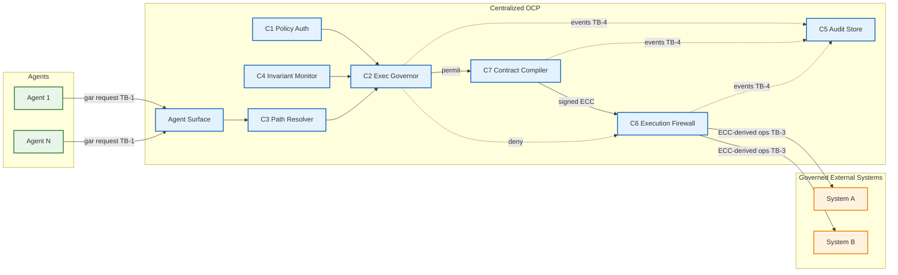
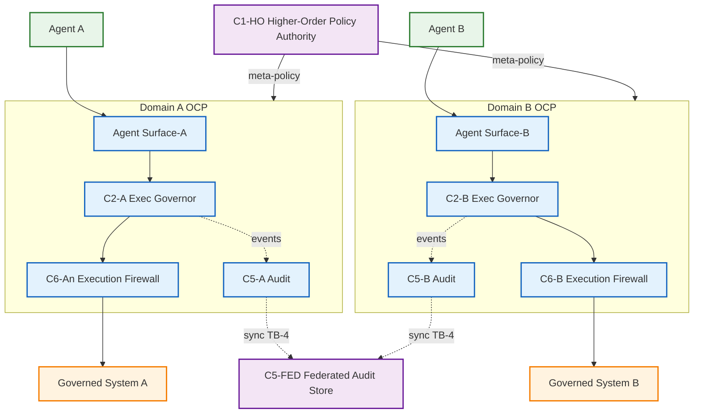
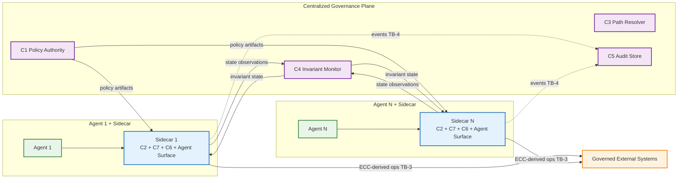
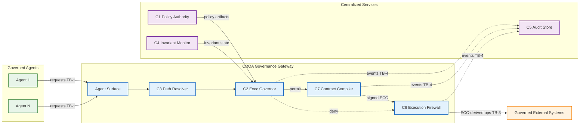
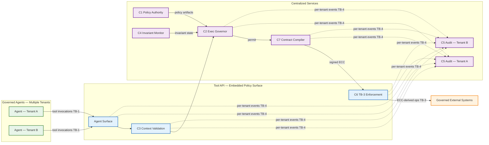

---
tags:
  - croa_foundation
version: 1
language: english
---

# CROA Framework — Part IV: Deployment Models

**Full title:** CROA — Constrained Reachability Orchestration Architecture: A Framework for Deterministic Governance of Agentic AI Execution
**Series designation:** CROA-4
**Status:** Official Specification (v1.0.1)
**Version:** v1.0.1
**Date:** 2026-09-03
**Part:** IV of VII

---

> **Revision history.** This file's earlier revision notes are consolidated in [CHANGELOG](../../CHANGELOG.md) (relocated 2026-06-16, Y. Durand; corpus bumped to v1.0.1.1). The

---

## Chapter 18. Deployment Model Overview

**Chapter abstract.** This chapter establishes the framework for selecting and applying the five CROA deployment models (DM-1 through DM-5). It specifies the properties that every conformant deployment must preserve regardless of topology, the selection criteria that determine which deployment model is appropriate for a given enterprise context, and the constraints that govern hybrid configurations. The five deployment models are not alternative architectures — they are alternative physical realizations of the same logical reference architecture (Part II). Every model must satisfy all Part II normative requirements; the models differ only in how the seven OCP components (C1–C7) are distributed across the physical deployment. This chapter depends on all component specifications in Part II (Chapters 4–6) and the CROA Policy-as-Code Lifecycle (§11) in Part III. Parts V and VI depend on the boundary preservation requirements established in this chapter.

---

### 18.1 Invariant Properties Across All Deployment Models

The five deployment models share a common normative foundation. The properties in this section MUST hold in every conformant deployment regardless of the topology selected. A deployment model that satisfies its own topology requirements but violates any property in this section is not CROA-conformant.

**P1 — Trust boundary preservation.** All four trust boundaries (TB-1 through TB-4, §6.1) MUST be present and enforced in every deployment model. A topology that collapses two trust boundaries — for example, co-locating C5 with a component that produces events without storage-layer append-only enforcement at the storage layer — violates TB-4 regardless of which deployment model is selected.

**P2 — C5 independence.** The Audit and Provenance Store (`C5`) MUST be architecturally independent of every component whose governance events it records. No OCP component that writes governance events to `C5` MAY have write access to `C5` records after they are written. The append-only property MUST be enforced at the storage layer, not only at the application layer, in every deployment topology.

**P3 — C1 authority exclusivity.** The Policy Authority (`C1`) MUST be the sole issuer of authoritative policy artifacts in every deployment model, including federated configurations. No component, service, or process in any deployment topology MAY issue, amend, or revoke policy artifacts except through `C1`.

**P4 — C6 as sole execution passage.** `C6` MUST be the sole authorized passage from the OCP to governed external systems in every deployment model. No direct channel from a governed agent or from any OCP component (including `C2`) to a governed external system that bypasses `C6` is permitted in any topology. This property is enforceable independently of the deployment topology — it is a network-level constraint, not a logical one.

**P5 — Agent Surface isolation.** The Agent Surface MUST be the sole interface through which a governed agent submits governed action requests, regardless of deployment topology. The Agent Surface MUST NOT expose any OCP component interface, policy artifact content, or C2.eval reasoning to the governed agent in any topology.

**P6 — Session integrity.** The session identifier assigned at TB-1 (Agent Surface authentication) MUST be propagated to every governance event in `C5` for that session, regardless of how OCP components are distributed across the physical deployment. A distributed deployment MUST NOT produce `C5` events for the same session under different session identifiers.

**P7 — C5 is a tier-0 availability dependency.** Because governance is fail-deny/fail-closed (§4.3, §4.6, §5.6), the write path on which a governed transition depends — the local durable commitment of the C5 event (I6.1, Part II §5.6) — is on the critical path of every governed action. Its unavailability stops governed execution. Therefore, in **production** deployments:

- The C5 durable-commit path (the local WAL under I6.1, and the redemption authority of §4.8) MUST be **highly available** — this is a MUST, not a SHOULD. A single non-redundant C5/WAL/redemption store is non-conformant for production; it is permitted only for evaluation/pilot deployments, which MUST document the limitation.
- The enterprise MUST declare, in the OCP Architecture Specification, an **availability class and SLA** for the C5 durable-commit path **at least equal to that of the most critical governed system in scope** (fail-closed couples them), together with a **recovery time objective (RTO)** and **recovery point objective (RPO = 0** for locally-committed events; no acknowledged event may be lost).
- The enterprise MUST use a stated, defensible **sizing method** for C5 (peak governed-action rate → required append throughput and storage growth), and MUST NOT rely on an unsourced heuristic. The "≈50 sessions per C2" figure of §18.6 is an illustrative planning starting point only, not a capacity guarantee; the deployment MUST verify its own throughput under peak load (Criterion 6).
- The same availability engineering applies to any component whose unavailability triggers fail-deny — notably a centralized `C2`/`C7` and the shared redemption authority (§4.8) — which MUST be HA in production.

---

### 18.2 Deployment Model Selection Criteria

An enterprise MUST select a deployment model of the CROA Policy-as-Code Lifecycle (Part III, §11). The selection MUST be documented in the OCP Architecture Specification and the selection rationale MUST be traceable to at least one requirement in the Requirements Traceability Matrix.

The following criteria govern model selection:

**Criterion 1 — Governance domain count.**
The number of distinct policy domains (§2.3) within the governance scope is the primary selection driver. A single governance domain covering one or more governed agents under a single Policy Authority is the baseline; DM-1 (Centralized) is the default selection for single-domain deployments. Multiple governance domains with independent Policy Authorities require federated governance; DM-2 is the baseline selection for multi-domain deployments.

**Criterion 2 — Agent deployment topology.**
How governed agents are deployed relative to the enterprise's network and cloud architecture affects which enforcement model is physically realizable. Agents deployed as discrete services in a cloud-native environment are candidates for DM-3 (Sidecar). Agents that cannot be modified to route through a new governance endpoint — legacy integrations, third-party agents — favor DM-4 (Gateway-Mediated).

**Criterion 3 — Conformance level target.**
Higher conformance levels impose stricter evidence requirements. L4 and L5 require trajectory analysis (`C4`) with per-session history preservation — deployments that disperse `C4` across sidecars must ensure that trajectory analysis spans the full session, not only the sidecar's local context. The deployment model MUST support the evidence production requirements of the targeted conformance level.

**Criterion 4 — Operational maturity.**
Distributed models (DM-2, DM-3) require more sophisticated operational capability: policy distribution management, sidecar lifecycle management, cross-domain audit aggregation. An enterprise with limited operational maturity SHOULD prefer DM-1 or DM-4 for initial deployment and migrate to a distributed model in Policy Update (§7.2) (Change Management) when operational capability is established.

**Criterion 5 — Existing enterprise infrastructure.**
Existing IAM, API management, and SIEM infrastructure can reduce implementation cost when integrated with CROA components. DM-4 (Gateway-Mediated) maps naturally onto existing enterprise API gateway infrastructure. DM-3 (Sidecar) maps naturally onto service mesh infrastructure. See Chapter 24 (Integration Patterns) for specific integration guidance.

**Criterion 6 — Governed action throughput.**
The expected number of concurrent governed action evaluations per second is a binding constraint on model selection. In DM-1, the centralized `C2` is the shared evaluation bottleneck; this topology is appropriate when concurrent evaluation load does not require horizontal scaling of `C2`. In DM-3, governance evaluation capacity scales linearly with agent count — each sidecar has its own `C2` instance. In DM-4, the governance gateway must be scaled horizontally to match peak evaluation load. The enterprise MUST define a throughput threshold in the OCP Architecture Specification, verify that the selected deployment model satisfies it under peak load, and document the HA or horizontal scaling configuration used to meet it. A deployment that fails to satisfy its documented throughput threshold under load produces fail-deny decisions that are governance successes but constitute a service disruption; this must be treated as a Policy Update (§7.2) change event trigger.

**Selection summary:**

| Deployment context | Recommended model |
|---|---|
| Single governance domain, centralized operations | DM-1 — Centralized Orchestration Governor |
| Multiple independent governance domains or legal entities | DM-2 — Federated Governance Domains |
| Cloud-native, service-mesh environment, latency-sensitive | DM-3 — Sidecar Enforcement |
| Brownfield deployment, existing API gateway, unmodifiable agents | DM-4 — Gateway-Mediated Enforcement |
| Platform-level governance, tool API enforcement | DM-5 — Embedded Policy Surface |

---

### 18.3 Hybrid Configurations

An enterprise MAY combine elements of multiple deployment models within a single deployment — for example, a DM-1 core with DM-3 sidecars for a subset of high-frequency agents, or a DM-2 federation in which individual domains use DM-4 internally.

A hybrid configuration MUST satisfy the following:

- The hybrid configuration MUST be documented in the OCP Architecture Specification as a named variant of the primary deployment model, with the secondary model identified and its scope bounded
- Every component in the hybrid configuration MUST satisfy its Chapter 4 normative requirements regardless of which part of the hybrid it belongs to
- All four trust boundaries MUST be preserved across the boundary between the primary and secondary model components
- The `C5` instances from all parts of the hybrid MUST be reconcilable into a single cryptographically chained audit record. The synchronous guarantee is at the level of **durable local commitment (I6.1, Part II §5.6)**: every governance event MUST be durably committed to its local append-only, signed write-ahead journal **before** the corresponding governed transition proceeds — there is no window in which a transition occurs without a durable, tamper-evident local record. **Central aggregation/replication MAY be deferred** under the declared I6.1 RTO exactly as §21.3/§21.5 permit for DM-3 sidecars; a hybrid that includes a DM-3 component inherits that model's deferred-replication allowance for the *central* record. What MUST NOT occur is a governed transition without local durable commitment, or a deferral exceeding the declared RTO — either triggers fail-deny. (This resolves the apparent conflict between this clause and §21.5: "synchronous" binds the local durability that gates execution, not the central aggregation, which is bounded by RTO. Reconciliation completeness on restore is a conformance check, Part II §5.6.)

**Normative constraint:** A hybrid configuration MUST NOT be used to relax the normative requirements of either contributing model. A component that does not satisfy its Chapter 4 requirements in the primary model does not satisfy them by virtue of being supplemented by the secondary model.

---

### 18.4 Component Placement Notation

Each deployment model chapter (19–23) specifies component placement using the following notation:

| Placement | Meaning |
|---|---|
| `CENTRALIZED` | The component runs as a shared service accessible to all governed agents in the deployment |
| `PER-AGENT` | A separate instance of the component runs for each governed agent |
| `PER-DOMAIN` | A separate instance of the component runs for each governance domain |
| `EMBEDDED` | The component's function is implemented within another component or system |
| `EXTERNAL` | The component is realized by an existing enterprise service (e.g., an existing SIEM for `C5`) |

---

### 18.5 Deployment Model Migration

An enterprise that changes its primary deployment model — for example, migrating from DM-1 (Centralized) to DM-3 (Sidecar) as governed agent count grows, or from DM-1 to DM-2 as organizational restructuring creates independent governance domains — is performing a deployment model migration.

A deployment model migration MUST be treated as a Policy Update (§7.2) change event (Part III, Chapter 7). The Change Impact Assessment MUST include: the source model, the target model, the component changes required, and the cutover procedure.

**Migration normative requirements:**

- P4 (C6 as sole execution passage) MUST hold throughout the migration. No window may exist during migration in which a governed agent can reach a governed external system without traversing an active `C6` instance — whether the source model's `C6` or the target model's `C6`.
- `C5` chain continuity MUST be maintained across the migration. Events produced by source-model components and target-model components MUST form a single unbroken `event.chain_hash` chain in the consolidated `C5` record. A migration that breaks the chain hash sequence invalidates the I3 (Auditability Invariant) for the migration period.
- The target model's normative requirements MUST be fully satisfied — including all GitOps Pipeline (§7.2) OCP Architecture Specification updates — before source-model components are decommissioned. An enterprise MUST NOT decommission source-model `C6` until target-model `C6` is confirmed to be enforcing TB-3 for all governed agents.
- The migration MUST be verified using the target model's Part IV conformance criteria before the migration is considered complete and the Policy Update (§7.2) change record is closed.

**Common migration paths:**

| From | To | Typical trigger | Key cutover constraint |
|---|---|---|---|
| DM-1 | DM-3 | Governed agent count exceeds DM-1 throughput threshold; cloud-native platform adoption | Each sidecar must be active and verified before the corresponding agent's traffic is redirected away from the centralized OCP |
| DM-1 | DM-2 | Organizational restructuring; new regulated subsidiary; geographic expansion | Each domain OCP must be fully provisioned and verified before agents are assigned to it; `C5-FED` must be operational before the first cross-domain event |
| DM-4 | DM-3 | Brownfield agents are modernized to accept sidecar deployment | Sidecar must intercept all agent traffic before gateway policies for that agent are removed |
| DM-1 | DM-4 | Enterprise adopts a centralized API gateway platform that subsumes OCP functions | Gateway must implement the full C2.eval pipeline (not only native access controls) before centralized OCP is decommissioned |

---

### 18.6 Deployment Model Comparison

The following table provides a consolidated cross-model comparison across the dimensions most relevant to deployment model selection. Entries marked RECOMMENDED reflect the design intent of the model; implementations that deviate must document the deviation in the OCP Architecture Specification.

| Dimension | DM-1 Centralized | DM-2 Federated | DM-3 Sidecar | DM-4 Gateway | DM-5 Embedded |
|---|---|---|---|---|---|
| **Chapter** | 19 | 20 | 21 | 22 | 23 |
| **Agent modification required** | Yes — route to Agent Surface | Yes — route to Agent Surface | No — sidecar intercepts | No — traffic routed via gateway | No — tool invocations via API |
| **Brownfield fit** | Low | Low | Low | Highest | Highest |
| **Cloud-native / service-mesh fit** | Moderate | Moderate | Highest | High | High |
| **Evaluation latency** | Higher (OCP network round-trip) | Higher | Lowest (local sidecar) | Moderate | Lowest (inline) |
| **Throughput scaling** | Limited by shared `C2`; HA cluster RECOMMENDED | Per-domain limits; independent scaling per domain | Linear with agent count | Limited by gateway capacity; horizontal scaling required | Limited by platform capacity |
| **Concurrent session guidance** | Indicative sizing heuristic only: about 50 sessions per `C2` instance without HA, to be replaced by measured throughput (§J.3/J.5) | Same heuristic per domain per `C2-D` instance, to be replaced by measured throughput (§J.3/J.5) | Scales per sidecar; bounded by central `C4`/`C5` throughput and the measured profile (§J.5) | Depends on gateway tier and measured profile | Depends on platform capacity and measured profile |
| **Multi-domain / multi-tenant** | No | Yes — per governance domain | No (single domain typical) | No | Yes — per §23.5.1 tenant isolation |
| **Fault isolation** | Centralized; HA REQUIRED for production | Per-domain; one domain failure does not affect others | Per-agent; one sidecar failure affects only its paired agent | Centralized; HA REQUIRED for production | Platform availability |
| **Operational maturity required** | Lowest | Highest | High — sidecar lifecycle management | Moderate | Low (using platform); High (building platform) |
| **`C5` configuration** | Simplest — single instance | Most complex — `C5-FED` + N domain chains | Moderate — event aggregation from N sidecars | Simple — gateway events | Moderate — per-tenant isolated chains |
| **Minimum conformance-level floor** | L1 | L2 (operational complexity requires higher maturity) | L2 | L1 | L3 (tenant isolation requirement) |
| **RECOMMENDED first deployment** | Yes | Only if multi-domain is a hard requirement from day one | Only with existing service mesh | Only if agents cannot be modified | Only if building a governed platform |
| **Primary selection driver** | First deployment; single governance domain | Multiple independent Policy Authorities | High throughput; cloud-native; latency-sensitive | Brownfield; legacy or third-party agents | Platform-level governance across multiple enterprises |

> *Note. The values in this row are **conformance levels** (L0–L5, Part VI), not organizational-maturity levels (M0–M4, Chapter 30) — the two scales are distinct and MUST NOT be conflated. They indicate the minimum **conformance level** below which the model's complexity makes conformance verification impractical, not the maximum achievable. All five models can achieve L4 or L5 conformance with appropriate implementation.*

---

**Summary of Normative Content (recap — skippable on a first linear read) — Chapter 18**

- §18.1, P1: All four trust boundaries (TB-1 through TB-4) MUST be present and enforced in every deployment model.
- §18.1, P2: `C5` MUST be architecturally independent of every component whose events it records; the append-only property MUST be enforced at the storage layer in every topology.
- §18.1, P3: `C1` MUST be the sole issuer of policy artifacts in every deployment model including federated configurations.
- §18.1, P4: `C6` MUST be the sole authorized passage to governed external systems in every topology; no direct bypass channel is permitted.
- §18.1, P5: The Agent Surface MUST be the sole governed-agent interface in every topology.
- §18.1, P6: The session identifier from TB-1 MUST propagate to every `C5` event for that session across all distributed components.
- §18.1, P7: In production, the `C5` durable-commit path (the local write-ahead journal under I6.1) and the shared redemption authority (Part II §4.8) MUST be highly available, with a declared availability class and SLA at least equal to that of the most critical governed system in scope, RPO = 0 for locally committed events, and a defensible sizing method. A single non-redundant `C5`, write-ahead journal, or redemption store is non-conformant for production. The same availability engineering applies to any component whose unavailability triggers fail-deny, notably a centralized `C2`/`C7`.
- §18.2: The deployment model selection MUST be documented in the OCP Architecture Specification with rationale traceable to the RTM.
- §18.2, Criterion 6: The enterprise MUST define a throughput threshold, verify the selected model satisfies it under peak load, and document the HA or scaling configuration.
- §18.3: Hybrid configurations MUST be documented; all four trust boundaries MUST be preserved across model boundaries; cross-model `C5` **local durable commitment (I6.1) MUST be synchronous** (before the transition), while **central aggregation MAY be deferred within the declared RTO** (§21.5) — the two are reconciled at §18.3.
- §18.5: Deployment model migration MUST be treated as a Policy Update (§7.2) change event. P4 (C6 as sole execution passage) MUST hold throughout migration. `C5` chain continuity MUST be maintained. The target model MUST satisfy all conformance criteria before source-model components are decommissioned.

**Cross-references.** Chapter 18 depends on all component specifications in Chapter 4 and all trust boundary specifications in Chapter 6. The deployment model selection is performed in GitOps Pipeline (§7.2) of the CROA-PaC. Part V (Threat Model) specifies how each threat class manifests differently across deployment topologies. Part VI (Conformance) specifies evidence requirements that deployment models must support at each conformance level.

---

## Chapter 19. DM-1 — Centralized Orchestration Governor

**Chapter abstract.** DM-1 is the baseline deployment model. All seven OCP components (C1–C7) are deployed as a single logical governance service — the Centralized Orchestration Governor — shared by all governed agents within the governance domain. Every governed action request passes through the centralized OCP before any execution occurs against any governed external system. DM-1 is the simplest topology to reason about, operate, and audit. It is the RECOMMENDED starting point for first-time CROA deployments and the default selection for single-governance-domain enterprises. This chapter specifies DM-1's component placement, trust boundary realization, normative requirements, trade-offs, failure modes, and selection guidance.

---

### 19.1 Topology Description

In DM-1, all seven OCP components are collocated within a single governance service boundary. The governed agents — potentially many — submit governed action requests to the centralized Agent Surface. The centralized OCP processes each request through C3, C2, C4, and either C6 (deny) or C7 + C6 (permit). All governance events are recorded in a single centralized `C5` instance.

*Fig. CROA-19a. DM-1 — Centralized Orchestration Governor. All C1–C7 and the Agent Surface operate within a single OCP service boundary. TB-1 is enforced at the Agent Surface; TB-3 is enforced at C6. No governed agent has a direct channel to any governed external system.*

---

### 19.2 Component Placement

| Component | Placement | Notes |
|---|---|---|
| `C1` — Policy Authority | `CENTRALIZED` | Single C1 instance; serves all agents and all C2/C3 instances within the domain |
| `C2` — Execution Governor | `CENTRALIZED` | Single C2 instance (or HA cluster sharing invariant state; the active ECC registry is held by `C7`) |
| `C7` — Contract Compiler | `CENTRALIZED` | Co-located with `C2`; compiles the ECC on each permit decision; holds the active ECC registry |
| `C3` — Path Resolver | `CENTRALIZED` | Single C3 instance; single Federated Context Registry |
| `C4` — Invariant Monitor | `CENTRALIZED` | Single C4 instance; maintains session histories for all governed agents |
| `C5` — Audit and Provenance Store | `CENTRALIZED` | Single C5 instance; append-only, cryptographically chained |
| `C6` — Execution Firewall | `CENTRALIZED` | Single C6 instance; the sole passage to all governed external systems |
| Agent Surface | `CENTRALIZED` | Single Agent Surface; all governed agents authenticate here |

---

### 19.3 Trust Boundary Realization

| Boundary | DM-1 realization |
|---|---|
| **TB-1 (Agent Boundary)** | The centralized Agent Surface is the single TB-1 enforcement point. Subject identity is authenticated at the Agent Surface; no governed agent bypasses this boundary. |
| **TB-2 (Policy Boundary)** | `C1` is isolated within the OCP service; `C2` and `C3` verify policy artifact signatures before application. `C1` does not receive governed agent outputs. |
| **TB-3 (Execution Boundary)** | The centralized `C6` is the sole passage to all governed external systems. All governed external systems are configured to accept connections only from `C6`. |
| **TB-4 (Audit Boundary)** | `C5` is isolated within the OCP service with storage-layer append-only enforcement. No component that writes events to `C5` can modify or delete those events after writing. |

---

### 19.4 Normative Requirements

- The Centralized Orchestration Governor MUST implement all seven OCP components (C1–C7) and the Agent Surface within a single logical service boundary.
- The centralized OCP MUST NOT be deployed on the same host, container, or network segment as any governed agent or governed external system, unless the deployment implements network-level isolation that enforces TB-1 and TB-3 independently of host-level controls.
- All governed agents within the governance domain MUST submit governed action requests exclusively to the centralized Agent Surface. No governed agent MAY maintain a separate channel to any governed external system.
- The centralized `C2`/`C7` core MAY be deployed as a high-availability (HA) cluster. All nodes in the HA cluster MUST share the same `C7` active ECC registry and MUST receive invariant state from the same `C4` instance. An ECC compiled and signed by one `C7` instance MUST be validated by `C6` using the shared `C7` active ECC registry, regardless of which instance compiled it.
- The centralized `C4` MUST maintain session histories for all governed agents. If `C4` is unavailable, `C2` MUST apply the fail-deny default (§4.6) for all governed actions until `C4` is restored.
- The centralized `C5` retention period MUST satisfy the enterprise's governance retention policy per §11.3 Step 4 (Part III).

**High availability guidance (RECOMMENDED, not normative):** For production deployments, the centralized OCP SHOULD be deployed with HA configuration for `C2` and `C6` — the components on the critical path for every governed action. `C1` and `C5` SHOULD have disaster recovery configurations. `C4` state SHOULD be persisted to durable storage at a frequency no greater than the enterprise-defined maximum invariant state age.

---

### 19.5 Trade-offs

| Dimension | DM-1 characteristic |
|---|---|
| **Simplicity** | Highest — single service boundary, single audit store, single policy authority |
| **Operational maturity required** | Lowest — one service to deploy, monitor, and upgrade |
| **Auditability** | Highest — single `C5` instance, no cross-component aggregation required |
| **Scalability** | Limited — centralized `C2` and `C4` are throughput bottlenecks for high-volume agent deployments |
| **Fault tolerance** | Single point of failure without HA configuration — OCP unavailability blocks all governed actions |
| **Latency** | Higher than sidecar models — each governed action requires a network round-trip to the centralized OCP |
| **Isolation between agents** | Logical only — all agents share the same `C4` session state and the same `C2` evaluation context |

---

### 19.6 Topology-Specific Failure Modes

**TM-1.1 — Centralized OCP unavailability.** If the centralized OCP becomes unavailable, all governed agents are blocked from accessing all governed external systems. The fail-deny default applies. This is a governance success — no ungoverned execution occurs — but it constitutes a service disruption. *Mitigation:* HA configuration for `C2` and `C6`; documented fallback procedure.

**TM-1.2 — C4 session state loss on restart.** If `C4` restarts without durable state persistence, session histories are lost. `C4` must then re-establish invariant state from `C5` before resuming trajectory analysis. During re-establishment, `C2` MUST apply the fail-deny default. *Mitigation:* Durable `C4` state persistence; documented recovery procedure.

**TM-1.3 — Single Federated Context Registry as bottleneck.** With a single `C3` instance serving all governed agents, the Federated Context Registry's context refresh interval (§11.3 Step 2) becomes a shared constraint. A stale golden record affects all agents simultaneously. *Mitigation:* Aggressive context refresh; monitoring of golden record currency.

---

### 19.7 When to Select DM-1

DM-1 is the RECOMMENDED first deployment model for organizations that:

- Have a single governance domain with one Policy Authority
- Are deploying CROA for the first time and prioritize operational simplicity
- Have a moderate number of governed agents, using the Appendix J sizing heuristic only until measured p95/p99 latency and throughput figures are available
- Can tolerate the latency of a centralized OCP on the governed action critical path
- Target conformance levels L1–L4 without extreme throughput requirements

DM-1 SHOULD NOT be selected when:

- Multiple independent governance domains require separate Policy Authorities (use DM-2)
- Governed agents are distributed across cloud regions with strict latency requirements (consider DM-3)
- The governed agent infrastructure cannot route traffic to a centralized service (use DM-4)

---

**Summary of Normative Content (recap — skippable on a first linear read) — Chapter 19**

- §19.4: The centralized OCP MUST implement all seven OCP components within a single logical service boundary.
- §19.4: The centralized OCP MUST NOT share host, container, or network segment with governed agents or governed external systems without network-level TB-1/TB-3 isolation.
- §19.4: All governed agents MUST submit requests exclusively to the centralized Agent Surface; no direct channels to governed systems are permitted.
- §19.4: HA `C2`/`C7` cluster nodes MUST share the same `C7` active ECC registry and invariant state source.
- §19.4: If `C4` is unavailable, `C2` MUST apply the fail-deny default.

**Cross-references.** Chapter 19 depends on the component specifications in Chapter 4 and the trust boundary specifications in §6.1. DM-1 is the baseline against which DM-2 through DM-5 introduce specific architectural variations. The NovaCare reference deployment ([Appendix H - Worked Example (NovaCare)](../appendices/appendix-h-worked-example-novacare.md)) uses DM-1.

---

## Chapter 20. DM-2 — Federated Governance Domains

**Chapter abstract.** DM-2 extends the CROA governance model to enterprises operating multiple independent governance domains — separate legal entities, regulated subsidiaries, geographic divisions, or business units with distinct Policy Authorities and distinct invariant registries. Each domain operates its own OCP instance. A higher-order Policy Authority (`C1-HO`) issues meta-policy that governs the federation itself, ensuring that cross-domain actions and cross-domain audit records satisfy enterprise-wide governance requirements while preserving each domain's policy independence. This chapter specifies DM-2's component placement, federation architecture, trust boundary realization, cross-domain action handling, federated audit model, normative requirements, trade-offs, and selection guidance.

---

### 20.1 Topology Description

In DM-2, each governance domain has its own complete OCP instance (C1-D through C7-D, where D identifies the domain). A higher-order Policy Authority (`C1-HO`) sits above the domain-level Policy Authorities and issues meta-policy: governance rules that apply across all domains and that domain-level Policy Authorities cannot override.

Governed agents are assigned to exactly one governance domain. A governed agent in Domain A that requests an action against a governed system in Domain B initiates a cross-domain governed action, which requires authorization from both Domain A's OCP and Domain B's OCP, with the ordering governed by the applicable meta-policy from `C1-HO`.

*Fig. CROA-20a. DM-2 — Federated Governance Domains. C1-HO issues meta-policy to all domain-level Policy Authorities. Each domain OCP is independent. C5-FED aggregates domain audit chains and is architecturally independent of all C5-D instances. Cross-domain actions require independent evaluation by both domain C2-D instances.*

---

### 20.2 Component Placement

| Component | Placement | Notes |
|---|---|---|
| `C1-HO` — Higher-Order Policy Authority | `CENTRALIZED` | Issues meta-policy applicable to all domains; cannot be overridden by any domain `C1-D` |
| `C1-D` — Domain Policy Authority | `PER-DOMAIN` | Issues domain-specific policy artifacts; MUST comply with meta-policy from `C1-HO` |
| `C2-D` — Domain Execution Governor | `PER-DOMAIN` | Evaluates governed actions within the domain against `C1-D` policy artifacts |
| `C7-D` — Domain Contract Compiler | `PER-DOMAIN` | Co-located with `C2-D`; compiles the ECC on a permit within the domain |
| `C3-D` — Domain Path Resolver | `PER-DOMAIN` | Maintains domain-specific Federated Context Registry |
| `C4-D` — Domain Invariant Monitor | `PER-DOMAIN` | Maintains domain-specific invariant registry and session histories |
| `C5-D` — Domain Audit Store | `PER-DOMAIN` | Domain-level append-only event log |
| `C5-FED` — Federated Audit Store | `CENTRALIZED` | Aggregates domain `C5-D` streams into an enterprise-wide cryptographically chained record |
| `C6-D` — Domain Execution Firewall | `PER-DOMAIN` | Enforces TB-3 for governed systems within the domain |
| Agent Surface-D | `PER-DOMAIN` | Domain-specific Agent Surface; authenticates subjects against the domain's identity provider |

---

### 20.3 Higher-Order Policy Authority (C1-HO)

`C1-HO` is the federation's trust root for meta-policy. It issues policy artifacts that:

- Define which governed actions are permitted to cross domain boundaries and under what conditions
- Specify minimum conformance requirements that all domain OCP instances MUST meet
- Establish the enterprise-wide invariant categories that all domain invariant registries MUST include (at minimum)
- Define the cross-domain audit synchronization requirements for `C5-FED`

`C1-HO` policy artifacts MUST be verified by each domain's `C2-D` in addition to the domain's own `C1-D` policy artifacts. In the event of conflict between a `C1-HO` policy artifact and a `C1-D` policy artifact, the `C1-HO` policy artifact takes precedence. Domain-level policy artifacts MAY be more restrictive than `C1-HO` policy artifacts but MUST NOT be less restrictive.

---

### 20.4 Cross-Domain Governed Actions

A cross-domain governed action is a governed action proposed by an agent in Domain A that targets a governed system in Domain B. The handling procedure is:

1. The governed agent in Domain A submits the governed action request to Domain A's Agent Surface.
2. Domain A's `C3-D` validates context references against Domain A's Federated Context Registry. If any context reference resolves to a Domain B resource, `C3-D` queries Domain B's `C3-D` for resolution (subject to the inter-domain contract authorized by `C1-HO`).
3. Domain A's `C2-D` evaluates the request against Domain A's policy artifacts (including applicable `C1-HO` meta-policy). If Domain A's evaluation produces a permit, the request is forwarded to Domain B's `C2-D`.
4. Domain B's `C2-D` independently evaluates the request against Domain B's policy artifacts. A permit from Domain A does not guarantee a permit from Domain B.
5. Both domain `C5-D` instances record their respective governance events. Both events MUST be synchronized to `C5-FED` before execution is authorized.
6. If both domain evaluations produce a permit, the ECC is compiled by the **target domain's** `C7-B` — the `C7` of the domain that contains the governed external system and whose `C6-B` will enforce the operation. Compilation and enforcement are therefore co-domain: `C6-B` validates the presented ECC against `C7-B`'s active ECC registry (signature, expiry, single-use redemption, invariant consistency per §4.8), exactly as in a single-domain deployment. This avoids any cross-domain ECC handoff (which would require `C6-B` to validate against a foreign `C7-A` registry) and is consistent with the rule that an ECC compiled by one component's registry is not authorized by another's. The source domain's permit is an input to `C7-B`'s compilation (carried with the cross-domain action identifier), not an ECC that `C6-B` redeems.

Cross-domain governed actions MUST carry a cross-domain action identifier that correlates the two domain-level `C5-D` records and the `C5-FED` aggregated record.

---

### 20.5 Federated Audit Model

Each domain's `C5-D` instance maintains an independent cryptographic chain for that domain's governance events. `C5-FED` aggregates these chains with the following properties:

- Events are aggregated from all `C5-D` instances in insertion order within each domain
- The `C5-FED` chain references each `C5-D` chain's integrity hash at the time of aggregation
- Cross-domain action records in `C5-FED` carry both the Domain A and Domain B `event.id` values, establishing the correlation
- `C5-FED` MUST be architecturally independent of all `C5-D` instances — `C5-FED` is an aggregator, not a replica. Compromise of any `C5-D` does not compromise `C5-FED`'s integrity for records already aggregated

An auditor with access to `C5-FED` alone MUST be able to reconstruct every cross-domain governance decision. An auditor with access to a single `C5-D` alone MUST be able to reconstruct every governance decision within that domain.

---

### 20.6 Normative Requirements

- Each domain OCP instance MUST implement all seven OCP components independently. No domain may share a `C2-D`, `C3-D`, or `C4-D` instance with another domain.
- `C1-HO` MUST issue meta-policy as signed policy artifacts per §4.3.2. Each domain's `C2-D` and `C3-D` MUST verify `C1-HO` signatures before applying meta-policy.
- Domain-level policy artifacts MUST NOT be less restrictive than applicable `C1-HO` meta-policy; they MAY be more restrictive.
- Cross-domain governed actions MUST receive independent evaluation from both the source domain `C2-D` and the target domain `C2-D`. A permit from the source domain is not sufficient authorization for execution in the target domain.
- Both domain `C5-D` governance events for a cross-domain action MUST be synchronized to `C5-FED` before execution is authorized at TB-3.
- A cross-domain governed action's ECC MUST be compiled by the target domain's `C7` — the domain whose `C6` enforces the operation — and `C6` MUST validate it against that same domain's active ECC registry. An ECC MUST NOT be enforced by a `C6` in a different domain from the `C7` that compiled it; cross-domain ECC authorization (one domain's ECC redeemed at another domain's `C6`) is not permitted.
- `C5-FED` MUST be architecturally independent of all domain `C5-D` instances and MUST enforce append-only at the storage layer.
- No governed agent may be assigned to more than one governance domain. Cross-domain access is governed by cross-domain governed action handling (§20.4), not by agent membership in multiple domains.

---

### 20.7 Trade-offs

| Dimension | DM-2 characteristic |
|---|---|
| **Domain isolation** | Highest — each domain has independent policy, invariants, and audit chain |
| **Policy independence** | Each domain can maintain distinct governance policies subject to `C1-HO` meta-policy floor |
| **Operational complexity** | High — N domain OCPs + `C1-HO` + `C5-FED` to operate and maintain |
| **Cross-domain latency** | Highest — cross-domain actions require two independent evaluations |
| **Fault isolation** | High — failure in one domain OCP does not disable governance in other domains |
| **Conformance evidence** | Complex — conformance claims must cover all domain OCPs and `C5-FED` |

---

### 20.8 When to Select DM-2

DM-2 SHOULD be selected when:

- The enterprise operates multiple legally independent entities or regulated subsidiaries with distinct compliance obligations
- Different business units require policy independence (e.g., one unit may permit certain actions that another unit must prohibit)
- Geographic distribution requires that governance decisions be made within specific jurisdictions (data sovereignty requirements)
- The enterprise's governance maturity supports operating multiple OCP instances

DM-2 SHOULD NOT be selected when the governance domains share a single Policy Authority — in that case, DM-1 with appropriate agent-level scoping in `C1` policy artifacts is simpler and equally conformant.

---

**Summary of Normative Content (recap — skippable on a first linear read) — Chapter 20**

- §20.3: `C1-HO` policy artifacts take precedence over domain-level policy artifacts in all conflicts.
- §20.4: Cross-domain governed actions MUST receive independent evaluation from both domain `C2-D` instances.
- §20.5: Both domain `C5-D` events MUST be synchronized to `C5-FED` before execution is authorized.
- §20.6: Each domain OCP MUST implement all seven components independently; no component sharing across domains.
- §20.6: `C5-FED` MUST be architecturally independent of all `C5-D` instances.
- §20.6: No governed agent may belong to more than one governance domain.

**Cross-references.** Chapter 20 builds on the single-domain model in Chapter 19. The inter-domain contract mechanism depends on the `C1-HO` policy artifact specification (§4.3.2). Cross-domain trajectory analysis — where `C4` must detect trajectories spanning domain boundaries — is an OPTIONAL extension; if implemented, it MUST be specified as a separate `C4-FED` function that does not compromise individual domain `C4-D` isolation.

---

## Chapter 21. DM-3 — Sidecar Enforcement

**Chapter abstract.** DM-3 distributes the enforcement-critical OCP components (`C2` and `C6`) as co-located sidecars — one sidecar per governed agent — while centralizing the policy authority (`C1`), trajectory analysis (`C4`), and audit store (`C5`). This topology applies the service mesh sidecar pattern to CROA governance: each agent's sidecar intercepts all governed action requests before they leave the agent's execution boundary, enforces the governance decision, and records the event. DM-3 eliminates the centralized OCP as a network bottleneck and enables per-agent ECC compilation without cross-network latency on the evaluation critical path. It is the topology of choice for cloud-native, high-frequency, or latency-sensitive agentic AI deployments. This chapter specifies DM-3's component placement, sidecar architecture, centralized service requirements, trust boundary realization, normative requirements, trade-offs, and selection guidance.

---

### 21.1 Topology Description

In DM-3, each governed agent is paired with a CROA Enforcement Sidecar — a co-located process or container that implements `C2` (evaluation) and `C6` (execution boundary enforcement) for that agent exclusively. The sidecar intercepts all governed action requests from the agent before they reach any governed external system. Policy artifacts are distributed to each sidecar from a centralized `C1`. Invariant state for trajectory analysis is provided to each sidecar by a centralized `C4`. All sidecar `C2` and `C6` events are forwarded to a centralized `C5`.

*Fig. CROA-21a. DM-3 — Sidecar Enforcement. C2, C7, and C6 are distributed per-agent as co-located sidecars (each sidecar compiles its own ECCs via `C7` on the permit path `C2 → C7 → C6`). C1, C3, C4, and C5 are centralized. Each sidecar enforces TB-3 for its paired agent. Policy artifacts are distributed from centralized C1; invariant state is provided by centralized C4; all events are forwarded to centralized C5. Note: C3 is shown centralized; a per-agent sidecar C3 configuration is also conformant and SHOULD be selected when evaluation latency requirements make a centralized C3 network round-trip unacceptable — the choice MUST be documented in the OCP Architecture Specification per §21.2.*

---

### 21.2 Component Placement

| Component | Placement | Notes |
|---|---|---|
| `C1` — Policy Authority | `CENTRALIZED` | Distributes signed policy artifacts to all sidecars via the policy distribution channel (TB-2) |
| `C2` — Execution Governor | `PER-AGENT` (sidecar) | Each sidecar contains a `C2` instance scoped to its paired agent |
| `C7` — Contract Compiler | `PER-AGENT` (sidecar) | Co-located with `C2` in each sidecar; compiles ECCs for its paired agent |
| `C3` — Path Resolver | `CENTRALIZED` or `PER-AGENT` | MAY be centralized (lower cost, higher latency) or embedded in each sidecar (lower latency, higher cost); enterprise MUST document the choice |
| `C4` — Invariant Monitor | `CENTRALIZED` | Single `C4` maintains trajectory analysis across all agents; sidecars report state observations to central `C4` |
| `C5` — Audit and Provenance Store | `CENTRALIZED` | All sidecars forward governance events to a single `C5`; sidecar-local event buffering is permitted during transient network partitions (see §21.5) |
| `C6` — Execution Firewall | `PER-AGENT` (sidecar) | Each sidecar's `C6` enforces TB-3 for its paired agent's operations |
| Agent Surface | `PER-AGENT` (sidecar) | Each sidecar implements the Agent Surface for its paired agent |

---

### 21.3 Sidecar Architecture

The CROA Enforcement Sidecar is a co-located process or container that implements the following functions for its paired agent:

**Agent Surface implementation.** The sidecar is the sole interface through which the paired agent submits governed action requests. The governed agent MUST be configured to route all governed action requests to the sidecar rather than directly to governed external systems.

**Policy artifact cache.** The sidecar maintains a local cache of the current policy artifacts distributed by `C1`. The cache is refreshed when `C1` issues a new policy artifact version. The cache MUST NOT be used after the policy artifact's validity window has expired and `C1` has not provided a renewed artifact; the sidecar MUST apply the fail-deny default in this condition.

**Invariant state receiver.** The sidecar receives invariant state updates from centralized `C4` before each `C2.eval` execution. The sidecar's `C2` MUST NOT execute `C2.eval` using invariant state whose age exceeds the enterprise-defined maximum invariant state age (§11.3 Step 1, Part III).

**ECC registry.** The sidecar maintains a local active ECC registry for ECCs compiled by its `C7`. ECCs compiled by this sidecar's `C7` are valid only for operations authorized against governed systems via this sidecar's `C6`. Cross-agent ECC authorization is not permitted.

**Event forwarding.** All governance events produced by the sidecar's `C2`, `C7`, `C6`, and Agent Surface MUST be committed durably and then forwarded to centralized `C5`. Durable commitment is to a **local write-ahead journal** that is a constituent of the `C5` evidence boundary: append-only, cryptographically signed and chained on the same terms as `C5` (I3), and crash-durable. A governed transition MUST NOT proceed until its event is durably committed to this local journal — this is how the sidecar satisfies I6 (Part II §5.6, clause I6.1) even when the centralized `C5` is unreachable.

If the centralized `C5` is temporarily unavailable, the sidecar MAY defer *replication* of locally committed events for a period not exceeding the enterprise-defined maximum event buffer period (the declared I6.1 RTO). During this window the sidecar MUST continue to enforce governance; transient unavailability of the *centralized* `C5` alone does not trigger fail-deny, because the local write-ahead journal continues to provide durable, tamper-evident recording. However, if the **local** write-ahead journal cannot accept an event (local durable commitment fails), or if the deferral exceeds the declared RTO, the sidecar MUST apply the fail-deny default. Locally committed events MUST be replicated to `C5` in the order they were produced when connectivity is restored, and reconciliation completeness is a conformance check (Part II §5.6).

---

### 21.4 Trust Boundary Realization

| Boundary | DM-3 realization |
|---|---|
| **TB-1 (Agent Boundary)** | Each sidecar's Agent Surface enforces TB-1 for its paired agent. Subject identity authentication is performed at the sidecar. |
| **TB-2 (Policy Boundary)** | Policy artifacts are distributed from centralized `C1` to each sidecar via a signed policy distribution channel. Each sidecar's `C2` verifies signatures before caching. |
| **TB-3 (Execution Boundary)** | Each sidecar's `C6` enforces TB-3 for operations initiated by its paired agent. A sidecar MUST be co-located with its paired agent such that the agent cannot bypass the sidecar to reach governed external systems. This is a network-level enforcement requirement — the sidecar's `C6` MUST be on the network path from the agent to all governed external systems. |
| **TB-4 (Audit Boundary)** | The centralized `C5` enforces TB-4. Sidecar event forwarding crosses TB-4; each forwarded event MUST be signed by the sidecar before transmission. |

---

### 21.5 Normative Requirements

- Each governed agent MUST be paired with exactly one CROA Enforcement Sidecar. An agent MUST NOT submit governed action requests to any interface other than its paired sidecar's Agent Surface.
- The sidecar MUST be deployed such that it is on the network path from the paired agent to all governed external systems. The sidecar's `C6` MUST intercept all outbound traffic from the paired agent to governed external systems. A sidecar that can be bypassed by the paired agent does not satisfy this requirement.
- The sidecar's `C2` MUST receive policy artifacts exclusively from the centralized `C1`. A sidecar MUST NOT apply policy artifacts from any other source.
- The sidecar's policy artifact cache MUST be invalidated upon receipt of a `C1` revocation notice. After invalidation and before receiving a replacement artifact, the sidecar MUST apply the fail-deny default.
- The sidecar's `C2` MUST receive invariant state from centralized `C4` before each `C2.eval` execution. If centralized `C4` is unavailable and the sidecar's last-received invariant state exceeds the maximum invariant state age, the sidecar MUST apply the fail-deny default.
- The sidecar MUST durably commit every governance event to a local, append-only, signed write-ahead journal (a constituent of the `C5` evidence boundary) before the corresponding governed transition proceeds, satisfying I6 via clause I6.1 (Part II §5.6). It MUST then forward (replicate) committed events to centralized `C5`. Deferred replication is permitted only during transient centralized-`C5` unavailability, for a maximum period defined by the enterprise and not exceeding the declared recovery time objective (RTO). Events MUST be replicated in production order when connectivity is restored. Failure of *local* durable commitment, or exceeding the declared RTO, MUST trigger the fail-deny default.
- Sidecar software upgrades MUST be treated as Policy Update (§7.2) change events per Chapter 16 (Part III). A sidecar upgrade that changes the `C2.eval` algorithm or the `C6` validation procedure MUST not be deployed until the Change Impact Assessment is complete and the phase exit criteria for any re-entered phases are satisfied.
- The enterprise MUST define and document a sidecar failure procedure specifying the behavior of the paired agent when its sidecar is unavailable. The default MUST be that the paired agent is blocked from all governed system access until the sidecar is restored; implementations MUST NOT default to allowing ungoverned access during sidecar failures.

---

### 21.6 Trade-offs

| Dimension | DM-3 characteristic |
|---|---|
| **Evaluation latency** | Lowest — `C2.eval` executes within the agent's network boundary |
| **Scalability** | Highest — governance capacity scales linearly with agent count |
| **Policy distribution complexity** | High — `C1` must distribute policy updates to N sidecars; update propagation lag is non-zero |
| **Operational complexity** | High — sidecar lifecycle management (deployment, upgrade, health monitoring) for each governed agent |
| **Fault isolation** | Per-agent — failure of one sidecar does not affect other agents |
| **`C4` centralization risk** | Centralized `C4` remains a single point of failure for trajectory analysis across all agents |
| **Audit integrity** | Local write-ahead journaling preserves durable, tamper-evident evidence at the transition; deferred replication introduces a bounded window of partial *central* observability, reconciled within the declared RTO (I6.1) |

---

### 21.7 When to Select DM-3

DM-3 SHOULD be selected when:

- The enterprise runs a cloud-native architecture with service mesh infrastructure (Istio, Linkerd, or equivalent)
- Governed action evaluation latency is a design constraint and the deployment needs per-agent or edge-local evaluation to meet its measured p95/p99 budget
- The governed-action rate is high enough that a centralized `C2` would be a measured throughput bottleneck under the Appendix J profile
- Individual agent fault isolation is a priority

DM-3 requires greater operational maturity than DM-1. Enterprises deploying DM-3 for the first time SHOULD run a DM-1 pilot first to validate their CROA-PaC deliverables before distributing enforcement across sidecars.

---

**Summary of Normative Content (recap — skippable on a first linear read) — Chapter 21**

- §21.5: Each governed agent MUST be paired with exactly one sidecar; no agent submits requests outside its sidecar.
- §21.5: The sidecar MUST be on the network path from agent to all governed external systems; bypass is not permitted.
- §21.5: The sidecar MUST receive policy artifacts exclusively from centralized `C1`; local caches MUST be invalidated on revocation.
- §21.5: If `C4` is unavailable and invariant state age exceeds the maximum, the sidecar MUST apply fail-deny.
- §21.5: Every governance event MUST be durably committed synchronously to the sidecar's local signed write-ahead journal before the next governed action is admitted (I6.1); replication to the aggregated `C5` is deferred and MUST complete within the defined RTO. The synchronous step is the durable local commit, not the replication — this is the write-ahead resolution of the sidecar-topology / synchronous-recording tension (I6.1, §5.6), not the earlier "forward synchronously to `C5`" formulation it supersedes.
- §21.5: Sidecar upgrades MUST be treated as Policy Update (§7.2) change events.
- §21.5: The default behavior when a sidecar is unavailable MUST be to block the paired agent from all governed system access.

**Cross-references.** Chapter 21 depends on the C2.eval algorithm (§4.4.2), the session lifecycle (§4.6.1), and the C4→C6 data flow (§4.10). The sidecar pattern is the CROA analog of the Zero Trust sidecar proxy described in NIST SP 800-207. Integration with service mesh infrastructure is specified in §24.2.

---

## Chapter 22. DM-4 — Gateway-Mediated Enforcement

**Chapter abstract.** DM-4 positions a dedicated CROA Governance Gateway inline between all governed agents and all governed external systems. The gateway is the centralized enforcement point for TB-3; no governed agent accesses any governed external system except through the gateway. DM-4 is the natural deployment model for brownfield environments — enterprises with existing governed agents that cannot be modified to route through a new governance endpoint — and for environments with existing enterprise API gateway infrastructure that can be extended to implement CROA governance. This chapter specifies DM-4's component placement, gateway architecture, trust boundary realization, normative requirements, trade-offs, and selection guidance.

---

### 22.1 Topology Description

In DM-4, a centralized CROA Governance Gateway is positioned on the network path between all governed agents and all governed external systems. Governed agents submit requests to the gateway; the gateway performs C3 context validation, C2 policy evaluation, and C6 execution boundary enforcement before forwarding ECC-derived operations to governed external systems. The governed agents themselves require no modification — they submit requests to the gateway endpoint rather than directly to governed external systems.

The key distinction from DM-1 is the direction of the governance boundary: in DM-1, governed agents submit governed action requests to the OCP's Agent Surface. In DM-4, governed agents submit requests that appear to target governed external systems, and the gateway intercepts and governs those requests inline.

*Fig. CROA-22a. DM-4 — Gateway-Mediated Enforcement. The CROA Governance Gateway is inline between all governed agents and all governed external systems. C2, C3, C7, and C6 are embedded in the gateway (the permit path runs `C2 → C7 → C6`). C1, C4, and C5 are separate centralized services. No governed agent has a direct channel to any governed external system; the gateway enforces TB-1 and TB-3.*

---

### 22.2 Component Placement

| Component | Placement | Notes |
|---|---|---|
| `C1` — Policy Authority | `CENTRALIZED` or `EXTERNAL` | MAY be an existing enterprise policy management system extended to issue CROA-compliant artifacts |
| `C2` — Execution Governor | `EMBEDDED` in gateway | C2.eval executes inline within the gateway for each request |
| `C7` — Contract Compiler | `EMBEDDED` in gateway | Co-located with `C2`; compiles the ECC inline on a permit decision |
| `C3` — Path Resolver | `EMBEDDED` in gateway | Context validation executes inline; Federated Context Registry accessible to the gateway |
| `C4` — Invariant Monitor | `CENTRALIZED` | Trajectory analysis is centralized; gateway reports state observations and receives trajectory alerts |
| `C5` — Audit and Provenance Store | `CENTRALIZED` or `EXTERNAL` | MAY be an existing enterprise SIEM extended to receive CROA event schema |
| `C6` — Execution Firewall | `EMBEDDED` in gateway | TB-3 enforcement is the gateway's primary function |
| Agent Surface | `EMBEDDED` in gateway | The gateway's intake interface serves as the Agent Surface |

---

### 22.3 Gateway Architecture

The CROA Governance Gateway implements the following functions inline:

**Request interception.** The gateway MUST be positioned such that it is the only network path from any governed agent to any governed external system. This is a network topology constraint: routing, firewall, and DNS configuration MUST ensure that governed agents cannot reach governed external systems except through the gateway.

**Agent Surface implementation.** The gateway implements the Agent Surface: authenticating subject identity, validating that requests conform to the `gar.*` schema, and rejecting requests that contain fields outside the schema.

**Inline C3 validation.** The gateway performs context grounding inline for each request: resolving `gar.context_refs` against the Federated Context Registry and classifying the result as `GROUNDED` or `CONTEXT_FAILURE`. Corrective Reframing responses MAY be generated inline before the request reaches `C2.eval`.

**Inline C2.eval.** The gateway applies the six-step C2.eval decision algorithm to each grounded request. The gateway's policy artifact cache MUST be kept current from centralized `C1`.

**ECC compilation and the `C7` active ECC registry.** On a permit decision, the gateway executes `C7` inline, compiling and signing the ECC and forwarding the ECC-derived operation to the governed external system. The operation is presented to the governed external system as originating from the gateway — the governed external system has no direct relationship with the governed agent. The gateway implements `C7` inline, and its `C7` active ECC registry is local to the gateway.

**C6 enforcement.** The gateway enforces at TB-3 that only operations derived from a valid, unexpired ECC are forwarded to governed external systems. For every operation presented, `C6` validates the ECC in real-time against the local `C7` active ECC registry — signature, expiry, single-use redemption status, and invariant consistency per §4.8 — before the operation is released; an operation not derived from a valid ECC is blocked and the block recorded in `C5`.

---

### 22.4 Normative Requirements

- The CROA Governance Gateway MUST be positioned such that no governed agent can reach any governed external system without traversing the gateway. This MUST be enforced at the network layer (routing, firewall policy) independently of application-layer controls.
- The gateway MUST implement the Agent Surface, C3, C2, and C6 functions in accordance with their Chapter 4 specifications.
- The gateway's policy artifact cache MUST be refreshed from centralized `C1` upon each `C1` policy issuance event. The gateway MUST apply the fail-deny default when no valid applicable policy artifact is available.
- The gateway MUST forward all governance events to centralized `C5` synchronously before forwarding any ECC-derived operation to a governed external system.
- The gateway MUST report state observations to centralized `C4` for trajectory analysis. The gateway MUST receive and act on trajectory alerts from `C4` by applying the ambiguity resolution step (step 6 of C2.eval) to the next governed action from the alerting session.
- The gateway's inline `C2.eval` execution MUST satisfy the determinism invariant (I2): for identical inputs, the gateway MUST produce identical decisions regardless of which gateway instance (in an HA configuration) processes the request.
- The gateway MUST NOT forward any request to a governed external system that has not been authorized via the full C2.eval → C7 → C6 pipeline. Partial evaluation or evaluation bypass is not permitted regardless of the source of the request.

---

### 22.5 Integration with Existing API Gateway Infrastructure

DM-4 is the natural model for enterprises with existing enterprise API gateway infrastructure (Kong, AWS API Gateway, Azure APIM, Apigee, or equivalent). The existing gateway MAY serve as the physical host for the CROA Governance Gateway functions, provided:

- The existing gateway can be extended to implement the `gar.*` schema validation, C3 context resolution, C2.eval algorithm, ECC compilation (C7), and C6 ECC validation
- The existing gateway's logging and audit functions are extended or replaced with `C5`-compatible event schema (§4.7.1) and synchronous event forwarding
- The existing gateway's policy management is replaced or supplemented by `C1`-issued policy artifacts meeting the §4.3.2 base policy artifact schema requirements
- The existing gateway's authentication is aligned with the Agent Surface subject identity authentication requirement (TB-1)

An existing API gateway that is extended to satisfy these requirements is a conformant DM-4 deployment. An existing API gateway that applies only its native access control policies — without implementing C2.eval, the ECC compilation function, and `C5` event recording — is not a CROA Governance Gateway regardless of its position in the network topology.

See §24.2 (Integration with API Management) for additional guidance.

---

### 22.6 Trade-offs

| Dimension | DM-4 characteristic |
|---|---|
| **Agent modification required** | None — governed agents route to gateway endpoint without internal modification |
| **Deployment for brownfield** | Highest — existing agents can be governed without code changes |
| **Gateway as critical path** | The gateway is a single critical-path component for all governed actions; HA is essential |
| **Evaluation latency** | Moderate — inline evaluation adds gateway processing time to every request |
| **Scalability** | Gateway must scale to handle peak governed action volume |
| **Reuse of existing infrastructure** | High — existing API gateways can be extended |
| **Visibility into agent internals** | Limited — the gateway governs what reaches the governed system; it cannot inspect agent-internal state |

---

### 22.7 When to Select DM-4

DM-4 SHOULD be selected when:

- Governed agents cannot be modified to route through a new governance endpoint (legacy agents, third-party agents)
- The enterprise has existing API gateway infrastructure that can be extended to implement CROA governance
- The deployment scope is well-defined by API surface — all governed agent access to governed systems goes through a specific set of API endpoints

DM-4 SHOULD NOT be selected when:

- Governed agents have direct database access, filesystem access, or other non-HTTP/HTTPS channels to governed systems that cannot be intercepted by the gateway inline (direct PostgreSQL connections, Kafka producer/consumer connections, gRPC streams, filesystem mounts, or message queue bindings). For such channels, DM-4 MUST be combined with DM-3 or DM-1 to govern the non-interceptable channels, or those channels MUST be eliminated from the governance scope as documented architectural exclusions per §9.3, Step 4 (Part III)
- The governed action volume exceeds the gateway's capacity and horizontal scaling of the gateway is not feasible

---

**Summary of Normative Content (recap — skippable on a first linear read) — Chapter 22**

- §22.4: The gateway MUST be positioned at the network layer to intercept all traffic from governed agents to governed systems; application-layer controls alone are insufficient.
- §22.4: The gateway MUST implement Agent Surface, C3, C2, and C6 per Chapter 4 specifications.
- §22.4: Policy artifact cache MUST be refreshed from `C1` on each issuance event; fail-deny applies when no valid artifact is available.
- §22.4: Governance events MUST be forwarded to `C5` synchronously before any ECC-derived operation is forwarded.
- §22.4: The gateway MUST NOT bypass C2.eval → C7 → C6 for any request, regardless of source.
- §22.5: Extending an existing API gateway satisfies DM-4 only if it implements all required CROA functions; native access control policies alone do not constitute CROA conformance.

**Cross-references.** Chapter 22 depends on the C2.eval algorithm (§4.4.2), the ECC schema (§4.4.1), and TB-3 (§6.1). Integration with existing API management infrastructure is specified in §24.2.

---

## Chapter 23. DM-5 — Embedded Policy Surface

**Chapter abstract.** DM-5 embeds governance enforcement at the boundary of the governed agent's tool or action API — the programmatic interface through which the governed agent invokes external operations. Rather than interposing a separate governance component between the agent and governed systems, DM-5 makes the tool API itself governance-aware: the tool API implements the Agent Surface, performs `C3` context validation, and enforces `C6` execution boundary controls before any operation reaches a governed external system. DM-5 is the governance model for platform-level enforcement — governing all agents that use a shared tool platform — and for enterprises embedding CROA governance into the AI platform layer rather than the deployment infrastructure layer. This chapter specifies DM-5's component placement, embedded policy surface architecture, trust boundary realization, normative requirements, trade-offs, and selection guidance.

---

### 23.1 Topology Description

In DM-5, the tool API — the interface through which governed agents propose operations against external systems — is extended to implement the CROA Agent Surface, `C3` context validation, and `C6` enforcement. Governed agents invoke tool calls through the tool API; the tool API evaluates each call against governance policy before executing it. The governed agent's code does not change — but every tool invocation is governed before it executes.

DM-5 is the CROA equivalent of embedded IAM in cloud APIs: governance is part of the API contract, not a separate enforcement layer.

*Fig. CROA-23a. DM-5 — Embedded Policy Surface. Agent Surface, C3, and C6 are embedded in the tool API; C1, C2, C7, and C4 are centralized (the permit path runs `C2 → C7 → T_C6`). Every OCP component on the path — Agent Surface, C3, C2, C7, and C6 — emits its governance events to the requesting tenant's isolated C5 chain (C5A or C5B per §23.4 and §23.5.1); the diagram shows both tenants' event flows. Each enterprise tenant has an isolated C5 audit chain. The tool API's governance enforcement is the TB-1 and TB-3 enforcement point for all agents on the platform.*

---

### 23.2 Component Placement

| Component | Placement | Notes |
|---|---|---|
| `C1` — Policy Authority | `CENTRALIZED` | Distributes policy artifacts to the embedded policy surface in the tool API |
| `C2` — Execution Governor | `CENTRALIZED` or `EMBEDDED` | MAY be centralized (tool API calls out to C2) or embedded (C2.eval executes within the tool API); enterprise MUST document the choice |
| `C7` — Contract Compiler | `CENTRALIZED` or `EMBEDDED` | Co-located with `C2`; compiles the ECC on a permit decision |
| `C3` — Path Resolver | `EMBEDDED` in tool API | Context validation runs within the tool API before the tool operation executes |
| `C4` — Invariant Monitor | `CENTRALIZED` | Tool API reports observations; centralized `C4` performs trajectory analysis |
| `C5` — Audit and Provenance Store | `CENTRALIZED` | Tool API forwards all governance events |
| `C6` — Execution Firewall | `EMBEDDED` in tool API | TB-3 enforcement is implemented within the tool API |
| Agent Surface | `EMBEDDED` in tool API | The tool API's intake interface implements the Agent Surface |

---

### 23.3 Embedded Policy Surface Architecture

The embedded policy surface modifies the tool API's request handling pipeline:

1. **Intake and schema validation:** Every tool invocation is validated against the `gar.*` schema. Invocations that do not conform to the schema — including those that carry reasoning content, urgency assertions, or fields outside the schema — are rejected before any evaluation occurs.

2. **Subject identity propagation:** The authenticated subject identity from the calling context (the session that initiated the agent's operation) MUST be propagated to the tool invocation and attached to all subsequent governance events. The tool API MUST NOT permit anonymous tool invocations from governed agents.

3. **C3 context grounding:** The tool API validates `gar.context_refs` against the Federated Context Registry. The Federated Context Registry accessible to the tool API is the same record the tool would act upon if the operation were permitted.

4. **C2 evaluation:** The tool API calls C2.eval (centralized or embedded) with the grounded governed action. The tool API MUST NOT proceed with a tool operation that produces a DENY outcome from C2.eval.

5. **C6 enforcement and ECC compilation:** On a permit decision, C7 executes and the ECC is used to authorize the tool operation. The tool operation is executed as an ECC-derived operation. The ECC is recorded in `C5`.

---

### 23.4 Normative Requirements

- The tool API implementing DM-5 MUST implement the Agent Surface specification (§4.9) at its intake boundary. Tool invocations that do not conform to the `gar.*` schema MUST be rejected and recorded in `C5`.
- The tool API MUST NOT execute any tool operation that has not been authorized through the full governance pipeline (C3 validation → C2.eval → C7 → C6).
- The subject identity authenticated by the calling context MUST be propagated to the tool API invocation and MUST appear in all governance events in `C5` for that tool invocation.
- The tool API MUST forward all governance events to centralized `C5` synchronously before executing any tool operation.
- The tool API MUST receive and apply the current enterprise invariant registry version from centralized `C4`. Tool invocations that would violate the current invariant registry MUST be denied regardless of any ECC compiled under a prior invariant registry version.
- The tool API's embedded policy surface MUST be covered by the enterprise's Policy Update (§7.2) change management process. Any modification to the tool API that affects the `C3` context validation, `C2.eval` integration, or `C6` enforcement behavior MUST be treated as a Policy Update (§7.2) change event.
- The tool API implementing DM-5 MUST NOT expose its internal governance decision logic, policy artifact content, or C2.eval reasoning to the governed agent through the tool API response.

---

### 23.5 Platform-Level Governance

DM-5's primary strategic use case is platform-level governance: an AI development platform or agentic AI tooling framework that embeds CROA governance into its tool execution layer. Every agent that uses the platform is automatically governed — without requiring per-agent deployment work.

In this scenario:

- The platform vendor implements DM-5 in the tool execution layer
- Enterprise customers configure their `C1` policy artifacts and invariant registry for the platform's tool API
- Every governed action that any agent on the platform executes passes through the embedded policy surface
- The platform vendor achieves "CROA-conformant" as a product claim verifiable via the Part VI assessment protocol

This is the path by which CROA governance scales to the broadest enterprise AI deployments without requiring per-deployment infrastructure work.

#### 23.5.1 Multi-Tenant Audit Isolation

Platform deployments of DM-5 introduce a multi-tenancy requirement that is absent from all other deployment models: multiple enterprise customers share the same tool API and the same centralized `C5` infrastructure. The isolation of each enterprise's `C5` audit chain from every other enterprise's records is a non-negotiable property — failure of tenant isolation is a `C5` integrity failure (P2) and an I3 (Auditability Invariant) violation for every tenant whose records could be accessed or influenced by another tenant.

Every DM-5 platform deployment MUST satisfy all of the following:

**Storage isolation.** Each enterprise tenant's `C5` records MUST be stored in an isolated partition — either a physically separate storage instance (separate database, separate object store) or a logically isolated partition with cryptographic access controls — such that a tenant with valid platform credentials cannot read, write, or enumerate records belonging to any other tenant.

**Independent cryptographic chain per tenant.** The `event.chain_hash` chain (§4.7.1) is per-tenant. There is no cross-tenant cryptographic chain. A tenant's audit chain covers only that tenant's governance events, starting from the tenant's first governance event and running continuously through the current event. The chain hash of Tenant A's last event is never incorporated into Tenant B's chain hash.

**Tenant-scoped completeness proof.** The platform MUST be capable of producing, on demand and per tenant, a cryptographic proof of record completeness for any period within that tenant's retention window. The completeness proof is computed from that tenant's isolated chain only. A platform that cannot produce tenant-scoped completeness proofs does not satisfy the I3 auditability requirement for platform deployments.

**Access control verification.** The platform's access control model MUST ensure that:

- A tenant's `C1` policy artifacts and invariant registry are readable only by that tenant's OCP components
- A tenant's `C5` records are accessible only to that tenant's authorized auditors and the platform's `C5` integrity verification functions
- Platform operators MUST NOT have unrestricted read access to tenant `C5` records; operator access MUST be logged in a separate platform audit record

**Conformance assessment for multi-tenant isolation.** An independent assessor verifying DM-5 conformance MUST demonstrate tenant isolation by attempting to read Tenant A's `C5` records using Tenant B's valid credentials. Successful cross-tenant access constitutes a conformance failure regardless of all other assessed properties.

#### 23.5.2 Positioning Relative to Agentic Platforms and Protocols (Informative)

DM-5 is the natural integration point for the 2025–26 agentic ecosystem. The framework takes no dependency on any specific protocol or framework, but the following positioning is provided so that implementers can see where each fits.

- **Tool-use protocols (e.g., MCP — Model Context Protocol).** A tool/context protocol defines *how* an agent discovers and invokes tools; it is a transport and capability-exposure layer, not a governance layer. In DM-5 the protocol server (the MCP server, or an equivalent tool gateway) is the most natural host for the **Agent Surface** and the embedded `C3`/`C6`: every protocol-mediated tool call becomes a governed action request (`gar.*`, §4.5.1) evaluated before the tool executes. A protocol's own permission scopes map to RBAC eligibility (§4.9.1); CROA adds invariant evaluation (`C2`), grounding (`C3`), trajectory analysis (`C4`), the compiled ECC (`C7`), enforcement (`C6`), and evidence (`C5`) on top. Tool calls that bypass the protocol server are outside the governed surface and are a TH-9 residual unless independently routed through `C6` (the §23.7 caveat about non-tool-API operations applies directly).
- **Orchestration frameworks (e.g., LangGraph, AutoGen and equivalents).** These structure multi-step and multi-agent control flow. CROA governs the *effects* of that flow, not the flow itself: each step that touches a governed external system is a governed action. Multi-agent orchestration introduces delegation, which is treated in Appendix L (Governed Multi-Agent Delegation); a framework's node/edge graph is the place to attach delegation tokens and the delegation chain (`event.delegation_chain`).
- **Workload identity (e.g., SPIFFE/SPIRE).** CROA requires an authenticated subject identity at TB-1 (§4.9, TH-6) but does not specify the identity technology. SPIFFE/SPIRE (or an equivalent workload-identity system) is a strong fit for issuing and attesting the agent/sub-agent subject identities that the Agent Surface authenticates and that propagate through the delegation chain (Appendix L, D2). Integration pattern IP-1 (IdP/IAM, Part IV Ch 24) is the general hook; workload identity is its agent-native realization.

In every case the relationship is the same: these are surfaces CROA **integrates with and governs through**, not mechanisms CROA replaces. See Appendix O for the comparison against enforcement mechanisms (OPA/Cedar, guardrails, sandboxing, approval gates, platform scopes).

---

### 23.6 Trade-offs

| Dimension | DM-5 characteristic |
|---|---|
| **Governance scope** | Limited to tool API surface — operations that do not go through the tool API are not governed |
| **Agent modification required** | None — agents use the tool API as before |
| **Platform scalability** | Highest — governance scales with platform usage, not with deployment count |
| **Policy configuration** | Enterprise-specific — each enterprise configures their `C1` artifacts for the shared platform |
| **`C5` multi-tenancy** | Platform `C5` must segregate enterprise governance records; each enterprise's audit chain MUST be isolated |
| **Vendor dependence** | Enterprise governance depends on the platform vendor's correct implementation of the embedded policy surface |

---

### 23.7 When to Select DM-5

DM-5 SHOULD be selected when:

- The enterprise uses a shared AI development platform or tool framework that can be extended to implement the embedded policy surface
- Platform-level governance is a strategic requirement — governing all agents that use a platform, without per-agent deployment
- The tool API surface covers all consequential governed actions (the enterprise does not have agent operations outside the tool API surface)

DM-5 MUST NOT be used as the sole deployment model when governed agents have consequential operations that do not go through the tool API. In such cases, DM-5 MUST be combined with DM-4 or DM-3 for the non-tool-API operations.

---

**Summary of Normative Content (recap — skippable on a first linear read) — Chapter 23**

- §23.4: The tool API MUST implement the Agent Surface; non-conforming tool invocations MUST be rejected and recorded in `C5`.
- §23.4: The full governance pipeline MUST execute for every tool operation; no bypass is permitted.
- §23.4: Subject identity MUST propagate from calling context to tool API and to all `C5` events.
- §23.4: Events MUST be forwarded to `C5` synchronously before any tool operation executes.
- §23.4: The current invariant registry version MUST be applied; prior-version ECC authorizations do not govern current-registry violations.
- §23.4: Modifications to the embedded policy surface MUST be treated as Policy Update (§7.2) change events.
- §23.4: The tool API MUST NOT expose governance internals to the governed agent.
- §23.5.1: Each enterprise tenant's `C5` records MUST be stored in an isolated partition; cross-tenant read access constitutes a conformance failure. The `event.chain_hash` chain is per-tenant with no cross-tenant linkage. The platform MUST produce tenant-scoped completeness proofs on demand. Conformance assessment MUST include a cross-tenant access attempt using a different tenant's credentials.

**Cross-references.** Chapter 23 depends on §4.9 (Agent Surface) and §4.5.1 (`gar.*` schema). Platform-level `C5` multi-tenancy must implement the multi-tenant data isolation properties specified normatively in §23.5.1 (Multi-Tenant Audit Isolation).

---

## Chapter 24. Integration Patterns

**Chapter abstract.** This chapter specifies how CROA OCP components integrate with four categories of existing enterprise infrastructure: Identity and Access Management (IAM), API Management, Observability and SIEM, and Change Management. Integration patterns are not deployment models — they specify how OCP components connect to existing enterprise services that realize portions of the CROA architecture, enabling enterprises to leverage existing infrastructure investment rather than building all CROA components from scratch. Each integration pattern specifies the CROA component being realized, the enterprise system it integrates with, the normative requirements for the integration, and the conformance risks if the integration is improperly implemented.

---

### 24.1 Integration Pattern IP-1 — Identity and Access Management (IAM)

**CROA component:** Agent Surface (TB-1 subject identity authentication)
**Enterprise system:** Identity Provider (IdP) — Keycloak, Azure AD / Entra ID, Okta, AWS Cognito, or equivalent

**What the integration provides:** The Agent Surface delegates subject identity authentication to the enterprise IdP via OpenID Connect (OIDC) or SAML 2.0. The IdP authenticates the subject (human user, service, or calling agent) and issues a signed token that the Agent Surface verifies before accepting a governed action request. The subject identity in the token becomes the `event.subject_id` in all subsequent `C5` events for the session.

**Normative requirements for IP-1:**

- The Agent Surface MUST verify the IdP-issued token signature before associating the subject identity with the session. An unverified token MUST NOT be accepted as subject identity evidence.
- The role assignments carried in the IdP token MUST be used to enforce RBAC for CROA-PaC governance roles (Compliance Lead review authority over `CONSTRAINED`-mode designations, Policy Authority Representative signing authority) as specified in Part III §7.4.
- The IdP MUST be configured to issue tokens that include a stable, unique subject identifier that is persistent across sessions. Session-scoped or ephemeral identifiers MUST NOT be used as the sole subject identity in `C5` events.
- The enterprise IdP integration MUST be covered by the enterprise's Governance Boundary Specification (Policy Definition (§7.2), Part III): if the IdP is compromised, subject identity assertions are compromised. The threat model (Part V, TH-6 Identity Confusion) applies.
- `C1` policy artifacts MUST reference subject identities using the same identifier scheme as the IdP. Policy artifacts that use a different identifier scheme than the IdP tokens produce a subject identity mismatch at C2.eval step 1 and will deny all governed actions for affected subjects.
- The Agent Surface MUST validate the `exp` (expiry) claim of the IdP-issued token and MUST reject tokens whose expiry time has passed at the time of the request, regardless of signature validity. An expired token with a valid signature MUST be treated as an unauthenticated request.
- The Agent Surface SHOULD implement replay protection by rejecting a token that has already been used to initiate an active session within the token's validity window. Where replay protection is not implemented, the enterprise MUST document this as a residual risk in the Implementation Deviations Register.

**Conformance risk:** If the IdP integration is not covered by the enterprise's security controls and the IdP token can be forged or replayed, TH-6 (Identity Confusion) is exploitable. The CROA conformance claim depends on the IdP's integrity as a prerequisite.

**Verifiable by:** Submit a request with an expired IdP token and confirm rejection with no `C5` session initiation record; submit a request with an unsigned token and confirm rejection; verify that `event.subject_id` values in `C5` match the stable subject identifiers from the IdP, not session-scoped ephemeral values.

---

### 24.2 Integration Pattern IP-2 — API Management

**CROA component:** C6 (Execution Firewall / TB-3 enforcement); optionally C2 (Execution Governor) for DM-4 deployments
**Enterprise system:** API Gateway — Kong, AWS API Gateway, Azure APIM, Google Apigee, or equivalent

**What the integration provides:** An existing enterprise API gateway serves as the physical host for `C6`'s TB-3 enforcement function. In DM-4 deployments, the gateway additionally hosts C3 and C2.eval inline.

**Normative requirements for IP-2:**

- The API gateway integration MUST implement ECC validation (signature verification, expiry check, invariant consistency check per §4.8) as a mandatory gateway policy applied to all traffic from governed agents to governed external systems. Existing gateway rate limiting, authentication, or routing policies MUST NOT substitute for ECC validation.
- The API gateway MUST forward all `C6` governance events (EXECUTION_AUTHORIZED, EXECUTION_BLOCKED) to `C5` synchronously. The gateway's native logging MUST NOT be used as a substitute for `C5` event recording.
- The API gateway MUST NOT cache permit decisions. ECC validation MUST occur in real-time for every request; a cached permit from a prior request does not authorize a subsequent request even from the same subject and session.
- In DM-4 deployments where the gateway hosts C2.eval: the gateway's policy evaluation plugin MUST implement the full six-step C2.eval algorithm (§4.4.2). Partial evaluation (e.g., only checking subject validity and policy existence but not invariant state) does not satisfy the C2.eval specification.
- The API gateway's TLS termination boundary MUST be treated as part of TB-3 enforcement. An API gateway that terminates TLS but does not implement ECC validation does not enforce TB-3.

**Conformance risk:** API gateways with native access control policies (JWT validation, API key authentication, rate limiting) provide security controls but not CROA governance. Enterprises that configure an API gateway with native controls and claim DM-4 CROA conformance without implementing ECC validation and `C5` event recording do not satisfy the Part II conformance requirements.

**Verifiable by:** Submit a request without an ECC reference and confirm `EXECUTION_BLOCKED` appears in `C5` (not only in gateway access logs); submit a request with an expired ECC reference and confirm rejection; confirm that `EXECUTION_AUTHORIZED` events in `C5` are present for a sample of known-permitted requests; confirm gateway native access logs are not the sole record of EXECUTION_BLOCKED events.

---

### 24.3 Integration Pattern IP-3 — Observability and SIEM

**CROA component:** C5 (Audit and Provenance Store)
**Enterprise system:** SIEM or log management — Splunk, IBM QRadar, Microsoft Sentinel, Elastic Security, Datadog, or equivalent

**What the integration provides:** The enterprise SIEM serves as the physical storage layer for `C5`, or as a secondary consumer of `C5` events for security monitoring. The `C5` event stream is forwarded to the SIEM for real-time alerting, anomaly detection, and long-term retention.

**Normative requirements for IP-3:**

- If the enterprise SIEM is used as the physical storage layer for `C5` (rather than a separate `C5`-dedicated store), the SIEM MUST enforce the append-only property at the storage layer. SIEM features that allow log deletion, modification, or suppression MUST be disabled for the `C5` event stream.
- The SIEM MUST preserve the `event.chain_hash` field (§4.7.1) and MUST NOT reorder, deduplicate, or normalize events in a way that breaks the cryptographic chain. Chain hash verification MUST be performable on demand for any period within the retention window.
- If the SIEM is a secondary consumer (the primary `C5` is a separate store), the SIEM integration MUST NOT affect the primary `C5`'s append-only integrity. The primary `C5` MUST record events independently of SIEM availability.
- SIEM alerting rules that trigger on DENY or EXECUTION_BLOCKED events MUST classify these events as governance successes in their alert descriptions and dashboards. Alert rules that classify these events as system errors or security incidents violate the Governance Success classification requirement (§4.7) and MUST NOT be used.
- The SIEM's retention period for `C5` events MUST satisfy the enterprise's governance retention policy and MUST NOT be shorter than the period during which conformance claims based on those records may be subject to audit.

**Conformance risk:** SIEMs commonly apply normalization, deduplication, and compression to ingested logs. Any processing that modifies `C5` event content or breaks the `event.chain_hash` chain invalidates the I3 (Auditability Invariant). The `C5` event stream MUST be ingested raw and must not be subject to SIEM normalization transforms.

**Verifiable by:** Traverse the `event.chain_hash` chain across 100 consecutive events in the SIEM storage and confirm the chain is unbroken; submit a test DENY event and confirm it appears in the SIEM governance dashboard as a governance success metric, not a system error or security incident; verify that the SIEM's configured retention period for the `C5` event stream meets the enterprise's governance retention policy.

---

### 24.4 Integration Pattern IP-4 — Change Management (ITSM)

**CROA component:** C1 (Policy Authority); Policy Update (§7.2) change management (Part III, Chapter 7)
**Enterprise system:** ITSM / Change Management — ServiceNow, Jira Service Management, BMC Helix, or equivalent

**What the integration provides:** The enterprise's existing change management system serves as the workflow engine for `C1` policy artifact issuance and Policy Update (§7.2) change events. Policy artifact issuance follows the enterprise's change advisory board (CAB) process; approved changes trigger `C1` signing and policy distribution.

**Normative requirements for IP-4:**

- The change management system MUST NOT be the signing authority for policy artifacts. `C1`'s signing key infrastructure is distinct from the change management system. An approved change record in the ITSM authorizes a human Policy Authority Representative to trigger `C1` signing — the ITSM record is not the artifact; the `C1`-signed policy artifact is.
- Every Policy Update (§7.2) change event (Chapter 16, Part III) MUST generate a corresponding change record in the enterprise's ITSM system. The ITSM record MUST reference the specific CROA-PaC deliverable versions affected by the change and the Change Impact Assessment (C-34).
- `C1` policy artifact revocations MUST be accompanied by a change record in the ITSM system. The revocation is not complete until both the `C1` signed revocation notice has been issued AND the change record is closed.
- The enterprise's standard change approval process MUST include verification that the CROA GitOps Pipeline (§7.2) are satisfied before a change is approved. An ITSM-approved change that does not satisfy the Policy Update (§7.2) exit criteria does not meet the CROA change management requirements.
- ChatOps is a permitted channel for a subject to *request* a `C1` exception authorization (Constrained Execution Mode, §2.1/§4.3.1) for an action that was blocked — it is **never** a direct override or unblock at `C6`, which §4.8 forbids (no exception, override, or emergency bypass is processed at `C6`; such requests re-enter at the Agent Surface). Every such ChatOps-initiated exception-authorization request, and its outcome (`C1` authorization issued, or denied), MUST be recorded in both the ITSM system (as an exception record) and `C5` (as the normative audit record). The ITSM record is the human-readable audit trail; the `C5` record is the cryptographic evidence. A subsequent action executed under an issued authorization is a normal `PERMIT_WITH_AUTHORIZATION` ECC, not an override.

**Conformance risk:** Enterprises that rely solely on ITSM records as their governance audit trail — without the cryptographically chained `C5` records — do not satisfy I3 (Auditability Invariant). The ITSM record is supplementary to `C5`; it does not substitute for it.

**Verifiable by:** Cross-reference all Policy Update (§7.2) change events in the audit period against ITSM change records and confirm each has a corresponding closed ITSM record; verify that each `C1` policy artifact issuance date has a corresponding closed ITSM change record; confirm that the `C5` chain hash is unbroken across policy change dates; perform a test ChatOps-initiated exception-authorization request and verify the request and its outcome (`C1` authorization or denial) appear in both the ITSM exception record and the `C5` audit record within the synchronous recording window.

---

**Summary of Normative Content (recap — skippable on a first linear read) — Chapter 24**

- §24.1: Agent Surface MUST verify IdP token signature; MUST reject expired tokens regardless of signature validity; SHOULD implement replay protection.
- §24.1: `C1` policy artifacts MUST use the same subject identifier scheme as the IdP tokens.
- §24.1: Verifiable by expired-token rejection test, unsigned-token rejection test, and `event.subject_id` stability verification.
- §24.2: API gateway integration MUST implement ECC validation; native gateway access controls do not substitute.
- §24.2: `C5` events MUST be forwarded synchronously; gateway native logging is not a substitute; ECC validation MUST occur in real-time.
- §24.2: Verifiable by no-ECC-reference rejection test, expired-ECC rejection test, and `C5` EXECUTION_BLOCKED event presence verification.
- §24.3: If the SIEM is the `C5` storage layer, append-only MUST be enforced; the `event.chain_hash` chain MUST be preserved intact.
- §24.3: DENY and EXECUTION_BLOCKED events MUST be classified as governance successes in SIEM alerting; system-error classification is prohibited.
- §24.3: Verifiable by chain hash traversal test, DENY event governance-success dashboard verification, and retention period inspection.
- §24.4: The ITSM system is not the `C1` signing authority; every Policy Update (§7.2) change event MUST generate a corresponding ITSM change record; ITSM records supplement `C5`.
- §24.4: Verifiable by Policy Update (§7.2) event / ITSM record cross-reference, policy issuance date / change record cross-reference, and ChatOps-initiated exception-authorization dual-recording test.

**Cross-references.** Chapter 24 depends on all component specifications in Chapter 4 and the CROA-PaC Policy Update (§7.2) specification in Chapter 16 (Part III). Appendix E (Mapping to NIST SP 800-207) cross-references IP-1 and IP-2 against Zero Trust architecture integration patterns. The NovaCare reference deployment ([Appendix H - Worked Example (NovaCare)](../appendices/appendix-h-worked-example-novacare.md)) uses IP-1 (Keycloak), IP-3 (integrated with C5), and IP-4 (GitHub Issues as ITSM and SSOT).

---

---

## Part IV Conformance Requirements

A CROA implementation claims conformance with Part IV if and only if an independent auditor — using only the deployment documentation, the `C5` governance record, and observable network and system configuration — can verify all of the following:

**Deployment model documentation.** The OCP Architecture Specification (C-13) identifies exactly one primary deployment model (DM-1 through DM-5) or a documented hybrid configuration. The selection rationale is present in the Requirements Traceability Matrix. Verifiable by: OCP Architecture Specification and RTM inspection.

**Invariant property preservation.** All seven invariant properties (P1 through P7 of §18.1) hold in the deployed configuration:

- all four trust boundaries are present and enforced;
- `C5` is architecturally independent and append-only at the storage layer;
- `C1` is the sole policy artifact issuer;
- `C6` is the sole authorized execution passage;
- the Agent Surface is the sole governed-agent interface;
- session identifiers are consistent across all distributed `C5` events; and
- in production, the `C5` durable-commit path (the local write-ahead journal under I6.1) and the shared redemption authority (Part II §4.8) are highly available, with a declared availability class and SLA at least equal to that of the most critical governed system in scope and RPO = 0 for locally committed events, and with a defensible sizing method. A single non-redundant `C5`, write-ahead journal, or redemption store is non-conformant for production; it is permitted only for an evaluation or pilot deployment, which MUST document the limitation.

Verifiable by: network topology inspection, `C5` event analysis, policy artifact provenance verification, and — for P7 — the deployment's declared availability class, redundancy configuration, and sizing method.

**Model-specific requirements.** All normative requirements specific to the selected deployment model (§19.4 for DM-1, §20.6 for DM-2, §21.5 for DM-3, §22.4 for DM-4, §23.4 for DM-5) are satisfied. Verifiable by: component deployment inspection, configuration review, network topology verification.

**Integration pattern compliance.** For each integration pattern (IP-1 through IP-4) in use, all normative requirements for that pattern are satisfied. In particular:

- IdP token signatures are verified at the Agent Surface;
- ECC validation is implemented in any API gateway used as C6;
- the `C5` event chain hash is preserved intact in any SIEM integration; and
- the ITSM system is not substituted for `C5` as the conformance evidence record.

Verifiable by: integration configuration inspection, `C5` event chain hash verification.

**No unauthorized bypass channels.** No network path exists from any governed agent to any governed external system that bypasses the deployment's `C6` enforcement. Verifiable by: network configuration inspection, firewall rule review, DNS configuration verification.

**Multi-tenant audit isolation (DM-5 only).** For DM-5 platform deployments:

- each enterprise tenant's `C5` records are stored in an isolated partition;
- cross-tenant access using a different tenant's valid credentials is not possible; and
- the platform can produce tenant-scoped cryptographic completeness proofs on demand.

Verifiable by: access control inspection; active cross-tenant access attempt using Tenant B credentials against Tenant A records; completeness proof generation test.

A system that fails any single criterion does not satisfy Part IV conformance. Partial conformance is not recognized.

> *Note. Part IV conformance — in particular the "No unauthorized bypass channels" criterion (network-enforced P4) — is a necessary condition for CROA conformance at L3 and above. It cannot gate L2: L2 (Refusal-Based Governance, Part VI §28.2) is defined precisely by the fact that not all bypass channels are eliminated (P4 is not network-enforced), so a deployment that satisfies this Part's bypass-elimination criterion has already met the property that distinguishes L3 from L2. Part VI (Chapters 28–30) specifies the full conformance model and the evidence requirements for each level.*

---

*End of Part IV — Deployment Models.*
*Continues in Part V — Threat Model (Chapter 25: Threat Model Overview).*
